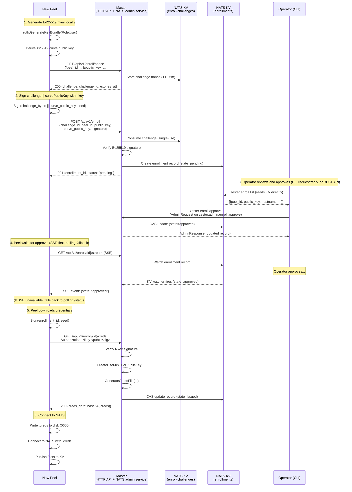

Zester's enrollment system provides a secure, manual-approval workflow for new peels to join the fleet. It replaces out-of-band credential distribution with an HTTP-based enrollment API on the master, a dedicated `pkg/enroll` package for state management, and CLI commands for operator approval.

This document covers the system design, data flow, trust model, and component responsibilities.

---

## Problem Statement

Before enrollment, adding a new peel to a Zester deployment required:

1. Generating a `.creds` file on the master using `BootstrapPeelCreds`.
2. Manually distributing the `.creds` file to the peel (via `scp`, secrets manager, etc.).
3. Starting the peel with the pre-provisioned credentials.

This out-of-band distribution model works but creates operational friction — especially in dynamic environments (auto-scaling groups, ephemeral VMs, containers) where manual steps slow provisioning.

The enrollment system solves this by allowing peels to **request** enrollment over HTTPS with a cryptographic proof-of-possession protocol, with the master holding requests in a pending state until an operator approves them via the CLI.

---

## Design Goals

| Goal | Rationale |
|------|-----------|
| **Manual approval by default** | New peels must be explicitly approved before receiving credentials. No auto-accept in production. |
| **Proof of key ownership** | Challenge-response protocol ensures the peel controls the private key for the public key it presents. |
| **Zero trust until enrolled** | Unenrolled peels have no NATS access. They interact only with the enrollment HTTP API. |
| **Idempotent requests** | A peel can safely retry enrollment if the network drops. |
| **Auditable** | Every state transition (pending, approved, rejected, issued, active, revoked) is logged with timestamp and actor. |
| **Multi-master safe** | Enrollment state lives in NATS KV with CAS-protected transitions, shared across all master instances. |

---

## System Overview

```
                                    NATS JetStream
                                   +-------------------+
                                   | KV: enrollments   |
                                   | KV: enroll-       |
                                   |     challenges    |
                                   | KV: facts, jobs...|
                                   +--------+----------+
                                            |
                     +----------------------+---------------------+
                     |                                            |
              +------+------+                            +--------+--------+
              |  Master(s)  |                            |  Enrolled Peels |
              |             |                            |  (NATS clients) |
              | - HTTP API  |                            +-----------------+
              |   /api/v1/  |
              |   enroll    |
              | - NATS      |
              |   client    |
              +------+------+
                     |
                     | HTTPS (enrollment only)
                     |
              +------+------+
              | New Peel    |
              | (not yet    |
              |  enrolled)  |
              +-------------+
              Generates nkey
              locally, proves
              ownership via
              challenge/response

              +-------------+
              | Operator    |
              | (CLI)       |
              | zester      |
              |  enroll ... |
              +-------------+
```

The enrollment flow creates a clear separation:

- **Unenrolled peels** interact only with the master's HTTP enrollment API over TLS. They have no NATS credentials and cannot access the message bus.
- **Enrolled peels** receive a `.creds` file and connect to NATS with full subject-isolated access.
- **Operators** review and approve enrollment requests either with the `zester` CLI — which connects to NATS with existing operator credentials and sends admin state transitions (approve/reject/revoke) via request/reply to a running master (`zester.admin.enroll.*`, answered by the `zester-masters-admin` queue group), while list/show read the enrollment KV bucket directly — or through the token-authenticated master REST API (`GET /api/v1/enrollments`, `POST /api/v1/enrollments/{id}/approve|reject|revoke`) served on the same TLS listener as the enrollment API. See [Master REST API](/docs/reference/master-api). When no master is running, the CLI's `--direct-kv` break-glass flag writes the enrollment KV directly.

---

## Enrollment State Machine

Each enrollment request follows a strict state machine with six states. The state machine is defined in `pkg/enroll/enrollment.go` (`Record.CanTransitionTo()`):

```
                  +──────────+
     POST         |          |   approve    +──────────+   peel downloads   +────────+
   /enroll   ───> | Pending  | ──────────>  | Approved | ──────────────────> | Issued |
                  |          |              +──────────+    GET /creds       +────────+
                  +──────────+                                                   |
                       |                                                         |
                       | reject   +──────────+                   peel connects   |
                       +────────> | Rejected |                   to NATS         |
                                  +──────────+                                   v
                                                                            +────────+
                                                                            | Active |
                                                                            +────────+
                                                                                 |
                                                                    revoke       |
                                                               +──────────+      |
                                                               | Revoked  | <────+
                                                               +──────────+
                                                                     ^
                  Note: Revoke can also transition from               |
                  Approved or Issued directly ────────────────────────+
```

### States

| State | Description | Stored in KV |
|-------|-------------|:------------:|
| `pending` | Peel submitted enrollment; awaiting operator action. | yes |
| `approved` | Operator accepted; credentials not yet downloaded by peel. | yes |
| `rejected` | Operator denied enrollment. | yes |
| `issued` | Credentials generated and downloaded by peel. | yes |
| `active` | Peel connected to NATS and publishing facts. | yes |
| `revoked` | Previously active/issued peel whose JWT has been revoked. | yes |

### State Transition Rules

| From | To | Trigger | Actor |
|------|----|---------|-------|
| *(new)* | `pending` | `GET /api/v1/enroll/nonce` + `POST /api/v1/enroll` | Peel (HTTP API) |
| `pending` | `approved` | `zester enroll approve` (CLI, request/reply to a master) or `POST /api/v1/enrollments/{id}/approve` (REST API) | Operator |
| `pending` | `rejected` | `zester enroll reject` (CLI, request/reply to a master) or `POST /api/v1/enrollments/{id}/reject` (REST API) | Operator |
| `approved` | `issued` | `GET /api/v1/enroll/{id}/creds` | Peel (HTTP API) |
| `approved` | `revoked` | `zester enroll revoke` (CLI, request/reply to a master) or `POST /api/v1/enrollments/{id}/revoke` (REST API) | Operator |
| `issued` | `active` | Master detects peel facts in KV | Master (automatic) |
| `issued` | `revoked` | `zester enroll revoke` (CLI, request/reply to a master) or REST API | Operator |
| `active` | `revoked` | `zester enroll revoke` (CLI, request/reply to a master) or REST API | Operator |

Invalid transitions (e.g., `rejected` to `approved`) are rejected. A peel ID can have at most one enrollment record at a time. A rejected peel can re-enroll (creating a new record).

### Implementation Reference

The valid transitions are defined as a map in `pkg/enroll/enrollment.go`:

```go
var validTransitions = map[State][]State{
    StatePending:  {StateApproved, StateRejected},
    StateApproved: {StateIssued, StateRevoked},
    StateIssued:   {StateActive, StateRevoked},
    StateActive:   {StateRevoked},
}
```

---

## Data Flow: Enrollment Sequence

### Challenge-Response Protocol

The enrollment protocol uses Ed25519 challenge-response to prove the peel controls the private key. This is the same cryptographic primitive used by NATS nkey authentication.



### Flow Details

**Step 1: Key Generation (Peel-side)**

The peel generates its Ed25519 nkey locally using `auth.GenerateKeyBundle(auth.RoleUser)`. The private seed never leaves the peel. The peel also derives its X25519 curve public key via `auth.CurvePublicKeyFromSeed()` for future settings encryption.

**Step 2: Challenge and Proof-of-Possession (Peel -> Master HTTP API)**

The enrollment uses a two-step challenge-response:

1. The peel sends a `GET /api/v1/enroll/nonce?peel_id=...&public_key=...` request. The master generates a 32-byte random challenge nonce (from `crypto/rand`), stores it in the `enroll-challenges` KV bucket (5-minute TTL), and returns it to the peel.
2. The peel signs `challenge_bytes || curve_public_key` with its Ed25519 private key and submits a `POST /api/v1/enroll` with the challenge ID, signature, peel identity, and curve public key. Including the curve key in the signed message cryptographically binds it to the enrollment proof, preventing curve key substitution attacks. The master verifies the signature using only the public key (via `nkeys.FromPublicKey().Verify()`), consumes the challenge (single-use), and creates the enrollment record.

This proves the peel controls the private key without ever transmitting it.

**Step 3: Operator Approval (REST API or CLI)**

Operators can approve enrollments through the authenticated master REST API (`POST /api/v1/enrollments/{id}/approve`) or via the `zester` CLI, which sends an `enroll.AdminRequest` over NATS request/reply on `zester.admin.enroll.approve` — exactly one master (queue group `zester-masters-admin`) applies the transition and replies with an `enroll.AdminResponse`. In both paths, approval updates the same enrollment record in the `enrollments` KV bucket, with the operator identity recorded as `DecidedBy` and the operation Info-logged for audit. The CLI's `--direct-kv` flag is the break-glass path that applies the KV transition directly when no master is running.

**Step 4: Credential Issuance (Master-side)**

Upon approval, the master generates credentials when the peel calls `/creds`:

1. Creates a user JWT signed by the account key using `auth.CreateUserJWTForPublicKey()` — a function that creates a JWT for a known public key without requiring the peel's seed.
2. Returns the JWT to the peel (base64-encoded). The peel combines the JWT with its locally-held seed to form a `.creds` file.
3. Transitions the record to `issued` state via CAS (before returning the response).

**Step 5: Credential Retrieval (Peel downloads credentials)**

The peel must prove key ownership again when downloading credentials by signing the enrollment ID with its nkey and including it in the `Authorization: Nkey <pub>:<sig>` header. This prevents a network-level attacker who observed the enrollment request from downloading the credentials.

**Step 6: Normal Operation**

The peel writes the `.creds` file to disk and starts its standard NATS connection flow. The master's fact watcher callback (wired in `cmd/zester-master/main.go`) automatically transitions the enrollment from `issued` to `active` when the peel first publishes facts. This transition is informational and has no security implications.

---

## Component Architecture

### pkg/enroll

The `pkg/enroll` package implements the core enrollment logic, independent of transport.

| File | Component | Responsibility |
|------|-----------|---------------|
| `enrollment.go` | `Record`, `State`, `EnrollmentSummary` | Data structures, state machine transitions, validation |
| `admin.go` | `AdminRequest`, `AdminResponse` | MessagePack wire types for operator admin request/reply on the `zester.admin.enroll.*` subjects |
| `store.go` | `Store` | KV-backed CRUD operations with CAS concurrency control and peel-to-enrollment index |
| `challenge.go` | `ChallengeStore`, `ChallengeRecord` | Challenge nonce generation, storage, and single-use consumption |
| `verify.go` | Verification functions | Ed25519 signature verification, peel ID/key validation, signing helpers |
| `handler.go` | `Handler`, request/response types | HTTP handlers, routing, rate limiting middleware, security headers, SSE streaming |
| `server.go` | `Server` | TLS HTTP server lifecycle (start, shutdown, timeouts) |
| `credential.go` | `CredentialIssuer`, `IssuedCredentials` | JWT generation via account key, base64 transport encoding |
| `client.go` | `Client` | Peel-side enrollment HTTP client with polling, exponential backoff, and ordered multi-URL master failover |
| `persist.go` | File I/O helpers | Credential/seed file management, key load-or-generate logic |

**Record fields** (from `pkg/enroll/enrollment.go`):

| Field | Type | Description |
|-------|------|-------------|
| `ID` | `string` | Enrollment identifier (`enr-` + KSUID) |
| `PeelID` | `string` | Human-readable peel identifier |
| `PublicKey` | `string` | Ed25519 public key (prefix `U`) |
| `CurvePublicKey` | `string` | X25519 curve public key (prefix `X`) for encryption |
| `State` | `State` | Current state: pending, approved, rejected, issued, active, revoked |
| `Hostname` | `string` | Optional hostname from the peel |
| `Metadata` | `map[string]string` | Peel-provided metadata (OS, arch, instance ID, etc.) |
| `CreatedAt` | `time.Time` | When the enrollment request was received |
| `UpdatedAt` | `time.Time` | When the record was last modified |
| `DecidedAt` | `*time.Time` | When the approval/rejection decision was made |
| `DecidedBy` | `string` | Identity of the operator who made the decision |
| `RejectReason` | `string` | Optional reason for rejection |
| `IssuedAt` | `*time.Time` | When credentials were issued |
| `ExpiresAt` | `*time.Time` | JWT expiry time |
| `RemoteAddr` | `string` | IP address the enrollment request came from |
| `Revision` | `uint64` | KV CAS revision for optimistic concurrency |

### HTTP API (in zester-master)

The master initializes the enrollment system in `cmd/zester-master/main.go`: it creates a `Store`, `ChallengeStore`, and `CredentialIssuer` (using the account key bundle), wires them into a `Handler`, and starts a `Server` on the `--enroll-addr` (default `:8443`). The server runs as a goroutine alongside the main NATS event loop.

The enrollment HTTP server has its own `http.ServeMux` (separate from any health server). TLS is mandatory — `NewServer()` rejects startup if TLS certificate and key are not provided (see `pkg/enroll/server.go`). The HTTP API serves only peel-facing endpoints:

| Endpoint | Method | Auth | Description |
|----------|--------|------|-------------|
| `/api/v1/enroll/nonce` | GET | TLS only | Request challenge nonce (peel_id and public_key as query params) |
| `/api/v1/enroll` | POST | TLS only | Submit enrollment with challenge signature |
| `/api/v1/enroll/{id}/status` | GET | TLS only | Check enrollment status (peel polling) |
| `/api/v1/enroll/{id}/stream` | GET | TLS only | Stream enrollment status changes (SSE) |
| `/api/v1/enroll/{id}/creds` | GET | Nkey auth | Download credentials (peel, post-approval) |

Routes are registered by `Handler.RegisterRoutes()` in `pkg/enroll/handler.go`.

**Admin operations** are available through two paths:

- The `zester` CLI (approve, reject, revoke, list, show) connects to NATS with the operator's existing credentials. State transitions are `enroll.AdminRequest` messages over request/reply on `zester.admin.enroll.approve` / `.reject` / `.revoke`, answered by the masters' `zester-masters-admin` queue group and applied to the `enrollments` KV bucket by the answering master (implemented in `internal/masterd/admin.go`); list/show read the bucket directly. The persistent `--direct-kv` flag on the `enroll` command group is a break-glass path that writes the KV directly when no master is running.
- The token-authenticated master REST API (`GET /api/v1/enrollments`, `POST /api/v1/enrollments/{id}/approve|reject|revoke` — reject and revoke take an optional `{"reason": "..."}` body) is served on the same TLS listener as the enrollment endpoints and requires a `Bearer` token. See [Master REST API](/docs/reference/master-api).

The peel-facing enrollment endpoints above remain unauthenticated but strictly rate-limited (burst 10, 1 request per 10 seconds per IP). All other routes on the listener — including the REST admin routes — use a separate, higher per-IP budget (burst 120, 20 requests per second); see `pkg/enroll/server.go`.

### Peel-side Enrollment Client

The peel includes an enrollment client that runs automatically on first start when no `.creds` file exists:

```
zester-peel --id web-01 --nats-url tls://... --nats-ca /data/auth/nats-ca.crt --master-urls https://...,https://...

1. HasCredentials(authDir, "web-01")?      [persist.go]
   +-- YES --> Connect to NATS normally (existing path)
   +-- NO  --> Start enrollment:
       a. LoadOrGenerateKey(authDir, "web-01")   [persist.go]
          +-- seed exists? Load from /data/auth/web-01.seed
          +-- no seed?     Generate new user nkey, save seed
       b. Client.Enroll(ctx, keyBundle)          [client.go]
          i.   CurvePublicKeyFromSeed(seed)
          ii.  GET /api/v1/enroll/nonce?peel_id=...&public_key=...
          iii. SignChallenge(seed, nonce)         [verify.go]
          iv.  POST /api/v1/enroll (with challenge_id + signature)
          v.   waitForApproval() — tries SSE stream first (/api/v1/enroll/{id}/stream),
               falls back to polling (exponential backoff: 10s..5m) if SSE unavailable
          vi.  SignEnrollmentID(seed, enrollmentID)
          vii. GET /api/v1/enroll/{id}/creds (Authorization: Nkey <pub>:<sig>)
          viii.DecodeJWTFromTransport(creds_data)
       c. SaveCredentials(authDir, "web-01", jwt, seed) [persist.go]
          - Writes /data/auth/web-01.creds (0600)
       d. Connect to NATS using new .creds file
       e. Continue normal peel startup (facts, subscriptions, etc.)
```

### CLI Commands

The `zester` CLI adds an `enroll` subcommand group for operators (registered in `cmd/zester/cmd/enroll.go`). The CLI connects to NATS using the operator's credentials (configured in `master.yaml` or via `--config`). It does not use the HTTP enrollment API. For HTTP-based automation, list, approve, reject, and revoke are also available via the token-authenticated [Master REST API](/docs/reference/master-api).

```
zester enroll list [--state <state>]        # List enrollments (default: pending)
zester enroll show <enrollment-id>          # Show enrollment details
zester enroll approve <enrollment-id>       # Approve a pending enrollment
zester enroll reject <enrollment-id>        # Reject a pending enrollment [--reason "..."]
zester enroll revoke <enrollment-id>        # Revoke an enrollment [--reason "..."]
```

Each CLI command opens a short-lived NATS connection via `connectClient()` and disconnects when done. Approve, reject, and revoke send an `enroll.AdminRequest` (`{id, operator, reason}`) via request/reply (5s timeout) to a master's admin queue group; the master applies `Store.Approve()`, `Store.Reject()`, or `Store.Revoke()` — all CAS updates — and replies with the updated record. List and show read the `enrollments` bucket directly through the `enroll.Store`. With `--direct-kv` (break-glass for when no master is running), the CLI applies the same `Store` transitions itself; on `nats: no responders`, the error message suggests this flag.

The CLI automatically uses the current OS username (via `os/user.Current()`) as `AdminRequest.Operator`, recorded on the enrollment record as `DecidedBy`.

---

## Storage Model

### KV Buckets

Two new NATS JetStream KV buckets, added to `bus.DefaultBuckets()` in `pkg/bus/kv.go`:

| Bucket | Key Pattern | Value | TTL | History | Storage |
|--------|-------------|-------|-----|---------|---------|
| `enrollments` | `<enrollment-id>` (e.g., `enr-2JFK...`) | `Record` (MessagePack) | None | 10 | File |
| `enrollments` | `peel.<peel-id>` | `<enrollment-id>` (plain text) | None | 10 | File |
| `enroll-challenges` | `chl-<ksuid>` | `ChallengeRecord` (MessagePack) | **5 minutes** | 1 | Memory |

The `enrollments` bucket uses a dual-key scheme:

- **Primary key**: `<enrollment-id>` holds the full `Record`.
- **Index key**: `peel.<peel-id>` maps a peel ID to its enrollment ID, enabling O(1) lookup by peel ID (see `Store.FindByPeelID()` in `pkg/enroll/store.go`).

The `enroll-challenges` bucket stores short-lived challenge nonces. Its 5-minute TTL provides automatic cleanup. Challenges are also deleted immediately after use (single-use, see `ChallengeStore.Consume()`).

### Integration with Existing Storage

The new buckets join the existing set in `pkg/bus/kv.go`:

| Bucket | Purpose |
|--------|---------|
| `facts` | Per-peel system facts |
| `settings-files` | Sanitized `.zy` templates for peel-side rendering |
| `secrets` | Per-peel encrypted sensitive values |
| `basket` | Peel-to-peel shared data |
| `jobs` | Job specs and status (plus the `active.<jid>` index) |
| `job-returns` | Per-peel incremental job results |
| `master-heartbeat` | Master liveness detection |
| `peel-heartbeat` | Peel liveness detection |
| `state-files` | Raw state files for peel-side caching |
| `leases` | Advisory single-publisher leader leases |
| **`enrollments`** | **Enrollment records and peel-to-ID index (new)** |
| **`enroll-challenges`** | **Short-lived challenge nonces (new)** |

All values in the `enrollments` bucket are serialized with MessagePack, consistent with the rest of Zester.

### CAS Concurrency Control

All state transitions use NATS KV `Update(key, value, lastRevision)` to prevent race conditions in multi-master HA deployments. This is the same CAS pattern used by the job system. From `pkg/enroll/store.go`:

```go
// Update uses the record's Revision field as the CAS token:
rev, err := s.kv.Update(ctx, rec.ID, data, rec.Revision)
```

If two masters race to approve the same enrollment, the second update fails with a revision mismatch and must retry.

### Enrollment ID Generation

Enrollment IDs use KSUID (same library as job IDs) with an `enr-` prefix:

```go
enrollmentID := "enr-" + ksuid.New().String()
```

The prefix distinguishes enrollment IDs from job IDs in logs and KV bucket listings.

---

## Trust Model

### Before Enrollment

```
+-------------+          HTTPS (TLS 1.3)          +-------------+
| New Peel    | ---------------------------------> | Master      |
| - No NATS   |    GET  /api/v1/enroll/nonce        | - HTTP API  |
|   access    |    POST /api/v1/enroll              | - TLS only  |
| - nkey      |    GET  /api/v1/enroll/{id}/status  |             |
|   generated |                                     |             |
|   locally   |    No NATS subjects accessible      |             |
+-------------+                                     +-------------+
```

- The peel has **no NATS credentials** and cannot connect to the message bus.
- The only interaction is with the enrollment HTTP API over TLS.
- The peel's private nkey seed is generated locally and never transmitted.
- Only the public key and curve public key are sent in the enrollment request.
- The peel proves key ownership via the challenge-response protocol.

### After Enrollment (Active)

```
+-------------+      TLS 1.3 + nkey/JWT auth       +-------------+
| Enrolled    | <=================================> | NATS Server |
| Peel        |    Subject-isolated access          |             |
| - .creds    |    zester.cmd.<peel-id> (sub)       |             |
|             |    zester.cmd.<peel-id>.> (sub)     |             |
|   on disk   |    zester.fact.<peel-id> (pub)      |             |
| - NATS      |    zester.job.*.ack.<peel-id>       |             |
|   client    |    zester.job.*.return.<peel-id>    |             |
|             |    zester.job.*.schedule.<peel-id>  |             |
+-------------+                                     +-------------+
```

- The peel has a valid `.creds` file containing a user JWT with subject-scoped permissions (`auth.PeelUserJWTOptions()` in `pkg/auth/jwt.go`).
- JetStream API access is scoped to the KV buckets a peel needs (`facts`, `settings-files`, `secrets`, `basket`, `state-files`, `peel-heartbeat` — the heartbeat Put is scoped to the peel's own key). The peel may also publish on `zester.target.resolve` for master-side target resolution. Peels have **no** write access to the `jobs` or `job-returns` KV buckets — scheduler `return_job` results are published on the peel-scoped `zester.job.*.schedule.<peel-id>` subject and persisted by the master, so one compromised peel cannot read, forge, or overwrite other peels' job records or returns. Peel JWTs also carry no `zester.admin.enroll.*` grant.
- The heartbeat and target-resolution grants degrade gracefully when absent from a credential: heartbeat puts fail (Debug-logged and retried — the peel looks offline in presence views) and basket target resolution falls back to facts-KV scans. Degraded, not broken.
- All communication flows through NATS with the same isolation guarantees as manually provisioned peels.

### Trust Decisions

| Decision Point | Who Decides | Mechanism |
|----------------|-------------|-----------|
| Verify key ownership | Master | Ed25519 challenge-response (nkey signature) |
| Accept enrollment request | Operator | Manual approval via CLI (NATS request/reply to a master) or REST API (bearer token) |
| Issue NATS credentials | Master | Generates JWT signed by account key |
| Authorize NATS subjects | NATS server | JWT-based subject permissions |
| Revoke enrollment | Operator | Revocation via CLI (NATS request/reply to a master) or REST API; JWT added to account revocation list |

---

## Relationship to Key Acceptance

Zester has two credential-trust mechanisms: the `pkg/auth.KeyStore` acceptance mechanism for pre-provisioned credentials, and the enrollment system:

| Aspect | Key Acceptance (`pkg/auth`) | Enrollment (`pkg/enroll`) |
|--------|---------------------------|--------------------------|
| **Trigger** | Peel connects to NATS with pre-provisioned `.creds` | Peel requests enrollment via HTTP with challenge-response |
| **Credential distribution** | Out-of-band (manual `scp`, secrets manager) | In-band (via enrollment API) |
| **Proof of identity** | NATS nkey challenge-response (after connection) | HTTP challenge-response (before NATS access) |
| **Storage** | In-memory `KeyStore` (single-master) | NATS KV `enrollments` bucket (multi-master) |
| **Concurrency** | `sync.RWMutex` | CAS (Compare-and-Swap) via KV revision |
| **State machine** | 4 states (pending, accepted, rejected, revoked) | 6 states (pending, approved, rejected, issued, active, revoked) |
| **Auto-accept modes** | `auto-trusted`, `auto-all` | Manual by default; auto-renewal for existing active enrollments |
| **Scope** | Key acceptance only | Full lifecycle: challenge, approve, credential issuance, active tracking, revocation |

The `KeyStore` covers deployments that distribute `.creds` out-of-band; the enrollment system is the recommended path.

---

## Multi-Master Considerations

In a multi-master deployment:

- **Enrollment state is shared** via the NATS KV `enrollments` bucket. All masters read and write to the same bucket.
- **Admin requests are load-balanced**: every master joins the `zester-masters-admin` queue group on the `zester.admin.enroll.*` subjects, so exactly one master applies each CLI-initiated approve/reject/revoke — any live master can answer.
- **CAS (Compare-and-Swap)** operations prevent race conditions when multiple operators approve/reject simultaneously.
- **Challenge nonces are shared** via the `enroll-challenges` KV bucket. A peel can request a challenge from one master and submit the signature to another.
- **Peels fail over between masters** — a peel configured with an ordered `master_urls` list rotates to the next master's enrollment API on connection failures and 5xx responses, and pins the URL that last succeeded (4xx never rotates). Because enrollment state is shared via KV, a flow started against one master completes cleanly against another.
- **Credential issuance** requires the account key, which all masters share (same `account.seed` file).
- **Rate limiting** is per-master instance (in-memory token buckets per source IP). Each master enforces its own limits independently.

---

## Security Properties

| Property | How It Is Achieved |
|----------|--------------------|
| **Proof of key possession** | Ed25519 challenge-response protocol; peel signs `challenge_bytes \|\| curve_public_key` |
| **No credential pre-sharing** | Peel generates its nkey locally; only the public key crosses the wire |
| **Replay protection** | Challenges are single-use (deleted after consumption) with 5-minute TTL |
| **Man-in-the-middle protection** | Enrollment API requires TLS 1.3; `Authorization: Nkey` header on credential download |
| **Rate limiting** | Per-IP token bucket on `/api/v1/enroll*` (10 tokens, 1/10s refill) with stale entry eviction; other routes on the listener get a separate higher budget (120 tokens, 20/s) |
| **Credential confidentiality** | Credentials transmitted over TLS; credential download requires second signature proof |
| **Audit trail** | Every state transition logged with timestamp, actor, and peel identity (operator identity rides `AdminRequest.Operator` and is recorded as `DecidedBy`; the answering master Info-logs each admin operation); 10 KV history revisions |
| **Revocation** | Operator revokes via CLI (NATS request/reply to a master) or REST API; user JWT added to NATS account revocation list |
| **Input validation** | Peel ID regex `^[a-zA-Z0-9][a-zA-Z0-9_-]{0,253}[a-zA-Z0-9]$`; public key prefix validation |

See `docs/enrollment-security.md` for the complete security specification including threat model, incident response procedures, and all `ENROLL-*` security requirements.

---

## Comparison: Salt Key Acceptance vs Zester Enrollment

| Feature | Salt Key Acceptance | Zester Enrollment |
|---------|--------------------|--------------------|
| **Protocol** | ZeroMQ (same bus as operations) | Dedicated HTTPS endpoint (separate from NATS) |
| **Security boundary** | Minion connects to ZMQ before acceptance | Peel has zero NATS access until approved |
| **Key exchange** | RSA public key sent over ZMQ | Ed25519 public key + challenge-response over HTTPS |
| **Proof of possession** | None (key is trusted at face value) | Ed25519 signature over random nonce |
| **Approval** | `salt-key -a <minion>` | `zester enroll approve <enrollment-id>` |
| **Credential format** | RSA key pair on disk | NATS `.creds` file (JWT + nkey seed) |
| **Multi-master** | Shared `/etc/salt/pki/` directory | Shared NATS KV bucket (no filesystem sync needed) |
| **Auto-accept** | `auto_accept: True` in master config | Manual by default (auto-renewal for existing peels) |
| **Revocation** | `salt-key -d <minion>` | `zester enroll revoke <id>` (JWT revocation via NATS account) |

The key architectural difference: in Salt, the minion connects to the ZeroMQ bus **before** key acceptance, meaning unauthenticated minions have some level of bus access. In Zester, unenrolled peels have **zero** NATS access — they only interact with the HTTP enrollment API.

---

## Related Documentation

- **[Enrollment Operations](/docs/operations/enrollment)** — Operator guide: setup, CLI commands, approving/rejecting peels, troubleshooting
- **[Enrollment API](/docs/reference/enrollment-api)** — HTTP API reference with endpoints, request/response formats, and curl examples
- **[Enrollment Security](/docs/architecture/enrollment-security)** — Security requirements, threat model, and `ENROLL-*` specification
- **[Enrollment Design](/docs/architecture/enrollment-design)** — Protocol design specification and rationale
