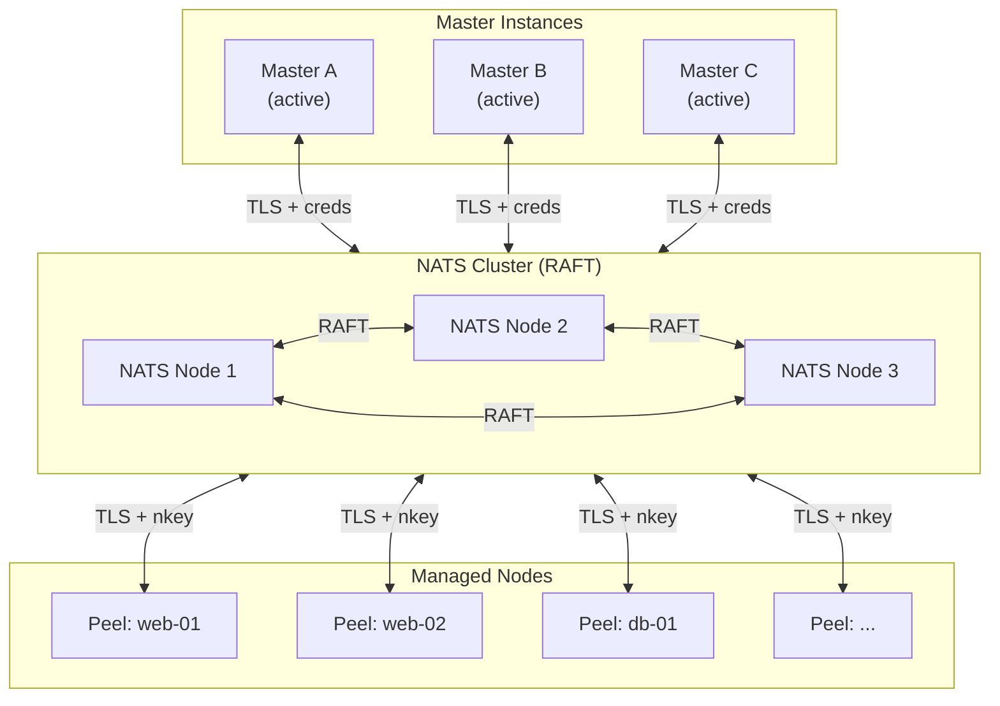
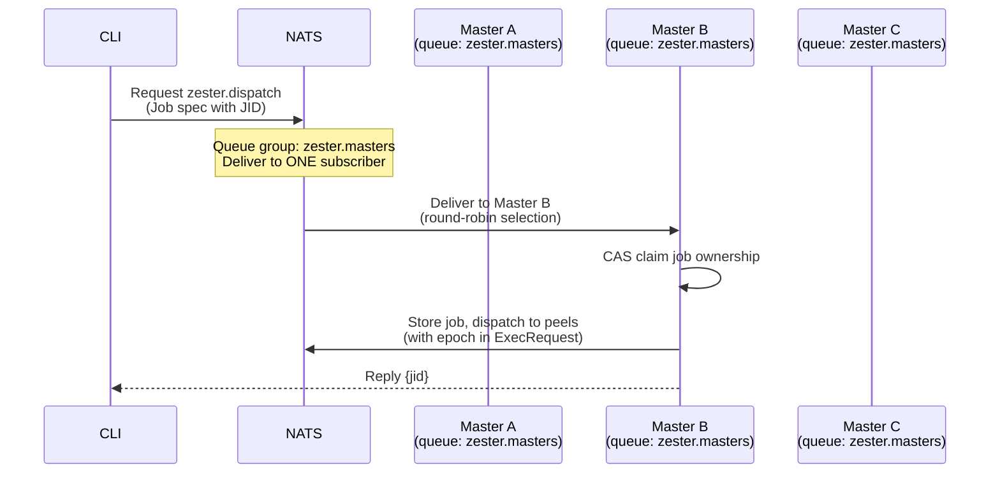
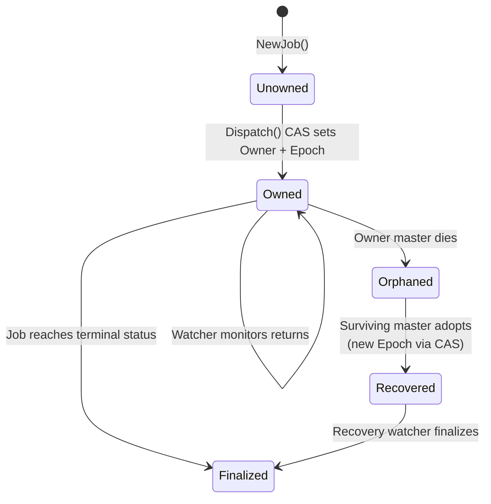
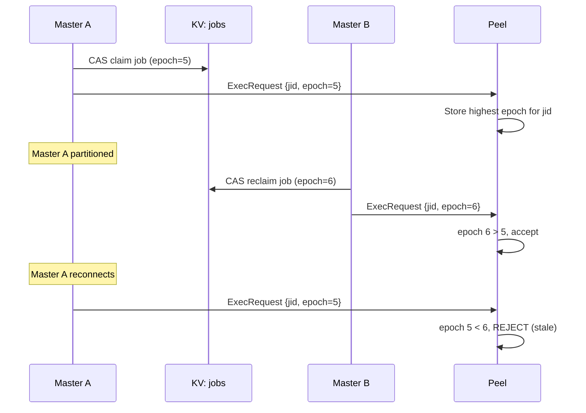
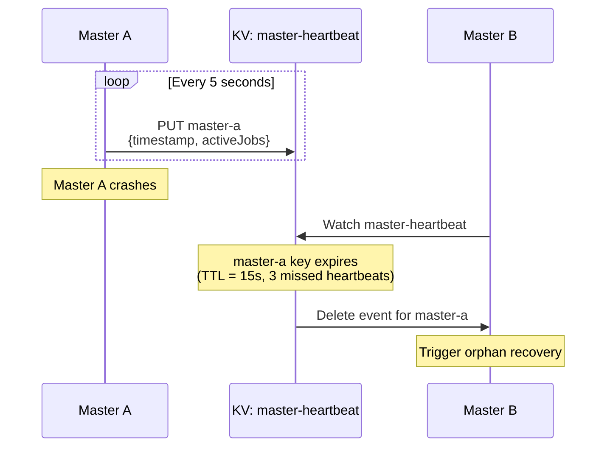
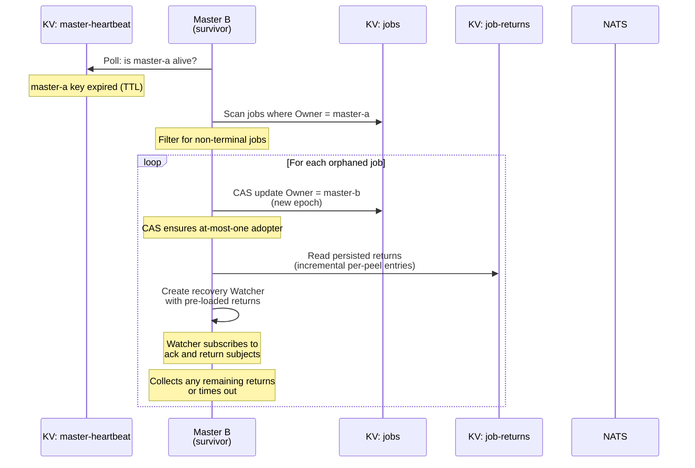
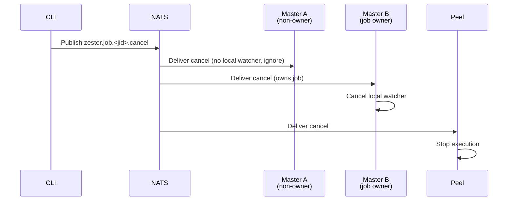
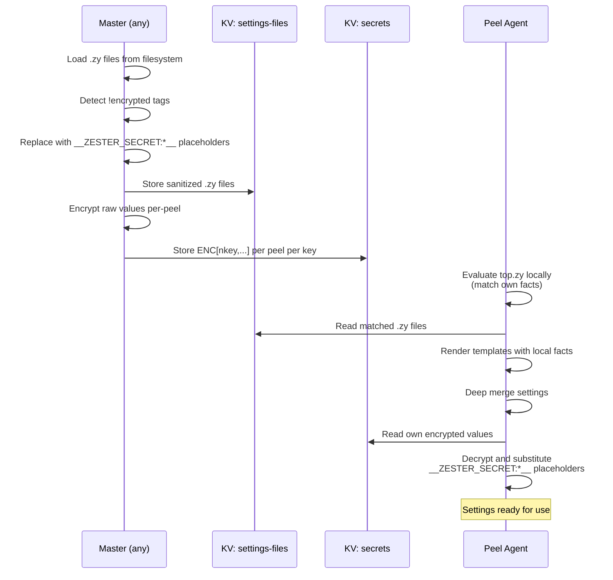

Zester supports active-active multi-master deployment where multiple master instances connect to the same NATS cluster and share the workload. This document covers multi-master topology, job ownership with fencing, heartbeat-based health monitoring, orphan recovery, settings distribution, and operational procedures.

All HA capabilities are implemented: multi-master job polling with fencing, and peel-side settings rendering. See [Implementation Status](#implementation-status) for details.

## Multi-Master Topology

In HA mode, two or more master instances connect to the same external NATS cluster as clients. NATS queue groups ensure that each dispatched job is handled by exactly one master, while JetStream KV provides shared state visible to all masters.



**Key characteristics:**

- All masters are **active-active** -- there is no primary/secondary distinction.
- Masters subscribe to `zester.dispatch` using a **NATS queue group**, so each incoming job request is delivered to exactly one master.
- Each master publishes a periodic **heartbeat** to the `master-heartbeat` KV bucket, keyed by its instance ID.
- Job ownership is tracked via the `Owner` field on the `Job` struct, set to the master instance ID that dispatched the job.
- If a master dies, surviving masters detect the missing heartbeat and **recover orphaned jobs** by re-creating watchers for any in-flight jobs owned by the dead master.
- All masters share the same **account seed** for encryption consistency (see [Shared Account Seed](#shared-account-seed)).

## Queue Group Dispatch

NATS queue groups are the mechanism that distributes job dispatch across masters without external coordination.



All masters subscribe to `zester.dispatch` with queue group `zester.masters`. NATS distributes incoming requests across queue members using round-robin delivery. This provides:

- **Load balancing** -- Job dispatch is spread across masters automatically.
- **No leader election** -- Any master can handle any job. No coordination protocol is needed.
- **Automatic failover** -- If a master disconnects, NATS stops delivering to it and redistributes to surviving members.

### Dispatch Idempotency

The CLI generates the JID (a KSUID) before dispatching. The master claims ownership via KV CAS. If a dispatch is retried (e.g., due to a timeout), the second master detects the existing JID via CAS failure and returns the existing job rather than creating a duplicate. This guarantees that a given JID is dispatched at most once.

### Queue Group Configuration

The queue group name is `zester.masters` and is configured in the master's dispatch subscription:

```go
nc.QueueSubscribe("zester.dispatch", "zester.masters", handler)
```

No external configuration is required. When a master starts and subscribes with this queue group, NATS automatically includes it in the distribution pool. When it disconnects, NATS removes it.

## Job Ownership

Every job has an `Owner` field that records which master instance dispatched it. This enables orphan detection when a master fails.

| Field | Type | Description |
|-------|------|-------------|
| `Owner` | `string` | Master instance ID that dispatched and is watching this job |
| `Epoch` | `uint64` | KV revision number from the CAS ownership claim (fencing token) |

The `Owner` is set during `Manager.Dispatch` via a KV CAS operation and stored in the `jobs` KV bucket alongside the job spec. The `Epoch` is the KV revision number returned by the CAS, serving as a fencing token for duplicate dispatch prevention.

### Owner Lifecycle



### Fencing Tokens

To prevent duplicate execution during network partitions, job ownership includes an **epoch-based fencing token**. The epoch is the KV revision number from the CAS operation that claimed ownership.



The fencing protocol works as follows:

1. Each job ownership claim (initial dispatch or orphan recovery) increments the epoch via KV CAS.
2. The epoch is included in every `ExecRequest` sent to peels.
3. Peels track the highest epoch seen per JID and **reject** ExecRequests with stale epochs.
4. When a partitioned master reconnects, it checks whether its jobs were reclaimed (epoch incremented) and abandons them if so.

This prevents duplicate execution during network partitions. Without fencing, a partitioned master that reconnects could re-dispatch jobs that a surviving master already reclaimed.

## Unreachable Targets (Presence-Aware Finalize)

Exec dispatch is fire-and-forget core NATS: a target gets exactly two sends —
the initial publish and one re-publish to still-silent targets after the ack
window (5s). A peel that was down for both sends almost certainly cannot
produce a return, and waiting the job's full timeout for it buys nothing.

At dispatch, the master records which targets have no live entry in the
`peel-heartbeat` bucket (`Job.OfflineAtDispatch`). This presence hint **never
gates delivery** — heartbeats can be stale, absent during a reconnect, or
missing under broken grants, so every resolved target is always published to.
The heartbeat classification additionally feeds the job record for auditing
(`Job.OfflineAtDispatch`). The watcher's fast path is broader: a grace period
(5s) after the ack-window re-publish, ANY target that never acked AND never
returned is finalized with a synthetic per-peel return
(`UNREACHABLE: no heartbeat at dispatch and no ack after republish`,
`Return.Unreachable`), published on the job's return subject so the
dispatching CLI finishes early. Any ack or return received first promotes the
target back into the normal wait set — the per-job ack is the authoritative
delivery proof and always overrides the heartbeat hint.

<Callout type="warn" title="UNREACHABLE means no delivery proof, not proof of non-delivery">
A narrow race exists: a peel CAN receive the dispatch, lose only its ack
(reconnect flap, write-timeout), execute a mutating job, and publish a return
AFTER the fast path has already finalized it as unreachable (the master
writes the synthetic, the late return lands in the job-events stream). The
per-peel KV record permanently says UNREACHABLE, but the actual side effect
happened. Before retrying a mutating job that exited with code 3
(unreachable), inspect `zester job show` or the job-events stream for a
late-arriving real return. The window for this is the ack-window + grace
(~10s default) — after which no further sends occur, so new divergence
cannot begin.
</Callout>

Recovery watchers (orphan reclaim of running jobs) do not run this fast path:
their peels may be mid-execution with the acks lost to the failover, so they
keep the deadline semantics. Reclaims of *claimed* jobs (never-published) are
fresh dispatches and DO classify presence and enable the fast path.

## Master Heartbeat

Each master publishes a periodic heartbeat to the `master-heartbeat` KV bucket. The heartbeat contains the master's instance ID, a timestamp, and the list of active job IDs it owns. Other masters watch this bucket to detect failures.

### Heartbeat KV Bucket

| Property | Value |
|----------|-------|
| Bucket | `master-heartbeat` |
| Key pattern | `<master-instance-id>` |
| TTL | 15 seconds |
| History | 1 |
| Replicas | Match cluster size |

### Heartbeat Payload

| Field | Type | Description |
|-------|------|-------------|
| `MasterID` | `string` | Unique instance identifier |
| `ActiveJobs` | `[]string` | JIDs of jobs this master is currently watching |
| `Timestamp` | `time.Time` | When the heartbeat was published (UTC) |

### Heartbeat Interval

Masters publish heartbeats every **5 seconds**. The KV bucket has a **15-second TTL** (3x the heartbeat interval), meaning a key expires if not refreshed within 15 seconds. A master must miss **3 consecutive heartbeats** before being declared dead, providing tolerance for GC pauses, brief network hiccups, and NATS leader elections.



## Orphan Detection and Recovery

When a master's heartbeat key expires (the master has not refreshed it within the TTL), surviving masters detect the expired heartbeat during their periodic orphan scan and initiate orphan recovery.

### Detection

Each master runs an orphan scanner that polls every **20 seconds**. The scanner lists all live masters (those with non-expired heartbeats in the `master-heartbeat` bucket), then scans the `jobs` bucket for non-terminal jobs owned by dead masters.

### Recovery Process



1. **Detect heartbeat expiration** -- The orphan scanner polls `master-heartbeat` every 20 seconds and identifies masters with expired keys.
2. **Scan for orphaned jobs** -- Query the `jobs` KV bucket for entries where `Owner` matches the dead master's ID and `Status` is non-terminal (`pending` or `running`).
3. **Adopt orphaned jobs** -- For each orphaned job, perform a CAS update on the `Owner` field to the recovering master's ID. This generates a new epoch (fencing token). Only one master's CAS succeeds; others back off.
4. **Recover return state** -- Read any incrementally persisted returns from the `job-returns` KV bucket to reconstruct watcher state. Re-subscribe to the return subjects to collect any further returns.
5. **Finalize or continue** -- The recovery watcher operates identically to a normal watcher. It collects any returns that arrive and finalizes the job when complete, timed out, or cancelled.

<Callout type="warn" title="Recovery race condition">
If multiple surviving masters detect the same heartbeat expiration simultaneously, they could both attempt to adopt the same orphaned jobs. This is resolved by using NATS KV's compare-and-swap (CAS) semantics on the `Owner` field update. Only one master's CAS succeeds; the others back off.
</Callout>

### Incremental Return Persistence

To minimize data loss when a master crashes, returns are persisted to the `job-returns` KV bucket **incrementally** as they arrive, not just at job finalization. Each return is written as a per-peel key (`<jid>.<peel-id>`) so the recovering master can reconstruct the watcher's state from KV.

This means:

- Returns that arrived at the dead master and were persisted to KV are recoverable.
- Only returns that were received in-memory but not yet written to KV may be lost.
- The recovering master re-subscribes to return subjects, so returns arriving after the crash are collected normally.

### Recovery Guarantees

| Guarantee | Mechanism |
|-----------|-----------|
| At-most-one owner | KV CAS on Owner field update |
| No duplicate execution | Fencing tokens (epoch) in ExecRequest; peels reject stale epochs |
| Returns recoverable | Incremental per-peel return persistence to `job-returns` KV |
| Returns not lost (post-crash) | Recovery watcher re-subscribes to return subjects; `job-events` stream captures all |
| Timely detection | 15-second heartbeat TTL (3x heartbeat interval) provides bounded detection time |

## Cancel Propagation

In multi-master mode, a cancel request may arrive at a different master than the one owning the job. To handle this, **all masters** subscribe to the cancel wildcard `zester.job.*.cancel`.



When a master receives a cancel message for a job it owns (has a local watcher), it cancels the watcher. If the master does not own the job, it ignores the cancel message. Peels also receive the cancel directly via NATS and stop execution regardless of which master sent it.

## Settings Distribution

Settings use **peel-side rendering**. The master distributes sanitized templates and encrypted secrets; each peel renders settings locally using its own facts.

### Peel-Side Rendering

The master distributes raw `.zy` files and encrypted secrets. Each peel performs its own template rendering locally.

#### Secret Placeholder Mechanism

Raw `.zy` files stored in the shared `settings-files` KV bucket must **never contain plaintext secret values**. Before storing, the master pre-processes each file:

1. Parse the YAML AST to find `!encrypted` tags
2. Replace the plaintext value with a placeholder: `__ZESTER_SECRET:<key.path>__`
3. Store the sanitized template in the `settings-files` KV bucket
4. Encrypt the original plaintext value per-peel and store in the `secrets` KV bucket

```yaml title="Original .zy file (on master filesystem)"
database:
  host: db.example.com
  password: !encrypted "s3cretP@ss"
```

```yaml title="Sanitized file in settings-files KV bucket"
database:
  host: db.example.com
  password: "__ZESTER_SECRET:database.password__"
```

The peel's rendering pipeline:

1. Evaluate `top.zy` locally (match own facts)
2. Read matched `.zy` files from `settings-files` KV
3. Render templates with local facts (placeholders remain as-is during rendering)
4. Deep merge rendered settings
5. Read own encrypted values from `secrets` KV
6. Substitute `__ZESTER_SECRET:*__` placeholders with decrypted values

<Callout type="error" title="Critical: Never store plaintext secrets in shared KV">
The `settings-files` KV bucket is readable by all peels. If raw `.zy` files containing plaintext `!encrypted` literal values were stored there, every peel could read every secret. The placeholder mechanism is a security requirement, not an optimization.
</Callout>

<Callout type="warn" title="Placeholder limitation">
Because `!encrypted` values are replaced with placeholders during template rendering, they cannot be used in Jinja2 expressions (e.g., ``). The value is a placeholder string at render time, not the actual secret. Encrypted values should only be used as terminal values.
</Callout>

#### Settings-Files KV Bucket

| Property | Value |
|----------|-------|
| Bucket | `settings-files` |
| Key pattern | `<relative-path>` (e.g., `common/base.zy`) |
| TTL | None |
| History | 3 |
| Replicas | Match cluster size |

The `settings-files` bucket stores **sanitized** `.zy` settings files (with secret placeholders) so that all peels have access to the same source. When an operator updates a settings file, the master pre-processes it and writes the sanitized version to this bucket.

#### Secrets KV Bucket

| Property | Value |
|----------|-------|
| Bucket | `secrets` |
| Key pattern | `<peel-id>` and `_master_curve_pub` |
| TTL | None |
| History | 3 |
| Replicas | Match cluster size |

The `secrets` bucket stores one encrypted secret map per peel (dot-path -> ciphertext), plus `_master_curve_pub` for sender key distribution. Only the intended peel can decrypt its own entry.

#### Peel-Side Rendering Flow



## Shared Account Seed

All master instances in a multi-master deployment must share the **same account seed** (`account.seed`). This is a deployment requirement for encryption consistency.

The account seed is used to derive X25519 curve keys for NaCl box encryption. If each master had its own seed, each would produce different ciphertexts, and the peel would need to know which master encrypted its secrets. With a shared seed, all masters derive the same X25519 key pair, and the peel decrypts using a single known sender public key.

| Requirement | Detail |
|-------------|--------|
| File | `/data/auth/account.seed` |
| Permissions | `0600` |
| Distribution | Copy to all master nodes or use Vault/Kubernetes Secret |
| Rotation | Rotate all masters simultaneously; re-encrypt all peel secrets |

<Callout type="warn" title="Shared secret management">
The account seed is a shared secret that must be distributed securely to all master instances. Store it in a secret management system (HashiCorp Vault, Kubernetes Secrets) rather than copying files manually. If the seed is compromised, all settings encryption is compromised.
</Callout>

## Deployment

### Adding a Master Instance

1. **Deploy the master binary** with the same configuration as existing masters.
2. **Distribute the shared account seed** (`account.seed`) from the secret store.
3. **Use the same NATS credentials** (`master.creds`) with master-level permissions.
4. **Start the master** -- it automatically joins the queue group and begins receiving dispatch requests.
5. **Verify** the new master appears in the `master-heartbeat` KV bucket:

    ```bash
    nats kv get master-heartbeat <new-master-id>
    ```

No configuration changes are needed on existing masters or peels. The NATS queue group handles redistribution automatically.

### Removing a Master Instance

1. **Gracefully shut down** the master:

    ```bash
    systemctl stop zester-master
    ```

2. The master's `Shutdown()` method cancels all active watchers and finalizes in-flight jobs.
3. NATS removes the master from the queue group immediately.
4. The heartbeat key expires after 15 seconds.
5. **No orphan recovery is triggered** because jobs were finalized during graceful shutdown.

For ungraceful removal (crash, network failure):

1. The heartbeat key expires after 15 seconds.
2. Surviving masters detect the expiration via periodic orphan scan.
3. Orphan recovery adopts and finalizes any in-flight jobs using CAS and fencing tokens.

### Minimum Cluster Size

| Masters | NATS Nodes | Behavior |
|---------|------------|----------|
| 1 | 1+ | Single master, no HA. Suitable for development. |
| 2 | 3+ | Basic HA. One master can fail. |
| 3 | 3+ | Recommended. Tolerates one master failure with headroom. |
| 5+ | 5+ | Large scale. Distributes dispatch load across more instances. |

<Callout type="info" title="Masters are independent of NATS nodes">
The number of master instances is independent of the NATS cluster size. Masters are NATS clients, not NATS servers. A 3-node NATS cluster can support any number of master instances.
</Callout>

## Implementation Status

All HA capabilities have been implemented:

### Multi-Master Job Polling

- Queue group subscription on `zester.dispatch`
- Job `Owner` field with KV CAS claiming
- Master heartbeat with TTL (5s interval, 15s TTL)
- Basic orphan scanner with CAS-based adoption
- Cancel propagation via `zester.job.*.cancel` wildcard subscription
- Shared account seed requirement

### Fencing and Robustness

- Fencing tokens (epoch) in job ownership and ExecRequest
- Peel-side stale-epoch rejection
- Incremental per-peel return persistence to `job-returns` KV
- Partitioned master reconnection detection and job abandonment

### Peel-Side Settings Rendering

- Secret placeholder mechanism (`__ZESTER_SECRET:*__`)
- Template engine included in peel binary
- Peel self-targeting via `top.zy` evaluation
- Settings compilation pipeline on peel

## Open Risks

Most HA concerns are addressed in the current implementation. Remaining operational risks to track:

- Multi-file settings updates are not truly transactional across KV keys. `_revision` reduces inconsistency windows but does not provide atomic multi-key snapshots.
- Peel-rendered settings are not centrally persisted by design. Operators must query a live peel (`settings.get`/`settings.items`) to inspect resolved values.

## Operational Runbook

### Verify Multi-Master Health

```bash
# Check all master heartbeats
nats kv ls master-heartbeat

# Inspect a specific master's heartbeat
nats kv get master-heartbeat master-prod-01

# Check queue group membership
nats sub --count 0 zester.dispatch
# Look for queue group info in the subscription details
```

### Diagnose Orphaned Jobs

```bash
# List all non-terminal jobs
zester job active

# Check if the owning master is alive
nats kv get master-heartbeat <owner-master-id>

# If the owner's heartbeat is missing, the job should be
# automatically recovered. If not, investigate:
journalctl -u zester-master --since '5 minutes ago' | grep orphan
```

### Force Orphan Recovery

If automatic recovery does not trigger (e.g., all masters restarted simultaneously):

```bash
# On a running master, the startup sequence scans for
# orphaned jobs and adopts them. Restart any master:
systemctl restart zester-master
```

### Rolling Master Upgrade

1. Upgrade one master at a time.
2. Stop the master gracefully:

    ```bash
    systemctl stop zester-master
    ```

3. Replace the binary and start:

    ```bash
    systemctl start zester-master
    ```

4. Verify the master rejoins the queue group and publishes heartbeats.
5. Repeat for the next master.

<Callout type="warn" title="Never stop all masters simultaneously">
If all masters are stopped at once, in-flight jobs will be orphaned with no surviving master to recover them. Jobs will remain in `running` status until a master starts and performs startup recovery.
</Callout>

### Monitor Queue Group Balance

To verify that job dispatch is balanced across masters, check the `zester_jobs_total` metric on each master's Prometheus endpoint:

```bash
curl -s http://master-a:9090/metrics | grep zester_jobs_total
curl -s http://master-b:9090/metrics | grep zester_jobs_total
curl -s http://master-c:9090/metrics | grep zester_jobs_total
```

The counters should be roughly equal over time, indicating balanced queue group distribution.
