NATS JetStream is the unified messaging, persistence, and KV layer that underpins every Zester operation. This document covers the rationale for choosing NATS, the subject hierarchy, KV bucket design, JetStream streams, and deployment topologies from single-node to multi-region superclusters.

## Why NATS

Zester evaluated several messaging technologies before selecting NATS JetStream as its backbone. The decision was driven by the need for a single technology that could serve as both the real-time message bus **and** the persistent data store, eliminating the operational complexity of running separate messaging and database systems.

### Alternatives Considered

| Criteria | NATS JetStream | ZeroMQ | Redis (Streams) | Custom Protocol |
|----------|---------------|--------|-----------------|----------------|
| **Persistence** | Native (JetStream KV + streams) | None (pure messaging) | Redis Streams + persistence | Must build from scratch |
| **Clustering / HA** | Built-in RAFT consensus | Manual (broker patterns) | Redis Cluster or Sentinel | Must build from scratch |
| **Auth model** | nkey + JWT with subject-level ACLs | None built-in | ACL per command | Must build from scratch |
| **Deployment** | Standalone server or cluster | C library with bindings | Separate process | N/A |
| **Pub/Sub patterns** | Native with wildcards | Extensive (PUB/SUB, PUSH/PULL, etc.) | PUB/SUB on channels | Must build from scratch |
| **KV store** | Native JetStream KV | None | Native (core feature) | Must build from scratch |
| **Connection model** | TCP with TLS, auto-reconnect | Various socket types | TCP with optional TLS | Must build from scratch |
| **Language** | Go (native) | C (with Go bindings) | C (with Go bindings) | Go |
| **Operational overhead** | Low (standalone server) | Low (no broker, but no persistence) | Medium (separate process, replication) | Low (custom) |

### Why Not ZeroMQ

ZeroMQ (used by SaltStack) is a powerful messaging library but lacks persistence, clustering, and authentication. Salt compensates by layering its own PKI, job cache (returners), and failover logic on top. Zester eliminates this complexity by using NATS, which provides all of these features natively.

### Why Not Redis

Redis Streams provide persistence and pub/sub, but running a separate Redis cluster adds operational overhead and introduces a second failure domain. Redis ACLs operate at the command level, not the subject/topic level, making fine-grained per-peel authorization harder to implement.

### Why NATS Wins

1. **Single dependency** -- NATS serves as message bus, KV store, and event stream. No external database needed.
2. **Standalone server** -- NATS runs as its own process with dedicated resources, simplifying operations and enabling independent scaling.
3. **Native Go** -- Written in Go, with first-class Go client libraries. No CGo, no FFI.
4. **Subject-level authorization** -- JWT permissions control exactly which subjects each peel can publish to or subscribe from.
5. **Built-in clustering** -- RAFT-based consensus for high availability without external coordination (no ZooKeeper, no etcd).
6. **Leaf nodes** -- Edge deployment pattern where remote sites connect through a leaf node, enabling WAN-optimized topologies.

## Subject Hierarchy

Zester organizes all NATS communication under a structured subject hierarchy rooted at `zester.`. Every subject follows a consistent pattern that maps to the operation type and target identity.

<Callout type="info" title="Source of truth">
The definitive subject definitions are in `pkg/bus/subjects.go`. The table below is derived directly from that source.
</Callout>

### Subject Prefix Tree

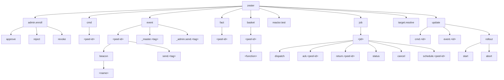

### Subject Reference Table

| Subject Pattern | Direction | Purpose | Example |
|----------------|-----------|---------|---------|
| `zester.cmd.<peel-id>` | Master -> Peel | Direct command dispatch | `zester.cmd.web-01` |
| `zester.cmd.*` | Master (subscribe) | Wildcard for all commands | Monitoring |
| `zester.event.<peel-id>.send.<tag...>` | Peel -> events stream | Custom peel events (`event.send` module); tag tokens are dotted (`myco.deploy.finished` = tag `myco/deploy/finished`) | `zester.event.web-01.send.myco.deploy.finished` |
| `zester.event.<peel-id>.beacon.<name>` | Peel -> events stream | Beacon events (v1: the `service` beacon) | `zester.event.web-01.beacon.service` |
| `zester.event._master.<tag...>` | Master -> events stream | Master-synthesized events (enrollment pending, reactor-derived `reaction.<tag>` chains) | `zester.event._master.enroll.pending.enr-1` |
| `zester.event._admin.send.<tag...>` | CLI -> events stream | Operator events (`zester event send`) | `zester.event._admin.send.maintenance.start` |
| `zester.event.>` | events stream / admin (subscribe) | Captured durably by the `events` stream feeding the reactor; `zester event watch` subscribes live | Event aggregation |
| `zester.fact.<peel-id>` | Peel -> Master | Fact data publication | `zester.fact.web-01` |
| `zester.basket.<peel-id>.<function>` | Peel -> Peel | Cross-peel data sharing | `zester.basket.web-01.network.ip_addrs` |
| `zester.dispatch` | CLI -> Master | Job dispatch request (request/reply, queue group: `zester.masters`) | `zester.dispatch` |
| `zester.target.resolve` | CLI/Peel -> Master | Target expression resolution (request/reply, queue group: `zester-target-resolvers`) | `zester.target.resolve` |
| `zester.admin.enroll.approve` | CLI -> Master | Enrollment approval (request/reply, queue group: `zester-masters-admin`) | `zester.admin.enroll.approve` |
| `zester.admin.enroll.reject` | CLI -> Master | Enrollment rejection (request/reply, queue group: `zester-masters-admin`) | `zester.admin.enroll.reject` |
| `zester.admin.enroll.revoke` | CLI -> Master | Enrollment revocation (request/reply, queue group: `zester-masters-admin`) | `zester.admin.enroll.revoke` |
| `zester.job.<jid>.dispatch` | Master -> JetStream | Job dispatched event (audit) | `zester.job.abc123.dispatch` |
| `zester.job.<jid>.ack.<peel-id>` | Peel -> Master | Dispatch acknowledgment: published when a peel *accepts* a job (before execution). Acked peels are exempt from the master's ack-window silent-target re-dispatch | `zester.job.abc123.ack.web-01` |
| `zester.job.<jid>.return.<peel-id>` | Peel -> Master/CLI | Job execution result | `zester.job.abc123.return.web-01` |
| `zester.job.<jid>.status` | Master -> JetStream | Aggregated job status | `zester.job.abc123.status` |
| `zester.job.<jid>.cancel` | CLI -> Master -> Peels | Job cancellation (stops peel execution) | `zester.job.abc123.cancel` |
| `zester.job.<jid>.schedule.<peel-id>` | Peel -> JetStream | Scheduler `return_job` result (peel identity enforced by NATS permissions) | `zester.job.abc123.schedule.web-01` |
| `zester.job.<jid>.>` | Any (subscribe) | All events for a job | Job monitoring |
| `zester.reactor.test` | CLI -> Master | Reactor rule dry-run (request/reply, queue group: `zester-reactor-testers`) | `zester reactor test '_master/enroll/pending/*'` |
| `zester.update.cmd.<id>` | Master -> Watchdog | Node-local update commands (request/reply) | `zester.update.cmd.web-01` |
| `zester.update.rollout.start` | CLI -> Master | Start rollout request (queue group: `zester.masters`) | `zester.update.rollout.start` |
| `zester.update.rollout.abort` | CLI -> Master | Abort rollout request (queue group: `zester.masters`) | `zester.update.rollout.abort` |

### Queue Groups

Zester uses NATS **queue groups** to distribute job dispatch across multiple master instances in an HA deployment. When masters subscribe to `zester.dispatch` with queue group `zester.masters`, NATS delivers each incoming request to exactly one member of the group using round-robin delivery.

```go
nc.QueueSubscribe("zester.dispatch", "zester.masters", handler)
```

| Queue Group | Subject | Purpose |
|-------------|---------|---------|
| `zester.masters` | `zester.dispatch` | Distribute job dispatch across active masters |
| `zester.masters` | `zester.update.rollout.start` | Ensure a single master instance handles each rollout start request |
| `zester.masters` | `zester.update.rollout.abort` | Ensure a single master instance handles each rollout abort request |
| `zester-target-resolvers` | `zester.target.resolve` | Every master joins; exactly one answers each target-resolution request from the CLI or a peel's `basket()` query. Callers fall back to a facts-KV scan when no master responds |
| `zester-masters-admin` | `zester.admin.enroll.approve` / `.reject` / `.revoke` | Exactly one master applies each enrollment admin request (`enroll.AdminRequest` -> `enroll.AdminResponse`) |
| `zester-reactor-testers` | `zester.reactor.test` | Every reactor-enabled master joins; exactly one answers each `zester reactor test` dry-run against its live rule snapshot |

Queue groups provide automatic load balancing and failover with no external coordination. When a master disconnects, NATS removes it from the group and redistributes to surviving members. When a new master starts, it automatically joins by subscribing with the same group name.

<Callout type="info" title="See also">
For full details on multi-master dispatch and queue group behavior, see the [High Availability](/docs/architecture/ha) documentation.
</Callout>

### Wildcard Patterns

NATS supports two wildcard tokens that Zester uses extensively:

| Token | Meaning | Example |
|-------|---------|---------|
| `*` | Matches exactly one subject token | `zester.cmd.*` matches `zester.cmd.web-01` but not `zester.cmd.web-01.restart` |
| `>` | Matches one or more tokens at the tail | `zester.event.>` matches `zester.event.web-01` and `zester.event.web-01.beacon.disk` |

### Helper Functions

The `pkg/bus/subjects.go` file provides type-safe helper functions for constructing subjects, preventing string formatting errors:

| Function | Returns | Example Output |
|----------|---------|---------------|
| `CmdSubject("web-01")` | `string` | `zester.cmd.web-01` |
| `EventSubject("web-01")` | `string` | `zester.event.web-01` |
| `BeaconSubject("web-01", "disk")` | `string` | `zester.event.web-01.beacon.disk` |
| `FactSubject("web-01")` | `string` | `zester.fact.web-01` |
| `BasketSubject("web-01", "network.ip_addrs")` | `string` | `zester.basket.web-01.network.ip_addrs` |
| `JobSubject("abc123")` | `string` | `zester.job.abc123` |
| `JobDispatchSubject("abc123")` | `string` | `zester.job.abc123.dispatch` |
| `JobAckSubject("abc123", "web-01")` | `string` | `zester.job.abc123.ack.web-01` |
| `JobReturnSubject("abc123", "web-01")` | `string` | `zester.job.abc123.return.web-01` |
| `JobStatusSubject("abc123")` | `string` | `zester.job.abc123.status` |
| `JobCancelSubject("abc123")` | `string` | `zester.job.abc123.cancel` |
| `JobScheduleSubject("abc123", "web-01")` | `string` | `zester.job.abc123.schedule.web-01` |
| `JobScheduleWildcard()` | `string` | `zester.job.*.schedule.*` |
| `JobAllSubject("abc123")` | `string` | `zester.job.abc123.>` |
| `PeelEventSendSubject("web-01", "myco.deploy.finished")` | `string` | `zester.event.web-01.send.myco.deploy.finished` |
| `MasterEventSubject("enroll.pending.enr-1")` | `string` | `zester.event._master.enroll.pending.enr-1` |
| `AdminEventSendSubject("myco.deploy.finished")` | `string` | `zester.event._admin.send.myco.deploy.finished` |
| `EventSubjectAll()` | `string` | `zester.event.>` |
| `UpdateCmdSubject("web-01")` | `string` | `zester.update.cmd.web-01` |
| `UpdateCmdSubjectAll()` | `string` | `zester.update.cmd.*` |

### Subject Permissions (JWT)

Peel user JWTs (`auth.PeelUserJWTOptions` in `pkg/auth/jwt.go`) are least-privilege: a peel can only publish on its own peel-scoped subjects (`zester.event.<peel-id>.>`, `zester.fact.<peel-id>`, `zester.job.*.ack.<peel-id>`, `zester.job.*.return.<peel-id>`, `zester.job.*.schedule.<peel-id>`) plus the JetStream API subjects for the KV buckets it needs. Three grants support the peel-side services:

| Grant | Purpose |
|-------|---------|
| `zester.target.resolve` (publish) | Request/reply to the master-side target-resolution service used by `basket()` queries; replies ride the `_INBOX.>` grant |
| `$JS.API.STREAM.INFO.KV_peel-heartbeat` (publish) | Bucket handle for the `peel-heartbeat` KV bucket |
| `$KV.peel-heartbeat.<peel-id>` (publish) | Put the peel's own liveness beat (scoped to its own key, mirroring the facts grant) |

<Callout type="info" title="Missing grants degrade, never break">
A peel whose credentials lack these grants stays fully functional: heartbeat puts fail (logged at Debug and retried on every 10s tick — the peel simply looks offline in presence views) and basket target resolution falls back to facts-KV scans. Degraded, not broken.
</Callout>

The admin subjects (`zester.admin.enroll.*`) are served by the masters with full-permission master credentials; operator NATS credentials must be allowed to publish on them for `zester enroll approve|reject|revoke` to work. Peel JWTs deliberately have **no** grant for `zester.admin.enroll.*`, and no `$KV.jobs` / `$KV.job-returns` grants — a compromised peel cannot administer enrollments or tamper with other peels' job records.

## KV Buckets

Zester uses NATS JetStream KV buckets as its primary persistence layer. All buckets are created during master startup via `InitializeStorageOpts()` in `pkg/bus/kv.go` (the `InitializeStorage()` convenience wrapper delegates to it).

### Bucket Reference

| Bucket | Key Pattern | Description | TTL | History | Tier |
|--------|------------|-------------|-----|---------|------|
| `facts` | `<peel-id>` | System facts collected from peels (OS, CPU, memory, disk, network) | None | 5 | critical |
| `settings-files` | `<relative-path>`, `_manifest`, `_revision` | Sanitized `.zy` settings files with `__ZESTER_SECRET:*__` placeholders, plus the file-set manifest and revision signal | None | 3 | critical |
| `secrets` | `<peel-id>` and `_master_curve_pub` | Per-peel encrypted secret map plus master curve public key | None | 3 | critical |
| `basket` | `<peel-id>.<function>` | Data shared between peels (e.g., IP addresses, hostnames) | None | 1 | critical |
| `jobs` | `<jid>` and `active.<jid>` | Job specifications, status, owner master ID, and epoch (fencing token), plus the active-jobs index (`ActiveJobEntry {owner, updated}`) | 7 days | 10 | critical |
| `job-returns` | `<jid>.<peel-id>` | Per-peel incremental execution results | 7 days | 1 | critical |
| `master-heartbeat` | `<master-instance-id>` | Master health heartbeats (timestamp, active jobs) | 15 seconds | 1 | ephemeral |
| `peel-heartbeat` | `<peel-id>` | Peel liveness heartbeats (`facts.Heartbeat {ts, version, protocol}`, written every 10s) | 30 seconds | 1 | ephemeral |
| `leases` | `publisher`, `facts-secrets` | Advisory leader leases for single-publisher work (`bus.LeaderLease`, 5s renew) | 15 seconds | 1 | ephemeral |
| `enrollments` | `<enrollment-id>` or `peel.<peel-id>` | Peel enrollment records and state | None | 10 | critical |
| `enroll-challenges` | `chl-<ksuid>` | Short-lived enrollment challenge nonces (memory storage) | 5 minutes | 1 | ephemeral |
| `state-files` | `<relative-path>`, `_manifest`, `_revision` | Raw `.zy` / `.star` state files for peel-side caching, plus the file-set manifest and revision signal | None | 3 | critical |
| `update-manifests` | `<component>.<goos>.<goarch>.<version>` | Published update manifests | None | 5 | critical |
| `update-status` | `<component>.<id>` | Watchdog status heartbeats | 60 seconds | 1 | ephemeral |
| `update-rollouts` | `<rollout-id>` | Rollout state and progress | None | 10 | critical |
| `reactor-files` | `reactor/<relative-path>`, `_manifest`, `_revision` | Reactor rule files (`top.zy` + reaction files), master-only — peel JWTs carry no grants for it | None | 3 | critical |

### Replica Tiering

Replica counts scale automatically with the NATS cluster: `bus.EffectiveReplicas(explicit, clusterSize)` returns an explicit operator-set count when > 0, otherwise `min(3, max(1, clusterSize))` — capped at 3, the JetStream RAFT sweet spot (R5 buys little for KV workloads). `InitializeStorageOpts(ctx, js, StorageOptions{Replicas, ClusterSize})` applies this to every bucket, stream, and Object Store.

Every asset — critical and ephemeral alike — gets the effective replica count; heartbeat and lease buckets must survive a single node loss for liveness detection to keep working. The `DurabilityTier` (`TierCritical` / `TierEphemeral` on `BucketConfig.Tier`) controls only warning behavior:

- A **critical** asset whose effective replica count is below `min(3, ClusterSize)` (an operator explicitly forced a low count in a cluster) logs a loud warning per asset — a single-node disk failure then permanently loses that data.
- A failed replica upgrade on an existing asset (older servers, insufficient cluster resources) never aborts startup: the asset is re-created at 1 replica with a warning that includes the manual migration hint (`nats stream edit KV_<bucket> --replicas=N`).

### Bucket Lifecycle

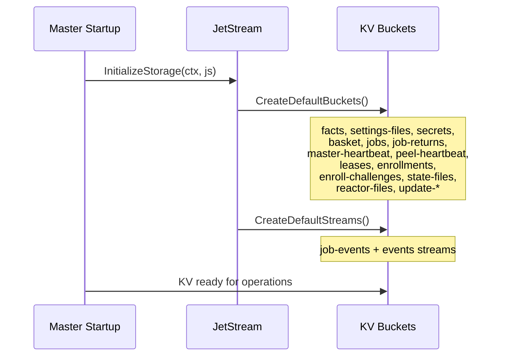

### KV Operations

All KV operations use MessagePack serialization transparently:

| Operation | Function | Description |
|-----------|----------|-------------|
| Write | `KVPut(ctx, kv, key, v)` | Encode value with MessagePack, store in bucket |
| Read | `KVGet(ctx, kv, key, v)` | Fetch from bucket, decode MessagePack into struct |
| Create bucket | `CreateBucket(ctx, js, cfg)` | Create or return existing KV bucket |
| Delete bucket | `DeleteBucket(ctx, js, name)` | Remove a KV bucket |

### The bus.KV Interface Boundary

Domain packages never touch nats.go KV types directly. The `bus.JetStreamAPI` interface's KV methods return `bus.KV` — a bus-owned narrow interface (Get/Put/Create/Update/Delete/Keys/ListKeys/ListKeysFiltered/Watch/WatchAll/WatchFiltered) with bus-owned companion types: `KVEntry` (Key/Value/Revision/Operation), `KeyWatcher` (nil-sentinel end-of-replay; the channel closes on consumer loss), `KeyLister`, and the op constants `KVOpPut`/`KVOpDelete`/`KVOpPurge`.

At the production boundary, `Client.JetStream()` returns `*bus.JS`, an adapter over the raw `jetstream.JetStream` that implements `JetStreamAPI`, `ConsumerAPI`, and `ObjectStoreAPI` (`Unwrap()` exposes the raw context; `bus.NewJS` wraps a self-built one). The raw `jetstream.KeyValue` is adapted exactly once, in `pkg/bus/kv_jetstream.go`. The error sentinels `bus.ErrKeyNotFound`, `bus.ErrKeyExists`, and `bus.ErrNoKeysFound` are aliases of the jetstream sentinels, so `errors.Is` works with either form. Tests use `bustest.NewFakeJS()` / `bustest.NewFakeKV()` against the same interfaces.

### Object Store Buckets

Zester currently defines one default Object Store bucket:

| Object Store | Key Pattern | Description | TTL | Replicas |
|---|---|---|---|---|
| `update-binaries` | `<component>/<goos>/<goarch>/<version>` | Binary artifacts used by self-update rollouts | 30 days | 1 |

## JetStream Streams

In addition to KV buckets (which are themselves built on streams), Zester defines explicit JetStream streams for event logging.

### job-events Stream

| Property | Value |
|----------|-------|
| **Name** | `job-events` |
| **Subjects** | `zester.job.>` |
| **Max age** | 7 days |
| **Retention** | Limits policy |
| **Storage** | File |
| **Replicas** | `EffectiveReplicas` (scales with cluster size, capped at 3) |
| **Description** | Full job event log for replay and audit |

The `job-events` stream captures messages published under `zester.job.>` (for example dispatch, ack, return, status, cancel, and scheduler `schedule` results). This provides:

- **Audit trail** -- Complete history of who ran what, when, and what happened.
- **Replay capability** -- Consumers can replay the stream from any point to reconstruct job state. The master relies on this in two places: the shared durable `schedule-results` consumer persists scheduler `return_job` results, and job reclaim replays `zester.job.<jid>.return.>` via an ephemeral pull consumer so returns published while no watcher was running are recovered.
- **Debugging** -- Inspect the exact sequence of events for any job.

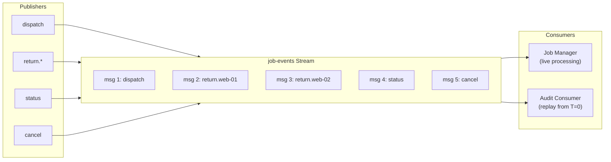

### events Stream

| Property | Value |
|----------|-------|
| **Name** | `events` |
| **Subjects** | `zester.event.>` |
| **Max age** | 7 days |
| **Max bytes / msgs** | 1 GiB / 1,000,000 |
| **Duplicate (MsgID) window** | 2 minutes |
| **Retention** | Limits policy |
| **Storage** | File |
| **Replicas** | `EffectiveReplicas` (scales with cluster size, capped at 3) |
| **Description** | Reactor event log |

The `events` stream captures every publish under `zester.event.>` — peel `event.send` events, beacons, operator events, and master-synthesized events — durably. The masters' shared durable consumer `reactor` (DeliverNew, explicit ack, AckWait 60s, MaxDeliver 5) delivers each event to exactly one master fleet-wide and replays events published while all masters were down. The size caps bound flood damage from a compromised peel; the duplicate window collapses redelivered reactor-derived events published with deterministic message IDs. See [Reactor architecture](/docs/architecture/reactor).

## Deployment Topologies

Zester supports multiple deployment topologies, scaling from development to multi-region production.

### Single Node (Development / Small Scale)

The simplest deployment: one NATS server with the master connecting as a client.

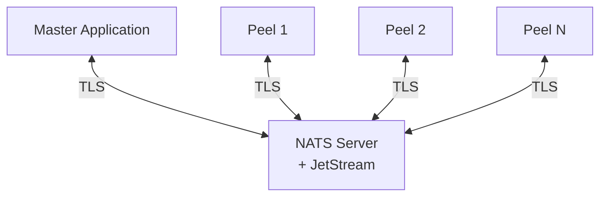

**Characteristics:**

- NATS runs as a separate process (or container) alongside the master
- No high availability -- single NATS failure = total outage
- Peels continue running last applied state during outage
- Suitable for development, testing, and small deployments (< 100 peels)
- JetStream data persisted to local disk (survives process restarts)

### 3-Node NATS Cluster (Production)

For production high availability, deploy a 3-node NATS cluster with RAFT consensus.

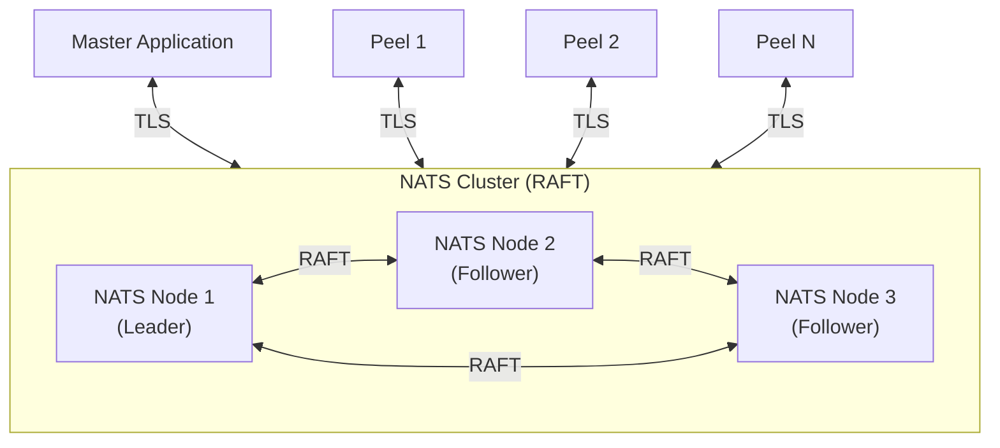

**Characteristics:**

- Tolerates 1 node failure (quorum = 2 of 3)
- Committed writes are never lost (RAFT guarantee)
- KV bucket and stream replicas = 3
- Election on leader failure is sub-second
- Master connects to cluster as an external client
- Peels receive connection URLs for all 3 nodes; NATS client handles failover

<Callout type="warn" title="Quorum requirements">
With 3 nodes, losing 2 nodes means the cluster cannot accept writes. JetStream becomes read-only for committed data. Plan for monitoring and rapid node recovery.
</Callout>

### 5-Node NATS Cluster (High Availability)

For environments requiring tolerance of 2 simultaneous failures:

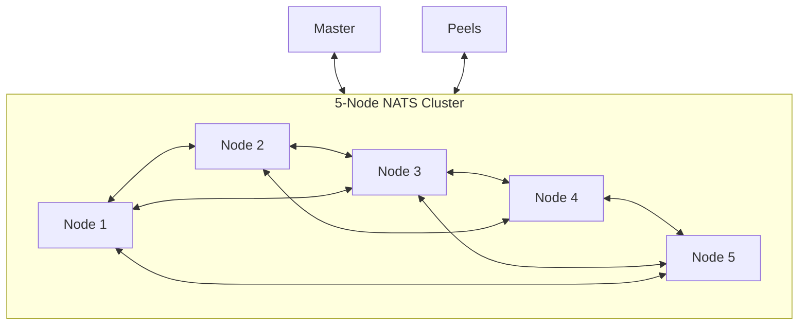

- Quorum = 3 of 5; tolerates 2 failures
- Higher write latency (must replicate to 3 nodes)
- Recommended for critical infrastructure with SLA requirements

### Superclusters (Multi-Region)

For multi-region deployments, NATS superclusters use **gateways** to connect independent clusters:

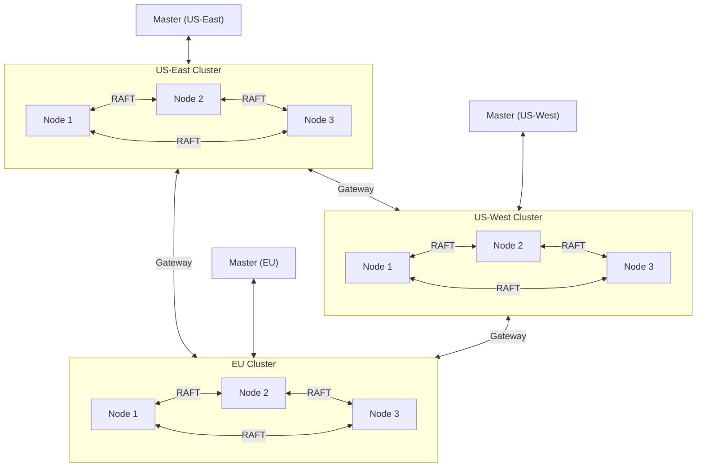

**Characteristics:**

- Each region has an independent RAFT cluster
- Gateways route interest-based messages between regions
- JetStream domains isolate per-region data (`JetStreamDomain` in `ServerConfig`)
- Cross-region peels connect through their local cluster
- Provides geographic redundancy and data locality

### Leaf Nodes (Edge / WAN)

For edge deployments or sites behind restrictive firewalls, NATS **leaf nodes** provide a WAN-optimized connection:

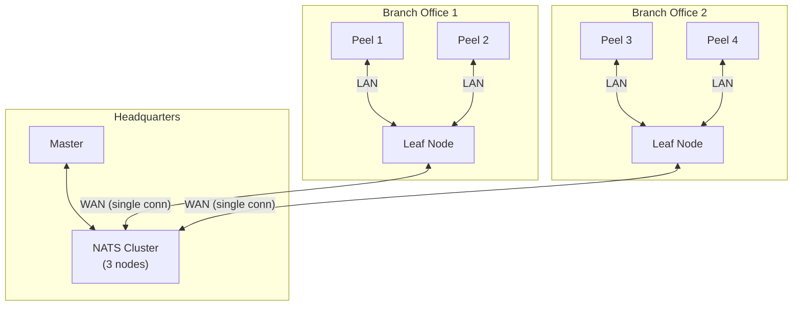

**Characteristics:**

- Leaf nodes multiplex all local peel connections into a **single WAN connection** to the hub cluster
- Reduces WAN bandwidth and connection count
- Peels connect to the local leaf node over LAN (low latency)
- Leaf nodes can operate in a degraded mode during WAN outages (local messaging continues)
- Subject mapping can remap subjects at the leaf boundary for namespace isolation

## Network Partition Behavior

Understanding NATS RAFT behavior during network partitions is critical for production operations.

### Partition Scenarios (3-Node Cluster)

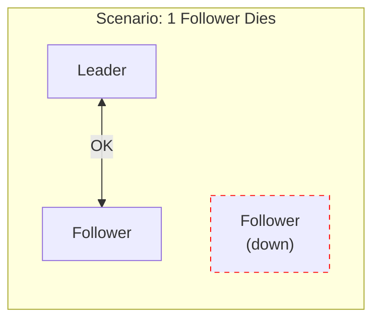

**One follower dies:** Leader continues. Quorum maintained (2/3). Writes succeed. Dead node catches up on rejoin via log replay.

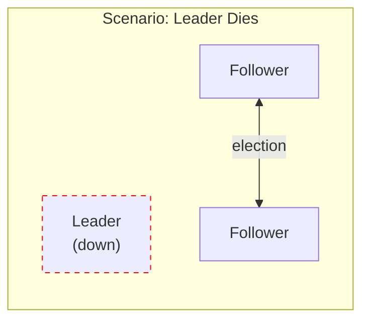

**Leader dies:** Remaining 2 nodes detect missing heartbeats. New leader elected (sub-second). Writes pause during election. No committed data lost.

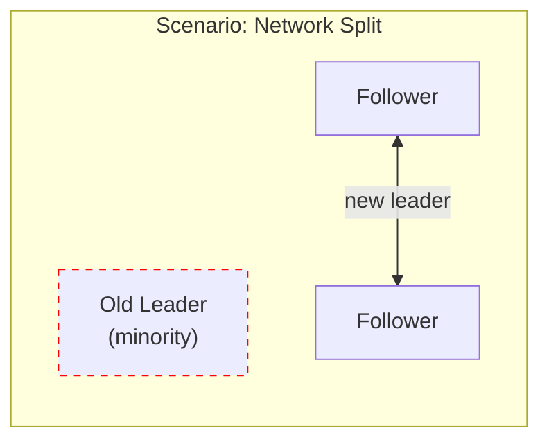

**Network split (1 vs 2):** Minority partition (old leader) cannot commit writes. Majority partition elects new leader. Old leader steps down when it discovers higher term. Uncommitted entries on old leader are discarded.

<Callout type="warn" title="Guarantee">
**Committed writes are never lost.** A write is committed only after replication to a majority. During a partition, the minority becomes read-only for committed data and cannot accept new writes.
</Callout>

### Peel Behavior During Partitions

| Scenario | Peel Impact |
|----------|------------|
| Master node down, NATS cluster healthy | Peels remain connected to NATS. New commands wait for master recovery. |
| NATS minority partition, peel on minority side | Peel reconnects to majority partition nodes. Buffered messages replayed. |
| Complete NATS outage | Peel reconnects with exponential backoff (unlimited retries). Continues running last applied state. |
| WAN link down (leaf node) | Local leaf messaging continues. WAN-dependent operations queue until reconnection. |
