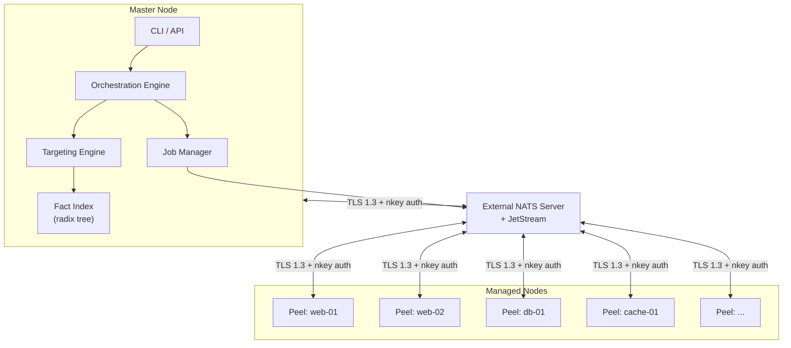
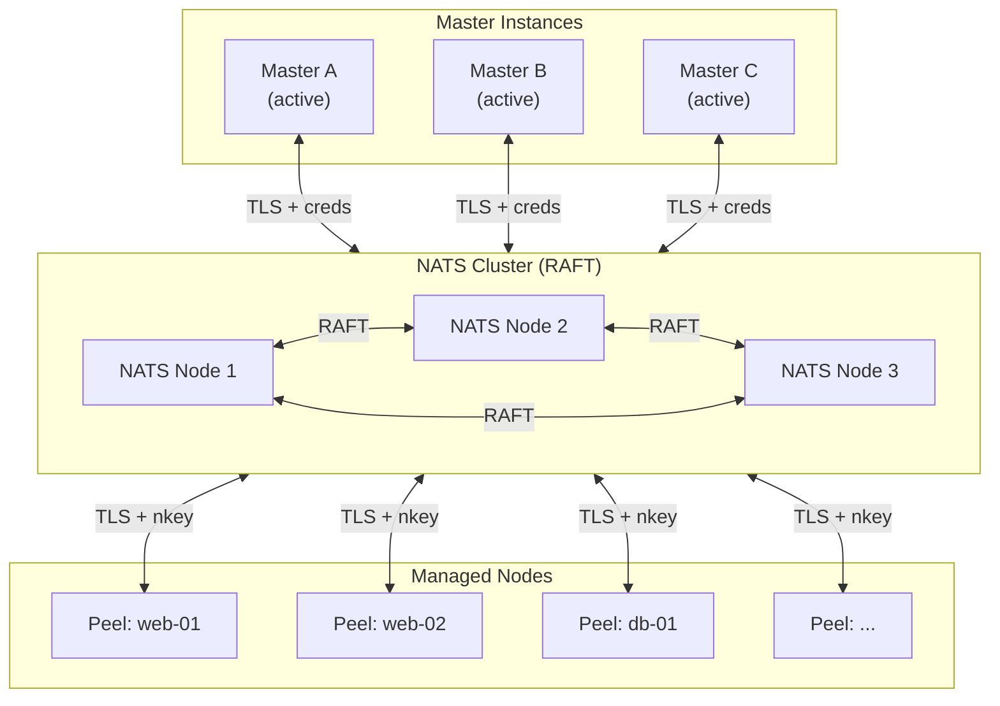
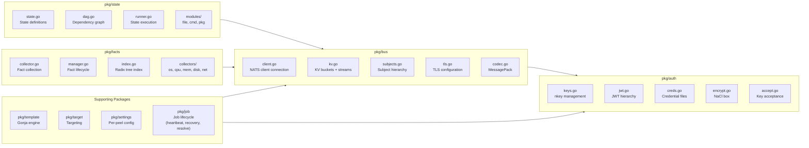
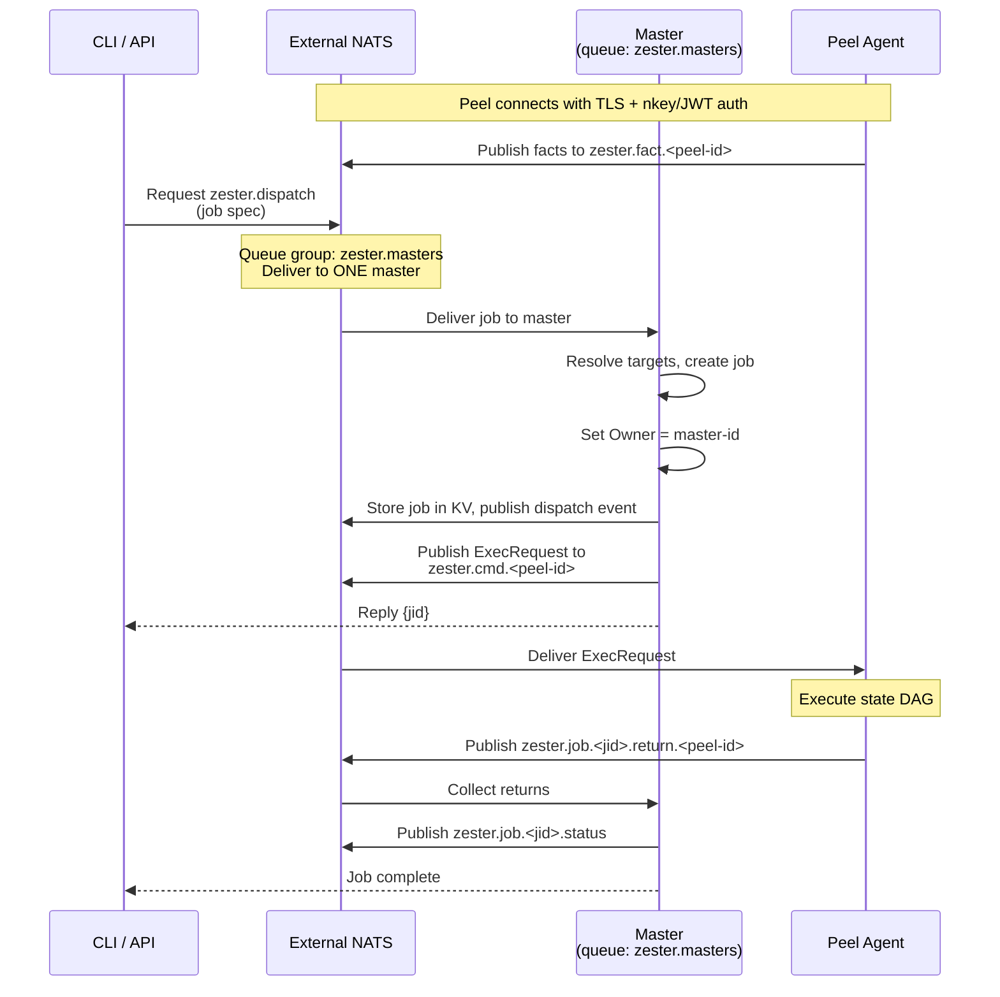
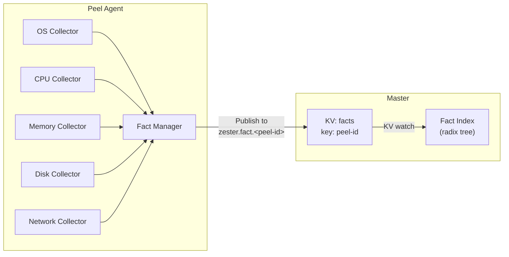
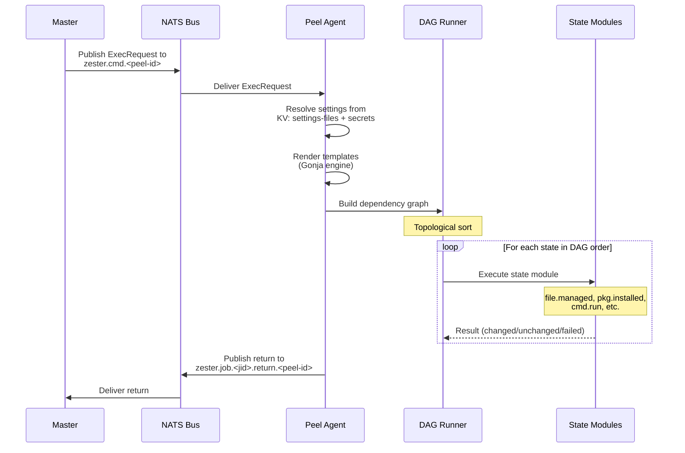
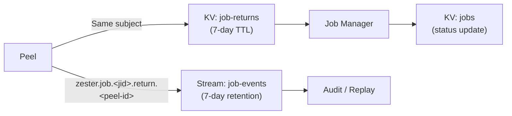

Zester is a configuration management system built in pure Go that replaces SaltStack's Python-based architecture with a modern, high-performance design centered on NATS JetStream. This document covers the system topology, package structure, component interactions, and end-to-end data flows.

## Master / Peel Topology

Zester uses a **master/agent model** where the central control plane is called the **master** and managed nodes are called **peels** (a nod to Zester's citrus-themed naming). All components — the master, peels, and CLI — connect to an external NATS server as clients. The master orchestrates operations, while peels receive commands, apply state, and report back.



**Key characteristics:**

- NATS runs as an **external server** with JetStream enabled. The master, peels, and CLI all connect to it as clients.
- The master authenticates to NATS using a `master.creds` file with permissions scoped to orchestration subjects.
- Peels connect over the network using **TLS 1.3** with **mTLS** (mutual TLS) and authenticate via **nkey challenge-response** with JWT-based authorization.
- All data -- facts, settings, job state, event history -- is persisted in NATS JetStream KV buckets and streams. There is no external database.

### Multi-Master Topology

Zester supports **active-active multi-master** deployment for high availability. Multiple master instances connect to the same NATS cluster and share the workload using NATS queue groups. There is no primary/secondary distinction -- all masters are equal peers.



In multi-master mode:

- All masters subscribe to `zester.dispatch` with queue group `zester.masters`. NATS delivers each dispatch request to exactly one master.
- Each master publishes a periodic **heartbeat** to the `master-heartbeat` KV bucket. Surviving masters detect missing heartbeats and recover orphaned jobs.
- Job **ownership** is tracked via the `Owner` and `Epoch` fields on the `Job` struct. The `Epoch` (KV revision from CAS) serves as a fencing token to prevent duplicate execution during network partitions.
- All masters share the same **account seed** for encryption consistency.
- All masters subscribe to `zester.job.*.cancel` for cancel propagation.

<Callout type="info" title="See also">
For full details on multi-master deployment, queue group dispatch, fencing tokens, heartbeat monitoring, and orphan recovery, see the [High Availability](/docs/architecture/ha) documentation.
</Callout>

## Package Structure

Zester's Go packages are organized by responsibility:



| Package | Responsibility |
|---------|---------------|
| `pkg/bus` | NATS client management, JetStream KV/streams, subject hierarchy, MessagePack codec, TLS |
| `pkg/auth` | nkey generation/management, JWT trust hierarchy, NaCl box encryption, credential files, key acceptance |
| `pkg/facts` | System fact collection (OS, CPU, memory, disk, network), fact indexing with radix tree |
| `pkg/state` | State file parsing, DAG-based dependency resolution, state module execution |
| `pkg/template` | Jinja2-compatible template engine with custom filters/functions |
| `pkg/target` | Peel targeting via glob, PCRE, fact matching, list, and compound expressions |
| `pkg/settings` | Per-peel settings management, top file matching, encrypted value handling |
| `pkg/job` | Job creation, dispatch, acknowledgment tracking, return collection, lifecycle management, master heartbeat, orphan recovery, ownership resolution |

## Component Interaction

The following diagram shows how the core components interact during normal operation. In a multi-master deployment, the CLI dispatches to `zester.dispatch` using a NATS queue group, and exactly one master handles each job.



## Message Flows

### Command Dispatch

When an operator issues a command (e.g., `zester 'web*' state.apply webserver`), the flow is:

1. **CLI resolves the target** -- The CLI queries the NATS KV facts bucket to resolve matching peel IDs.
2. **CLI creates a job** -- A job ID (JID) is generated with the resolved targets.
3. **CLI dispatches to master** -- The job is sent to `zester.dispatch` via request/reply. In a multi-master deployment, NATS queue group `zester.masters` delivers the request to exactly one master.
4. **Master claims ownership** -- The receiving master sets the job's `Owner` field to its own instance ID and stores the job in the `jobs` KV bucket.
5. **Master dispatches to peels** -- An `ExecRequest` is published to `zester.cmd.<peel-id>` for each target. A dispatch event is published to `zester.job.<jid>.dispatch` for audit.
6. **Peels execute and return** -- Each peel executes the function and publishes its result to `zester.job.<jid>.return.<peel-id>`. For job dispatches, peels also subscribe to `zester.job.<jid>.cancel` so cancellation stops execution.
7. **Master aggregates** -- The owning master's watcher collects returns, computes aggregate status, and publishes to `zester.job.<jid>.status`. Returns are stored in the `job-returns` KV bucket.

### Fact Synchronization

Fact data flows from peels to the master and into the targeting index:



1. Each peel runs **fact collectors** (OS, CPU, memory, disk, network) on a periodic schedule.
2. Collected facts are serialized with MessagePack and published to `zester.fact.<peel-id>`.
3. The master stores facts in the `facts` KV bucket (keyed by peel ID, 5 history revisions).
4. A KV watch on the `facts` bucket triggers updates to the in-memory **radix tree index**, which supports fast pattern matching for the targeting engine.

### State Application

The state application flow is Zester's core workflow:



1. The master publishes an `ExecRequest` (with module `state.apply`) to `zester.cmd.<peel-id>`.
2. The peel resolves settings from `settings-files` and `secrets` KV buckets (peel-side rendering model).
3. Templates in the state file are rendered using the Gonja engine, with access to facts, settings, and basket data.
4. The state is parsed into a **DAG** (directed acyclic graph) and topologically sorted to respect `require` dependencies.
5. Each state in the DAG is executed by its corresponding **state module** (e.g., `file.managed`, `pkg.installed`, `cmd.run`).
6. Results are collected and published as a job return.

<Callout type="info" title="Peel-side rendering">
Peel-side settings rendering is implemented. The master distributes sanitized `.zy` files (with `__ZESTER_SECRET:*__` placeholders replacing `!encrypted` literals) via the `settings-files` KV bucket and encrypted secrets via the `secrets` KV bucket. Each peel renders templates locally using its own facts. This eliminates per-peel CPU load on the master and simplifies multi-master coordination. See [High Availability](/docs/architecture/ha#peel-side-rendering) for details.
</Callout>

### Job Returns

Job returns flow through the system with persistence for audit and replay:



- Job returns are published to subjects matching `zester.job.<jid>.return.<peel-id>`.
- The `job-events` JetStream stream captures **all** job-related messages (`zester.job.>`) for 7 days, providing a complete audit trail and replay capability.
- The `job-returns` KV bucket stores incremental per-peel entries — the sole store for return payloads; the finalized job record carries summary counts.
- The `jobs` KV bucket tracks aggregate job status (10 history revisions).

## Data Model

All data is persisted in NATS JetStream. The storage layer consists of **KV buckets** for key-value state and **streams** for ordered event logs:

| Storage | Type | Purpose | Retention |
|---------|------|---------|-----------|
| `facts` | KV bucket | Per-peel system facts | No TTL, 5 revisions |
| `settings-files` | KV bucket | Sanitized `.zy` settings files for peel-side rendering | No TTL, 3 revisions |
| `secrets` | KV bucket | Per-peel encrypted `!encrypted` values | No TTL, 3 revisions |
| `basket` | KV bucket | Peel-to-peel shared data | No TTL, 1 revision |
| `jobs` | KV bucket | Job specs, status, ownership, and epoch | 7-day TTL, 10 revisions |
| `job-returns` | KV bucket | Incremental per-peel returns | 7-day TTL, 1 revision |
| `master-heartbeat` | KV bucket | Master instance health and active job list | 15-second TTL, 1 revision |
| `job-events` | Stream | Full job event log | 7-day max age, file storage |

All values are serialized with **MessagePack** (`github.com/vmihailenco/msgpack/v5`), chosen for its compact binary format, self-describing structure, and no-codegen requirement.

## Serialization

Zester uses MessagePack for all wire-format serialization via the `pkg/bus/codec.go` module:

```go
// All NATS messages use these two functions
func Encode(v any) ([]byte, error)  // struct -> MessagePack bytes
func Decode(data []byte, v any) error  // MessagePack bytes -> struct
```

**Why MessagePack over alternatives:**

| Criteria | MessagePack | Protobuf | CBOR |
|----------|-------------|----------|------|
| Schema required | No | Yes (.proto) | No |
| Code generation | None | Required | None |
| Self-describing | Yes | No | Yes |
| Go library | vmihailenco/msgpack | google.golang.org/protobuf | fxamacker/cbor |
| Relative size | Baseline | Smallest | Similar |

MessagePack was selected because it requires no build-time code generation, is self-describing (simplifying debugging), and the `vmihailenco/msgpack/v5` library is mature and well-tested in Go.

## External NATS Architecture

Zester uses an external NATS server for all messaging and persistence. The master connects to NATS as a client using `bus.NewClient`, the same connection layer used by peels:

```go
type Client struct {
    nc     *nats.Conn           // NATS connection
    js     jetstream.JetStream  // JetStream context
}
```

**Benefits of the external NATS approach:**

- **Dedicated resources** -- NATS has its own process with dedicated memory and CPU, independent of the master.
- **Production-grade HA** -- Deploy a 3+ node NATS cluster with RAFT consensus for high availability.
- **Simplified master** -- The master is a pure client, reducing its complexity and resource footprint.
- **Standard operations** -- Use standard NATS tooling for monitoring, backup, and management.
- **JWT-enforced auth** -- NATS natively enforces the operator/account/user JWT hierarchy, with each connection scoped to its authorized subjects.

The `ClientConfig` accepts `URLs` for connecting to one or more NATS servers, with full reconnection support. For multi-cluster isolation, use NATS JetStream domains.

## Peel Resilience

The peel client (`pkg/bus/client.go`) is designed for resilience during network disruptions:

| Parameter | Default | Purpose |
|-----------|---------|---------|
| `MaxReconnects` | -1 (unlimited) | Never stop trying to reconnect |
| `ReconnectWait` | 2 seconds | Base wait between attempts |
| `ReconnectJitter` | 500ms - 5s | Randomized jitter to avoid thundering herd |
| `ReconnectBufSize` | 8 MB | Buffer messages during reconnection |
| `PingInterval` | 20 seconds | Health check frequency |
| `MaxPingsOut` | 3 | Missed pings before declaring unhealthy |
| `DrainTimeout` | 30 seconds | Graceful shutdown drain timeout |

The client exposes `DisconnectNotify()` and `ReconnectNotify()` channels, allowing the peel agent to react to connectivity changes (e.g., pausing state application during disconnection and replaying buffered events on reconnection).
