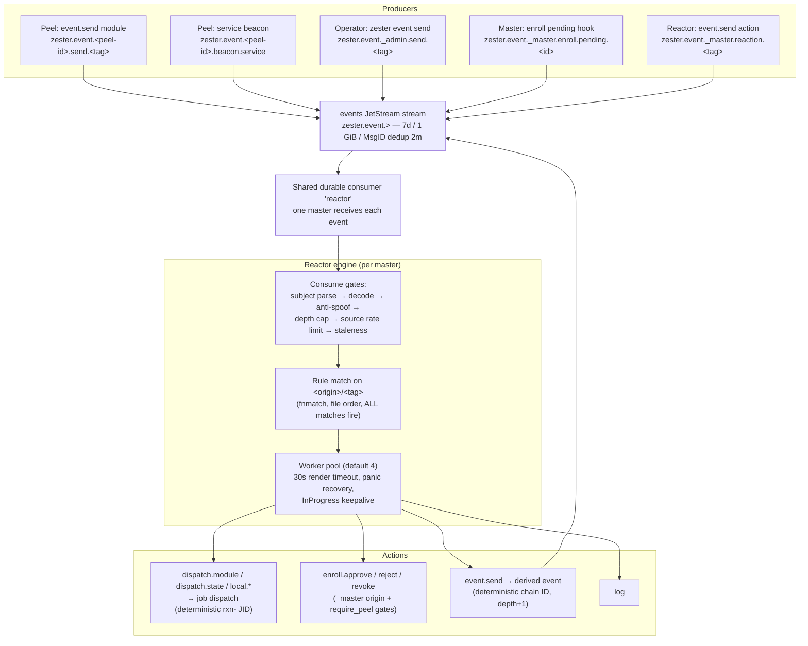

The reactor is Zester's event-driven automation engine — the equivalent of Salt's reactor system. Peels, operators, and the master itself publish **events** onto a durable JetStream stream; the master-side reactor matches each event against operator-written **rules** and executes typed **reactions**: dispatching jobs, transitioning enrollments, emitting derived events, or logging.

This document covers the system design: the event flow, the subject and trust model, the exactly-once execution story, loop guards, rules distribution, and multi-master behavior.

For rule authoring see the [Reactor guide](/docs/guides/reactor), for configuration and runbooks the [Reactor operations guide](/docs/operations/reactor), and for wire formats and schemas the [Events reference](/docs/reference/events).

**Source**: `pkg/event`, `pkg/reactor`, `pkg/beacon`, `internal/masterd/reactor.go`

---

## Event Flow

An event is a MessagePack `event.Event` (`id`, `tag`, `data`, `ts`, `v`, `origin`, `depth` — additive-only wire evolution, key set pinned by a conformance test) published under `zester.event.>`. The `events` stream captures every publish durably; the masters' shared durable consumer delivers each event to exactly one master fleet-wide and replays events published while every master was down.

## Subject Scheme and Origins

The **subject**, not the payload, is authoritative for event identity. `event.ParseSubject` derives the origin and tag from subject tokens with adversarial validation (minimum 4 tokens, no empty or wildcard tokens, unrecognized shapes rejected):

| Subject shape | Origin | Derived slash tag | Producer |
|---|---|---|---|
| `zester.event.<peel-id>.send.<t1>.<t2>...` | `<peel-id>` | `t1/t2/...` | `event.send` execution module on the peel |
| `zester.event.<peel-id>.beacon.<name>` | `<peel-id>` | `beacon/<peel-id>/<name>` | Peel beacon engine (v1: the `service` beacon) |
| `zester.event._master.<t1>.<t2>...` | `_master` | `t1/t2/...` | Master-synthesized events (enrollment hooks, reactor `event.send` chains) |
| `zester.event._admin.send.<t1>.<t2>...` | `_admin` | `t1/t2/...` | `zester event send` (operator CLI) |

Tags use slashes in rule files and payloads (`myco/deploy/finished`) and dots on the wire subject (`myco.deploy.finished`). The mapping is strictly 1:1 because tag segments may only contain `[a-zA-Z0-9_-]` — dots, wildcards, and whitespace are rejected by `event.ValidateTag`.

Rules match against the **match key** `<origin>/<slash-tag>`, e.g. `web-01/myco/deploy/finished` or `_master/enroll/pending/enr-123`. Including the origin in the match key is a core security property (see Trust Model).

## The events Stream and the Shared Durable Consumer

| Property | Value |
|---|---|
| Stream name | `events` |
| Subjects | `zester.event.>` |
| Max age / bytes / msgs | 7 days / 1 GiB / 1,000,000 |
| Duplicate (MsgID) window | 2 minutes |
| Consumer | durable `reactor`, shared by all masters |
| Deliver policy | `DeliverNew` (a freshly created consumer starts at the stream tip) |
| Ack policy | explicit, `AckWait` 60s, `MaxDeliver` 5, `MaxAckPending` 64 |

The size caps bound flood damage from a compromised peel. Because the consumer is durable and shared, JetStream delivers each event to exactly one master (the same pattern as the `schedule-results` consumer) and resumes from the last ack after downtime — events published while all masters were down replay automatically once one comes back.

### Exactly-Once Side Effects

Delivery is at-least-once (crashes, `AckWait` expiry, and explicit Naks all redeliver), so the reactor makes every side effect idempotent per `(event, rule, block)`:

- **Reaction jobs** get a deterministic, content-addressed JID: `"rxn-" + hex(sha256(origin || event.ID || ruleRef || blockID))[:32]`. A re-run dispatch of the same reaction hits the jobs bucket's CAS `Create`: if the existing record was actually published it fails with `job.ErrJIDConflict`, which the executor classifies as **duplicate-suppressed** (metric result `duplicate`), not an error. A collision with a record still in `claimed` (persisted but provably never published, e.g. another master's dispatch died mid-flight) is instead `job.ErrJobClaimPending` — transient, so the event redelivers until the claim is resumed or reclaimed rather than acking a reaction that never ran. Including the origin in the hash means an attacker replaying event IDs can only suppress reactions to its *own* events.
- **Derived events** (`event.send` action) get a deterministic ID `sha256(parent.ID || ruleRef || blockID)` and are published with that ID as the JetStream **MsgID**, so redelivered emissions collapse in-stream within the 2-minute duplicate window; beyond the window, the deterministic event ID makes all downstream reaction JIDs identical, so the chain stays exactly-once end to end.
- **Enrollment transitions** are checked against the enrollment state machine first: an already-applied transition classifies as a duplicate, and CAS races redeliver and reclassify on the next attempt.

The engine acks a message only after **all** matched rules completed or failed permanently; any transient failure (connectivity, KV errors) answers `NakWithDelay(10s)` for redelivery — safe precisely because every side effect dedups. A saturated worker queue Naks with a 5s delay (metric reason `backpressure`) rather than dropping.

## Consume Pipeline

The consume callback does only cheap work, in a fixed gate order; expensive rendering and execution happen in a bounded worker pool (default 4 workers) with a 30s render timeout, panic recovery, and `InProgress` keepalives so one slow reaction never stalls consumption or times out the delivery:

1. **Subject parse** — malformed subjects are acked and dropped (`reason="malformed"`).
2. **Decode** — undecodable payloads are dropped (`reason="decode"`).
3. **Anti-spoof** — a payload `tag` that disagrees with the subject-derived tag is dropped (`reason="spoof"`).
4. **Depth cap** — events at or beyond `reactor.max_chain_depth` (default 3) are dropped (`reason="depth"`).
5. **Per-source rate limit** — token bucket per origin, default 120 events/min with burst 30, bounded LRU (`reason="ratelimit"`).
6. **Staleness** — events older than `reactor.max_event_age` (default 1h) are dropped with a loud Warn (`reason="stale"`); set `0` to disable and replay everything after an outage.
7. **Rule match** — no match acks quietly (counted separately as `unmatched`, not a drop); matches are handed to the workers.

All permanent drops are acked (never redelivered) and counted in `zester_reactor_events_dropped_total{reason}`.

## Trust Model

The reactor is designed so that a compromised peel cannot escalate through the event system:

- **Subject-token identity.** The peel JWT allows publishing only `zester.event.<own-peel-id>.>` — the NATS server enforces the origin token. Payload identity claims are ignored: the payload `tag` is cross-checked against the subject and dropped on mismatch, and reaction templates get `event.peel` from the subject token, never from event data.
- **Origin-scoped match keys.** Rules match `<origin>/<tag>`, and the reserved origins `_master` / `_admin` cannot be claimed by peels: enrollment validates peel IDs against `^[a-zA-Z0-9][a-zA-Z0-9_-]*$` (no dots, no leading `_`, no NATS wildcards), and `ParseSubject` rejects any other `_`-prefixed origin. A compromised peel can therefore never make its events match a `_master/...` or `_admin/...` rule — it can only spoof itself.
- **Enrollment actions are double-gated.** `enroll.approve|reject|revoke` blocks require a `require_peel` glob at compile time (a rule without one fails validation), and the executor refuses the action unless the triggering event's origin is `_master` — so even a rule-authoring mistake (a bare-star match glob) cannot let peel-emitted events approve enrollments. The rule loader additionally lints bare-star enroll globs and bare-star `require_peel` values with loud warnings.
- **Post-render validation bounds template injection.** Event data flows through Jinja templates into action fields, so every dispatch block is validated after rendering: the function name must match `^[a-z0-9_]+\.[a-z0-9_]+$`, the target expression must parse under `pkg/target`, and an optional `max_targets` aborts reactions whose resolved target set is unexpectedly large. Reaction templates have no `salt[...]` module-dispatch surface (`ModuleFn` is nil — using it is a render error).
- **No peel access to reactor state.** The `reactor-files` bucket is master-only (peel JWTs carry no grants for it), peels cannot subscribe to `zester.event.>` (no cross-peel snooping), and the reactor-control subjects (`zester.reactor.>`) are admin/master-only.
- **Attribution.** Every reaction job carries `User: "reactor:<rule>"`, `TargetExpr`, and `Metadata{source: reactor, rule, event_id, event_tag, reactor_depth}`; enrollment records actioned by the reactor record the operator `reactor`, with the rule-qualified identity in the master's audit log line.

## Loop Guards

Reaction chaining (`event.send`) is enabled by default, so the loop guards are correctness-critical, not defense-in-depth. The throttle and the breaker are **two-phase**: checked before a rule executes, recorded only after it completes (success or permanent failure) — a transiently failed attempt consumes no guard state, so its Nak redelivery retries instead of being refused by the window the failed attempt would otherwise have recorded.

| Guard | Default | Behavior |
|---|---|---|
| **Depth cap** | 3 | Every reactor-derived event carries `depth = parent + 1`; events at or beyond the cap are dropped at consume, and the `event.send` action refuses to emit at the cap (loudly, instead of emitting an event that would be dropped). Reaction jobs propagate their depth to the peel via `ExecRequest.ReactorDepth`, and the peel's `event.send` module stamps it into emitted events — so chains that pass *through* a peel execution stay counted. |
| **Per-(rule, source) throttle** | 0 (off) | A refractory period after a rule **completes** a fire for a source; further fires of the same rule for the same source are skipped (`result="throttled"`) until it elapses. Set per rule (`throttle:` in `top.zy`) or globally (`reactor.default_throttle`). |
| **Storm circuit breaker** | 60 fires/min → open 5m | A sliding one-minute window per rule counting **completed** fires; exceeding the rate opens the breaker for the cooldown, during which the rule's reactions are skipped (`result="breaker_open"`). Expired cooldowns are swept closed every 15s, so the open state (gauge + degraded readiness) clears even if the event flow stopped. This is the hard backstop against feedback loops that depth counting cannot see (reaction → state run on peel → organic event → same rule). |
| **Per-source rate limit** | 120/min, burst 30 | Caps how many events any single origin can push through the reactor. |
| **Staleness gate** | 1h | Prevents acting on ancient events after long outages (reacting to a 20-hour-old service-down alarm is harmful). |

## Rules Distribution

Reactor rules live in `.zy` files under the master's local `reactor.dir` (default `/data/reactor`) and are distributed to all masters through the **`reactor-files`** KV bucket — master-only, history 3, no peel grants — using the same batch protocol as settings and state files:

1. **Publish** (holder of the `publisher` lease only, on lease acquisition — master start or failover): all `.zy` files are Put under `reactor/<relative-path>` keys, then a `_manifest` (sorted key + SHA-256 list describing the complete set), then a `_revision` bump — the watched signal. An empty or missing local reactor dir **refuses** to wipe a populated bucket, so a misconfigured master cannot delete every rule fleet-wide.
2. **Load** (every reactor-enabled master): the loader fetches exactly the manifest's file set with per-file SHA-256 verification. Listed-but-missing keys, hash mismatches, and content-without-a-manifest all fail the load as torn or tampered publishes. `reactor/top.zy` is parsed into ordered rules; a rule referencing a missing reaction file fails the whole load.
3. **Hot reload**: a `_revision` watch triggers debounced reloads (2s debounce + up to 5s jitter). ANY load failure keeps the **last-known-good** rule snapshot active — the engine never crashes and never half-applies a rule set — and surfaces as a `degraded` reactor readiness check plus the `zester_reactor_rule_errors_total` counter.

Rule snapshots are immutable and atomically swapped; an in-flight event pins the snapshot it matched against, so a concurrent reload can never tear a reaction file away from its rule.

## Multi-Master Behavior

- **One consumer, all masters.** Every reactor-enabled master attaches to the same durable `reactor` consumer; JetStream delivers each event to exactly one of them. There is no reactor leader — capacity scales with masters, and a master crash mid-reaction just redelivers to a survivor after `AckWait` (deterministic JIDs make the re-run a no-op).
- **Rules publish is lease-gated, not engine-gated.** Only the `publisher` lease holder publishes the local reactor dir to the bucket (the state-files pattern), and it does so **regardless of `reactor.enabled`** — a reactor-disabled master that wins the lease still distributes the rules, so mixed topologies (dedicated publisher masters) cannot silently starve the enabled masters of rules. Rule *loading* runs on every reactor-enabled master.
- **Test service.** Every reactor-enabled master joins the `zester-reactor-testers` queue group on `zester.reactor.test`, answering `zester reactor test` dry-runs against its live rule snapshot.
- **Boot resilience.** A reactor boot failure is non-fatal: the master logs a Warn, reports the `reactor` readiness check as `down`, and retries every 60s until the engine starts (the sched-consumer pattern). Consumer lag is exported as the `zester_reactor_lag` gauge, polled every 15s; the same loop sweeps expired storm breakers closed. Dispatch reactions consumed during boot wait for the master's facts index to finish its initial replay: target resolution errors (and the event redelivers) until the index is seeded, so backlog reactions are never acked against a partially-populated fleet view.

## Beacons (Peel Side)

Beacons are the peel-side event producers: periodic local observations published under `zester.event.<peel-id>.beacon.<name>`. v1 ships exactly one beacon — **`service`** — which polls configured services through the `exec.ServiceExec` provider and emits running-state *transitions* (Salt's service beacon shape). Configuration arrives through the settings pipeline (`beacons:` key, hot-reloaded, snapshot warm-started); events ride the peel's existing event publish grant and are buffered in a bounded 256-entry FIFO while NATS is unreachable. Polls are skipped while the peel's exec worker is running a mutating execution, so a reaction-triggered state run does not immediately re-trip the beacon that caused it.

## What Ships in v1 (and What Does Not)

Shipped: the event wire format and subject scheme, the `events` stream, the reactor engine with all guards, rules distribution with hot reload, `dispatch.*`/`local.*`/`enroll.*`/`event.send`/`log` actions, the `service` beacon, the `event.send` execution module, and the `zester event send|watch` / `zester reactor test` CLI.

<Callout type="info" title="Phase 2 (planned, not in v1)">
The full beacon set (disk usage, memory, load, file watch), master-emitted job lifecycle events (e.g. a `job/<jid>/finalized` tag), `runner.orchestrate`-style master-side orchestration, `wait_for_returns`, and `zester-migrate` conversion of Salt reactor SLS files are planned but **not implemented**. Docs or examples referring to them describe future behavior.
</Callout>
