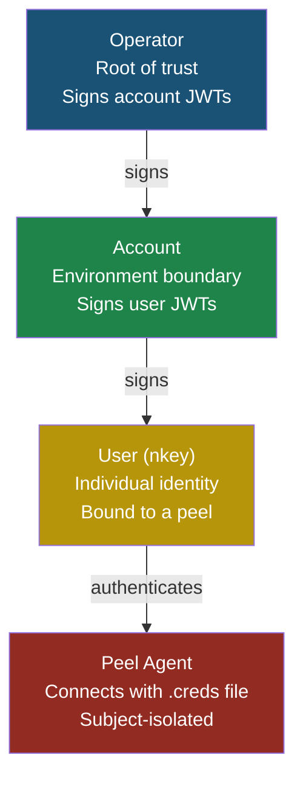
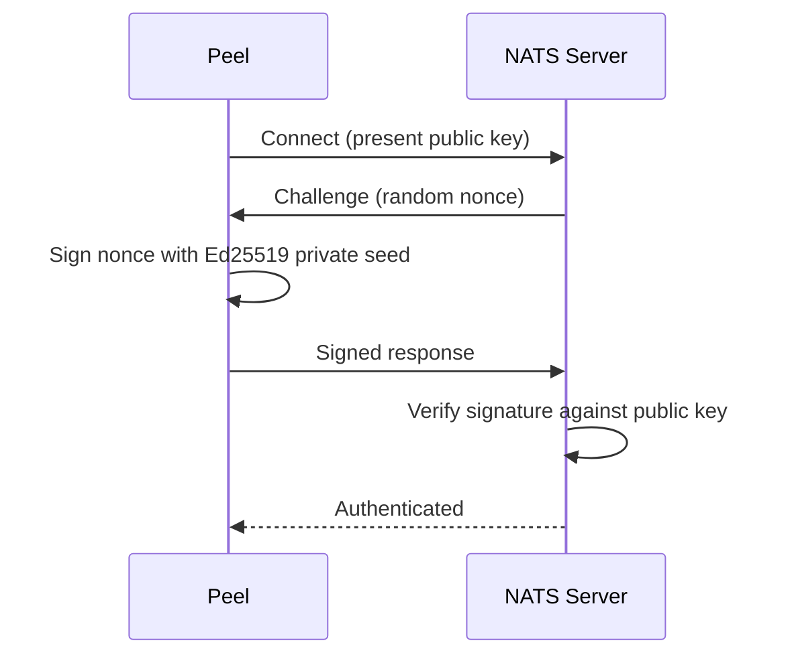
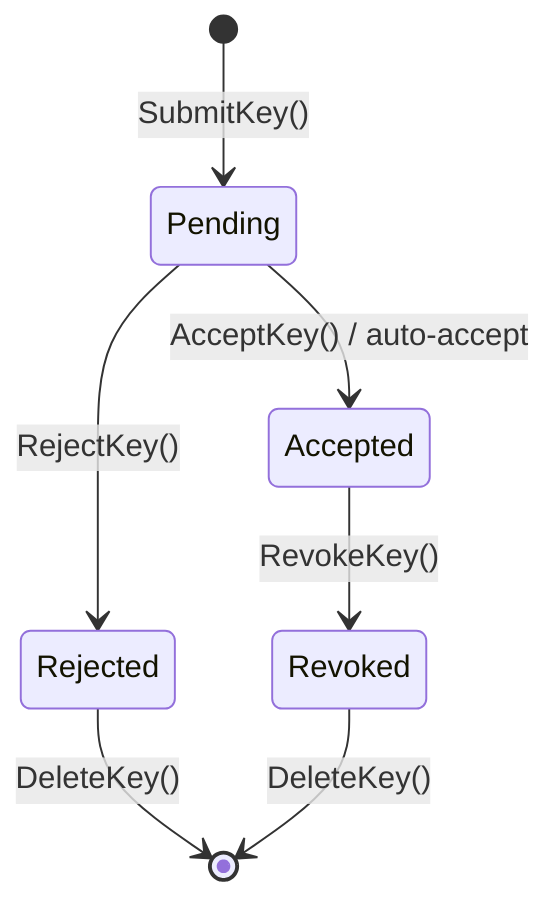

Zester implements a zero-trust security architecture with multiple independent layers protecting transport, identity, authorization, and data. Every connection is authenticated, every message is encrypted in transit, and sensitive settings are encrypted end-to-end so only the target peel can read them.

## Trust Hierarchy

The core trust model follows a three-tier JWT hierarchy rooted in a single operator identity. Each level delegates bounded authority to the level below.



| Level | nkey Prefix | Scope | Responsibility |
|-------|-------------|-------|----------------|
| **Operator** | `O` | Entire deployment | Signs account JWTs. Root of the trust chain. |
| **Account** | `A` | One environment | Signs user JWTs. Provides namespace isolation. |
| **User** | `U` | One peel | Authenticates via challenge-response. Carries JWT permissions. |

## Transport Security

All NATS connections between peels and the master are encrypted with TLS 1.3. The implementation in `pkg/bus/tls.go` enforces TLS 1.3 as the **minimum version** -- earlier protocol versions are rejected at connection time.

### Server and Client TLS Configuration

**`ServerTLSConfig`** (master side):

```go
tlsCfg := &tls.Config{
    Certificates: []tls.Certificate{cert},
    MinVersion:   tls.VersionTLS13,
    // ClientAuth is set conditionally:
    // only when cfg.VerifyClient is true
}
if cfg.VerifyClient {
    tlsCfg.ClientAuth = tls.RequireAndVerifyClientCert
}
```

**`ClientTLSConfig`** (peel side):

```go
tlsCfg := &tls.Config{
    MinVersion:   tls.VersionTLS13,
    Certificates: []tls.Certificate{cert}, // client cert for mTLS
    RootCAs:      pool,
}
```

Both functions enforce `MinVersion: tls.VersionTLS13`. There is no configuration knob to weaken this.

### Mutual TLS (mTLS)

When `VerifyClient` is enabled (the recommended production setting), both sides must present valid certificates signed by the same CA. This provides bidirectional authentication at the transport layer before any NATS-level authentication begins.

### Certificate Generation

Zester includes built-in tooling for bootstrapping a self-signed CA and issuing certificates:

| Function | Purpose |
|----------|---------|
| `GenerateSelfSignedCA(org, validity)` | Create a self-signed ECDSA P-256 CA certificate |
| `ca.IssueCert(cn, ips, dnsNames, validity)` | Issue server or client certificates signed by the CA |
| `WritePEM(path, data)` | Write PEM-encoded data with `0600` permissions |

The CA uses **ECDSA P-256** (also known as prime256v1), providing equivalent security to RSA 3072 at a fraction of the key size and computation cost.

<Callout type="warn" title="Production certificate management">
The built-in CA is intended for bootstrap and testing. Production deployments should use a proper PKI infrastructure (e.g., HashiCorp Vault PKI, cert-manager, or a corporate CA) with automated rotation.
</Callout>

## Identity and Authentication

### Ed25519 nkeys

Every entity in Zester has an Ed25519 nkey identity managed through the `KeyBundle` struct in `pkg/auth/keys.go`. A `KeyBundle` contains the key pair, public key, seed, and role metadata.

| Function | Purpose |
|----------|---------|
| `GenerateKeyBundle(role)` | Generate a new Ed25519 key pair for operator, account, or user |
| `LoadKeyBundle(role, seed)` | Reconstruct a key bundle from a stored seed |
| `LoadKeyBundleFromFile(role, path)` | Load from a seed file (supports decorated `.creds` format) |
| `kb.SaveSeedToFile(path)` | Write seed with `0600` permissions |
| `ValidatePublicKey(pub, role)` | Verify public key format and role prefix |

### Challenge-Response Authentication

nkeys use challenge-response authentication. No passwords or private keys are ever transmitted over the wire.



1. The peel presents its public key during connection.
2. The NATS server sends a random nonce.
3. The peel signs the nonce with its Ed25519 private key (the seed never leaves the peel).
4. The server verifies the signature. If valid, the connection is authenticated.

### Three-Tier JWT Hierarchy

Authorization is encoded in NATS JWTs following a three-tier chain: **Operator -> Account -> User**. The `pkg/auth/jwt.go` package provides functions for creating and validating each level.

- **Operator JWT** -- Root of trust. Signs account JWTs. Supports signing key delegation.
- **Account JWT** -- Environment boundary. Signs user JWTs. Enforces resource limits.
- **User JWT** -- Per-peel identity. Carries subject-level publish/subscribe permissions.

The `ValidateJWTChain()` function verifies the complete chain:

1. Decode and validate the operator JWT (self-signed).
2. Verify the account JWT was signed by the operator or one of its signing keys.
3. Verify the user JWT was signed by the account or one of its signing keys.

### Credential Files

Credential files (`.creds`) bundle a peel's JWT and nkey seed into a single file, produced by `pkg/auth/creds.go`. The `BootstrapPeelCreds()` function generates everything a peel needs to connect:

1. Generate a new user nkey pair.
2. Create a user JWT signed by the account key, with peel-specific subject permissions.
3. Write the `.creds` file with `0600` permissions.

```
-----BEGIN NATS USER JWT-----
eyJ0eXAiOiJKV1QiLCJhbGciOiJlZDI1NTE5LW5rZXkifQ...
------END NATS USER JWT------

************************* IMPORTANT *************************
NKEY Seed printed below can be used to sign and prove identity.
NKEYs are sensitive and should be treated as secrets.

-----BEGIN USER NKEY SEED-----
SUAM...
------END USER NKEY SEED------
```

## Key Acceptance

Before a peel can operate, its key must be accepted by the master. The key acceptance system in `pkg/auth/accept.go` provides thread-safe operations and supports three acceptance modes.

### Acceptance Modes

| Mode | Behavior | Use Case |
|------|----------|----------|
| **Manual** | Keys remain pending until an admin explicitly accepts | High-security production environments |
| **AutoTrusted** | Keys are auto-accepted if the peel's JWT is signed by a trusted account | Standard production default |
| **AutoAll** | All keys are auto-accepted immediately | Development and testing only |

<Callout type="success" title="Choosing an acceptance mode">
Use `manual` when you need explicit approval for every new peel joining the infrastructure. Use `auto-trusted` for production environments where peels are provisioned through trusted automation. Reserve `auto-all` strictly for development and testing -- it accepts any key without verification.
</Callout>

### Key Lifecycle



Each `KeyRecord` tracks the peel ID, Ed25519 public key, X25519 curve public key (for encryption), current state, timestamps, and the identity of who accepted, rejected, or revoked the key. All operations on the key store are thread-safe.

## Settings Encryption

Sensitive settings values (passwords, API keys, tokens) are encrypted with NaCl box encryption so they are only readable by the target peel. The `Encryptor` in `pkg/auth/encrypt.go` handles all cryptographic operations.

### How It Works

1. The master derives an X25519 curve key from its Ed25519 nkey seed.
2. Each peel's X25519 public key is used as the encryption recipient.
3. `SealSettingsValue` encrypts the plaintext and produces a tagged string: `ENC[nkey,<base64>]`.
4. The peel decrypts using its own X25519 curve key pair derived from its nkey seed.

### Key Derivation

`CurvePublicKeyFromSeed` derives an X25519 public key from an Ed25519 nkey seed through the following chain:

```
Ed25519 nkey seed
    |
    v  nkeys.DecodeSeed()
    |
    v  Raw 32-byte seed
    |
    v  nkeys.EncodeSeed(PrefixByteCurve, rawSeed)
    |
    v  Curve seed
    |
    v  nkeys.FromCurveSeed()
    |
    v  X25519 key pair (public + private)
```

This means every peel's signing identity (its nkey) also provides an encryption identity. No additional key management is required.

<Callout type="info" title="Accepted risk: cryptographic domain separation">
Reusing the same seed for Ed25519 signing and X25519 encryption violates strict domain separation — compromise of the signing seed also compromises encryption confidentiality. This trade-off is accepted because: (1) the blast radius is limited to a single peel per compromised seed, (2) the NATS nkeys library uses the same derivation pattern for its xkey feature, and (3) the operational simplicity of a single seed per identity outweighs the theoretical concern.
</Callout>

### Multi-Master Key Compatibility

The account seed is the root of the encryption trust chain. The master derives its X25519 curve key from the account seed and publishes the curve public key to the `secrets` KV bucket so peels can decrypt settings. In multi-master deployments, all masters **must** share the same `account.seed` file — otherwise each master derives a different curve key, and peels cannot decrypt settings encrypted by a different master. The seed never leaves the master; only the derived curve public key is published to KV.

### Per-Peel Encryption

Each peel has a unique X25519 key pair derived from its unique nkey seed. The master encrypts settings individually for each target peel. Even if the NATS KV store is compromised, encrypted values are unreadable without the specific peel's private key. A compromised peel can only decrypt its own settings -- not those of any other peel.

<Callout type="info" title="Encryption algorithm">
NaCl box uses X25519 for key exchange, XSalsa20 for symmetric encryption, and Poly1305 for authentication. A fresh 24-byte nonce is generated for every seal operation.
</Callout>

## NATS Subject Isolation

JWT-based subject permissions enforce strict isolation between peels at the NATS server level.

**Publish permissions (peel can send to):**

| Subject Pattern | Purpose |
|-|-|
| `zester.event.<peel-id>.>` | Only its own events and beacons — the reactor derives event identity from this NATS-enforced subject token, so a compromised peel can spoof only itself, never another peel or the reserved `_master`/`_admin` origins (see [Reactor architecture](/docs/architecture/reactor)) |
| `zester.fact.<peel-id>` | Only its own fact data |
| `zester.job.*.ack.<peel-id>` | Only its own job acknowledgments |
| `zester.job.*.return.<peel-id>` | Only its own job returns |
| `$JS.API.STREAM.INFO.KV_facts` | JetStream: facts bucket info |
| `$JS.API.DIRECT.GET.KV_facts.>` | JetStream: direct get from facts |
| `$JS.API.STREAM.MSG.GET.KV_facts` | JetStream: message get from facts |
| `$JS.API.CONSUMER.CREATE.KV_facts` | JetStream: create consumer on facts |
| `$JS.API.CONSUMER.CREATE.KV_facts.>` | JetStream: create named consumer on facts |
| `$JS.API.CONSUMER.DELETE.KV_facts.>` | JetStream: delete consumer on facts |
| `$JS.API.STREAM.INFO.KV_settings-files` | JetStream: settings-files bucket info |
| `$JS.API.DIRECT.GET.KV_settings-files.>` | JetStream: direct get from settings-files |
| `$JS.API.STREAM.MSG.GET.KV_settings-files` | JetStream: message get from settings-files |
| `$JS.API.CONSUMER.CREATE.KV_settings-files` | JetStream: create consumer on settings-files |
| `$JS.API.CONSUMER.CREATE.KV_settings-files.>` | JetStream: create named consumer on settings-files |
| `$JS.API.CONSUMER.DELETE.KV_settings-files.>` | JetStream: delete consumer on settings-files |
| `$JS.API.STREAM.INFO.KV_secrets` | JetStream: secrets bucket info |
| `$JS.API.DIRECT.GET.KV_secrets.>` | JetStream: direct get from secrets |
| `$JS.API.STREAM.MSG.GET.KV_secrets` | JetStream: message get from secrets |
| `$JS.API.CONSUMER.CREATE.KV_secrets` | JetStream: create consumer on secrets |
| `$JS.API.CONSUMER.CREATE.KV_secrets.>` | JetStream: create named consumer on secrets |
| `$JS.API.CONSUMER.DELETE.KV_secrets.>` | JetStream: delete consumer on secrets |
| `$JS.API.STREAM.INFO.KV_basket` | JetStream: basket bucket info |
| `$JS.API.DIRECT.GET.KV_basket.>` | JetStream: direct get from basket |
| `$JS.API.STREAM.MSG.GET.KV_basket` | JetStream: message get from basket |
| `$JS.API.CONSUMER.CREATE.KV_basket` | JetStream: create consumer on basket |
| `$JS.API.CONSUMER.CREATE.KV_basket.>` | JetStream: create named consumer on basket |
| `$JS.API.CONSUMER.DELETE.KV_basket.>` | JetStream: delete consumer on basket |
| `$JS.API.STREAM.INFO.KV_state-files` | JetStream: state-files bucket info |
| `$JS.API.DIRECT.GET.KV_state-files.>` | JetStream: direct get from state-files |
| `$JS.API.STREAM.MSG.GET.KV_state-files` | JetStream: message get from state-files |
| `$JS.API.CONSUMER.CREATE.KV_state-files` | JetStream: create consumer on state-files |
| `$JS.API.CONSUMER.CREATE.KV_state-files.>` | JetStream: create named consumer on state-files |
| `$JS.API.CONSUMER.DELETE.KV_state-files.>` | JetStream: delete consumer on state-files |
| `$KV.basket.<peel-id>.>` | Write own basket data to KV |
| `$KV.facts.<peel-id>` | Write own facts to KV |
| `_INBOX.>` | NATS request-reply inbox |

**Subscribe permissions (peel can listen to):**

| Subject Pattern | Purpose |
|-|-|
| `zester.cmd.<peel-id>` | Only commands addressed to this peel (exact) |
| `zester.cmd.<peel-id>.>` | Only sub-commands addressed to this peel |
| `zester.job.*.cancel` | Job cancellation signals |
| `$KV.settings-files.>` | Read settings template files from KV |
| `$KV.secrets._master_curve_pub` | Read master's curve public key |
| `$KV.secrets.<peel-id>` | Read own encrypted secrets from KV |
| `$KV.basket.>` | Read all basket data from KV |
| `$KV.state-files.>` | Read state files from KV |
| `_INBOX.>` | Reply inbox (required for request/reply) |

<Callout type="warn" title="Subject isolation guarantees">
A peel **cannot** publish facts as another peel, subscribe to another peel's commands, or read another peel's settings. The JWT enforces this at the NATS server level -- the peel's client connection is physically prevented from accessing unauthorized subjects. This is a fundamental difference from Salt, where all minions share the same ZeroMQ PUB/SUB bus.
</Callout>

## Zero-Trust Principles

Zester follows zero-trust principles throughout its design:

| Principle | Implementation |
|-----------|---------------|
| **All connections authenticated** | TLS 1.3 with mTLS for transport; nkey challenge-response for identity |
| **All traffic encrypted** | TLS 1.3 on the wire; NaCl box for sensitive settings at rest |
| **No implicit trust** | Every peel must present valid credentials; key acceptance requires explicit or policy-based approval |
| **Least privilege** | JWT subject permissions restrict each peel to only its own subjects |
| **Defense in depth** | Four independent layers (transport, identity, authorization, data) each protect against different threat vectors |
| **Blast radius containment** | Compromising one peel's key affects only that peel; account keys scope to one environment |

<Callout type="warn" title="Operator key security">
The operator key is the root of the entire trust chain. It should be stored offline in a hardware security module (HSM) or air-gapped machine. Use operator signing keys for day-to-day operations. If the operator key is compromised, the entire deployment's trust is invalidated.
</Callout>
