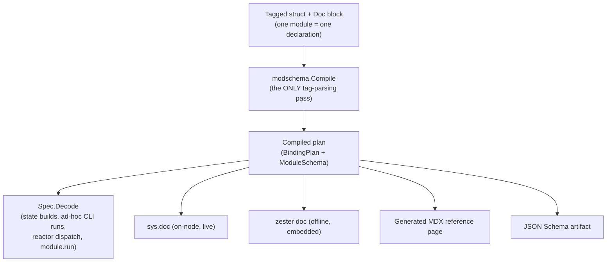

Every built-in module in Zester — all 47 state modules, every execution-module builtin, and any Starlark custom module that opts in — is described by exactly **one** schema declaration: a tagged Go struct plus a documentation block, compiled once at package init. That single declaration is the *only* thing that knows how to parse the module's parameters, and it is also the only thing that knows how to document them. There is no second place where a parameter's type, default, or behavior is described, so there is no place for the two to drift apart.

This document explains the framework as a system: what a schema declaration looks like, how it turns into runtime behavior and published documentation, why the parameter policy is strict by default, and the structural gates that keep it that way. For the day-to-day mechanics of writing or migrating a module, see `pkg/state/modules/CLAUDE.md` in the repository; the module reference pages themselves live under [Modules](/docs/guides/modules) and [Execution Modules](/docs/guides/execution-modules).

**Source**: `pkg/modschema`, `pkg/modschema/paramtypes`, `pkg/modschema/schematest`, `pkg/cliargs`, `pkg/moduledoc`, `cmd/zester-docgen`

---

## The problem this replaced

Before this framework, each module hand-rolled its own parameter extraction — a chain of `config["mode"].(string)`, `config["enable"].(bool)`, and similar type assertions, repeated with small variations across every module. Two classes of bug fell directly out of that pattern:

- **A reactor-dispatched `file.managed` with `mode: 0755` silently applied `0644`.** Zester's wire codec (`bus.Encode`/`bus.Decode`, MessagePack) returns integers as sized kinds by magnitude — `420` decodes as `uint16`, not `int` — and a legacy `config["mode"].(int)` assertion matched none of the unsigned kinds, so the value silently became the field's zero value instead of erroring or coercing.
- **The CLI's `key=value` parser delivers every value as a raw string**, so `enable=true`, `makedirs=true`, and `template=true` were silently ignored by any module still doing a bare `.(bool)` assertion — the flag looked accepted on the command line and did nothing.

Beyond correctness, every module's documentation — the parameter table, the accepted types, the examples — was a hand-maintained page that nobody was forced to keep in sync with the code. Both problems have the same root cause: the parameter contract lived in scattered, ad hoc code instead of one place a machine could read.

## One schema declaration per module

A migrated module's Go struct **is** its own schema proto — the same type that holds the module's runtime parameters also carries the `zester:"..."` tags the framework compiles. There is no separate "config struct" and no map-normalizing wrapper standing between them:

```go
type PkgRemoved struct {
    id   string          // untagged — the framework skips it
    reqs state.Requisites // untagged — skipped

    // The tagged, exported field IS the module's one parameter declaration.
    Package string `zester:"name,primary" usage:"package to remove (defaults to the state ID)"`

    pkg exec.PackageExec // injected provider — untagged, skipped
}
```

Untagged fields — the state ID, requisites, injected execution-layer providers, revert memos — are invisible to the compiler; only exported fields carrying a `zester:"..."` tag are parameters. The tag grammar covers everything a parameter needs to say about itself:

| Option | Meaning |
|---|---|
| `primary` | Falls back to the state ID when every source key is absent or empty (at most one per module) |
| `aliases=a\|b` | Additional accepted keys, tried in order after the canonical name |
| `required` | A missing value is a typed error, not a silent zero |
| `default=LIT` | An **eager** default, decoded through the field's own decoder at *compile* time — an invalid default literal fails the build, never a live run |
| `lazy` | The default is documented but never materialized here; the module resolves it at use time (e.g. `file.managed`'s `mode` defaults to `0644`, but only the module knows *when* to apply that) |
| `sensitive` | The value is redacted everywhere the parameter is ever rendered (see below) |
| `zester:"-"` | Skip this field entirely |

Alongside the struct, a module registers one `Doc` block — summary, a CommonMark description, per-phase effects prose, examples, notes, and any behavioral-difference IDs — compiled together with the struct into a `modschema.Spec`:

```go
var pkgRemovedSpec = mustSpec("pkg.removed", modschema.KindState, PkgRemoved{}, modschema.Doc{
    Summary: "Ensure a system package is not installed.",
    Effects: modschema.Effects{
        Check:  "Queries the provider whether the package is installed...",
        Apply:  "Removes the package through the detected manager...",
        Revert: "Cannot restore the package: the removed version is not recorded...",
    },
    Examples: []modschema.Example{ /* ... */ },
    SeeAlso: []string{"pkg.installed"},
})
```

`mustSpec` compiles this exactly once, at package init, and panics on a bad declaration — a mistagged field or an invalid default is a programming error caught the moment the binary starts, not a fact discovered by a user at run time.

## Compile once, decode from the plan

`modschema.Compile` is the framework's **only** tag-parsing pass. It walks the struct once and produces a `BindingPlan` — for every field, its canonical name, its aliases, whether it dispatches to a primitive coercion or a named semantic type, its pre-decoded default, and its required/lazy/primary/sensitive flags — plus a derived `ModuleSchema` view for documentation and JSON Schema. Every consumer reads that same compiled plan:



Decoding itself is **transactional**: a config map is decoded into a scratch instance, and the caller's real destination is written only once every field has succeeded. A decode that fails midway leaves the destination completely untouched, so retrying against the same instance is always safe — there is no such thing as a partially-applied parameter set.

Coercion follows a fixed, origin-independent table — the same rules apply whether a value arrived from a YAML file, a CLI `key=value` token, or a msgpack-encoded reactor dispatch. A string coerces to a bool by recognizing `true/yes/1/on` and `false/no/0/off` (case-insensitively); an int accepts every sized integer kind (including the msgpack `uint16` that used to defeat `mode: 0755`) and base-10 numeric strings; a float accepts any finite numeric kind. This single table is what fixed both bugs described above: the sized-int case is now handled explicitly, and the CLI's string delivery goes through the identical bool/int coercion as every other origin.

## The sealed semantic-type vocabulary

Some parameters aren't plain primitives — they're small, well-defined pieces of domain logic: a file mode that might arrive as an octal string or an integer with a distinct "was this ever set" question; a three-valued flag where "unset" must be distinguishable from "false". Zester gives these a closed, deliberately small vocabulary of **semantic types**, defined once in `pkg/modschema/paramtypes` and never inline in a module:

| Type | Represents | Key accessors |
|---|---|---|
| `FileMode` | Octal-string or integer file modes, including setuid/sticky bits | `Declared()`, `Mode()`, `Resolve(default)`, `Equal(m)` |
| `TriState` | A three-valued boolean — unset is distinct from false | `Declared()`, `Value()`, `ValueOr(default)` |
| `GroupRef` | A group by numeric GID *or* by name | `Declared()`, `IsGID()`, `GID()`, `Name()` |
| `TemplateFlag` | A `template:` flag — bool, the literal `"jinja"`, or a truthy string | `Declared()`, `Enabled()` |
| `StringList` | `string \| []string \| []any`, with scalar elements stringified and nested elements rejected | it *is* a `[]string` |
| `StringMap` | A map with scalar values stringified and composite values rejected | it *is* a `map[string]string` |

The vocabulary is **sealed**: `SemanticType` declares an unexported method that only the `paramtypes` package can implement, so no module — inside Zester or in a third-party fork — can define an ad hoc semantic type inline. A field whose Go type isn't a primitive and isn't a registered semantic type fails to compile the schema at all. Every type also owns its `Declared()` bit: an *absent* parameter never even reaches a semantic type's `Decode` (its zero value already means "undeclared"), which is what lets `service.dead` distinguish "the operator said nothing about `enable`" from "the operator explicitly set it to false" — the exact distinction the old `Enable bool` / `hasEnable bool` field-pair pattern existed to fake.

Adding a genuinely new semantic type is a `paramtypes`-only change (implement the interface, register it, add its fixtures); it is never something an individual module reaches for on its own.

## Validation is Decode's rejection contract

There is no separate `Validate()` method to remember to call and no second place validation logic can live: a schema's validation *is* whatever `Decode` accepts or rejects, and that same behavior is what the generated JSON Schema constraints describe. A rejected value produces a typed `FieldError` carrying the module, the parameter, the offending key, one of three error kinds (`MissingRequired`, `WrongType`, `ValueInvalid`), and — for anything but a `sensitive` field — the offending value for a useful error message. An unrecognized key produces a typed `UnknownKeyError` naming the module, the key, and a nearest-match suggestion (edit distance ≤ 2), so a typo reads as `unknown parameter "nmae" (did you mean "name"?)` rather than a silently-ignored no-op.

Parameters marked `sensitive` (currently `user.present.password`) are redacted everywhere a value could otherwise leak: the `FieldError` itself, every wrapped cause in its error chain, decode-report warnings, the JSON Schema (`writeOnly: true`), and every rendered surface (generated pages, `sys.doc`, `docdata.json`). A sensitive field's default is never rendered and never appears in a generated example.

## Strict by default: the unknown-parameter policy

Because every built-in state module now decodes through a compiled schema, the peel can enforce a policy on parameters it doesn't recognize — and it does, by default. The `strict_params` peel setting (`peel.yaml` `strict_params:` / `--strict-params`, **default `true`**) controls whether an unrecognized parameter on a migrated module fails the build (`PolicyError`) or only logs a warning and continues (`PolicyWarn`, the historical, permissive behavior). With the default in effect, `pkg.removed` configured with `nmae: telnet` fails loudly instead of silently removing whatever the state ID happened to name.

The same policy object is threaded through **every** decode path uniformly — compiled highstates, ad-hoc `zester '<target>' <module> ...` runs, `module.run` forwarding, reactor `dispatch.module` actions, and Starlark custom modules that declare a `PARAMS` dict — so there is exactly one place the fleet's tolerance for typos is decided, not one policy per entry point.

Strictness never trips over keys that are genuinely not module parameters. A fixed, single-source-of-truth set of reserved keys is always excused, regardless of policy:

- **Requisites** — `require`, `watch`, `onchanges`, `onfail`
- **Generic state attributes** — `onlyif`, `unless`, `order`, `retry`, `failhard`, `prereq`
- **Compiler-only directives** — `names`, `listen`, and the `_in` inverse forms (`require_in`, `watch_in`, `onchanges_in`, `onfail_in`, `listen_in`, `prereq_in`)
- **The exec-layer dry-run flag** `test` (an ad-hoc run or reactor dispatch passes the whole argument map straight to the builder, `test=True` included)
- **The Salt universal state-identifier idiom** `name` — Salt lets *any* state declare `name:` as a human-readable label independent of what it actually manages (`test.nop: - name: anchor` is valid Salt even though `test.nop` has no `name` field at all). The peel excuses this key fleet-wide, exactly like `test` above.

These stay present in a state's config map right up to build time — the runner, the compiler, and the generic-attribute wrapper consume them *after* the module builder runs — so a module builder must never try to interpret them itself; the framework already excuses them from unknown-key checking on the module's behalf.

The `name` exclusion deserves its own note, because it is the one entry on this list that is *also* a real, commonly-declared parameter: most modules' primary parameter canonical name **is** `name` (`file.managed`, `pkg.removed`, …), so for them an explicit `name:` is consumed as that parameter long before the reserved-key excuse is ever consulted — a module's own declared fields always win first. The reserved-key entry only ever comes into play for a module, like `test.nop`, that declares no `name` field of its own; only then does the framework fall back to excusing the key instead of rejecting it as unknown. This ordering is why the exclusion is safe to apply unconditionally: it can loosen strictness for an undeclared decoration key, but it can never mask a genuine typo of a parameter a module actually has.

## One schema, five faces

The same compiled plan is the source for every way a module's documentation surfaces, so there is exactly one prose to keep accurate:

- **`sys.doc`** — an on-node command (`zester '<target>' sys.doc [module]`) that renders live documentation from whatever schemas the connected peel actually has registered. It runs on the peel's read-only fast path, so it answers even mid-highstate.
- **`zester doc`** — an offline CLI command reading `pkg/moduledoc`'s embedded `docdata.json` (generated ahead of time by `zester-docgen`), so it works on a peel-only box with no reachable master. It renders through the exact same text renderer `sys.doc` uses, and a pinned test (`TestDocdataMatchesLive`) asserts the embedded copy is byte-identical to what a live daemon would produce.
- **Generated reference pages** — one MDX page per module under [Modules](/docs/guides/modules) and [Execution Modules](/docs/guides/execution-modules), regenerated by `cmd/zester-docgen` from the live registries.
- **The combined JSON Schema artifact** — `/schema/zester-modules.schema.json` (see below).
- **`docdata.json`** — the embedded data file backing `zester doc`, generated in the same pass.

Every one of these five faces is a *rendering* of the same `ModuleInfo` (fields, aliases, types, effects, examples, notes, divergences); none of them re-derives anything from a module's source code independently.

## The editor JSON Schema

`cmd/zester-docgen` also emits a single combined JSON Schema document at `website/public/schema/zester-modules.schema.json` — published at `/schema/zester-modules.schema.json` — written to JSON Schema draft 2020-12. It describes a Zester state file as an object mapping state IDs to exactly one module name to that module's parameters:

- Every module with a compiled schema gets its own entry under `$defs.modules.<module-name>`, built from the same `ModuleSchema` used for the reference pages — required parameters, per-field types, and descriptions all included.
- Every semantic type actually used by a migrated module gets **one shared** `$defs.semanticTypes.<Type>` entry; a module referencing `TriState` in three fields references the same `$def` three times rather than inlining three copies of its schema.
- A module absent from `$defs.modules` (not yet migrated, or an operator's own Starlark module with no declared `PARAMS`) is deliberately left unconstrained — the artifact only ever adds constraints as more modules gain schemas, and never rejects a state file it doesn't yet understand.

Point an editor or a YAML-aware CI linter that understands `$schema`/`$id` references at this file to get real-time parameter validation and autocompletion while authoring `.zy` state files. Treat it as a **structural** approximation of the decode contract, not a byte-for-byte restatement of it: it describes representations and per-field constraints — types, required-ness, enum-shaped semantic types — accurately, because those are exactly what `ModuleSchema` derives from the same compiled plan `Decode` executes. But `Decode`, not the schema, remains the actual enforcement authority. A few things the schema structurally cannot express: cross-field rules a module's own builder-tail logic enforces (a value only valid in combination with another field), the exact source-resolution order between a primary and its aliases, and the `,omitempty`-driven distinction between "absent" and "explicitly zero" that some semantic types (`TriState`) rely on. An editor catching a schema violation is a fast, useful signal; a peel accepting the same document at decode time is still the last word.

## Contract fixtures: permanent behavioral guards

Every migrated module ships a `testdata/contract/<module>.yaml` file: a table of cases, each pinning either an expected decoded-field projection (an *accept* case) or an expected error kind (a *reject* case), replayed across however many of the three input universes — YAML, CLI `key=value` tokens, and msgpack — are relevant to that case. These aren't synthetic checks against a mocked decoder: the YAML leg runs the real `yaml.v3` unmarshaler the settings pipeline uses, the CLI leg runs the real, relocated `pkg/cliargs.ParseKeyValues`, and the msgpack leg is always mechanically derived by round-tripping the YAML-parsed value through `bus.Encode`/`bus.Decode` — hand-written msgpack fixtures are disallowed specifically because a hand-picked `int64` literal would never exercise the sized-kind bug this whole framework exists to fix.

While a module was mid-migration, these fixtures were *differential*: a harness ran the legacy hand-rolled parser and the new compiled schema side by side over the same input and asserted they agreed, except where a difference was deliberately declared (see below). Once a module's legacy parser is deleted, the exact same fixture file becomes a **permanent regression guard** — `schematest.RunContract` replays it against the new decoder forever, so the differential proof that migration didn't change behavior survives without keeping the old, unused parsing code around.

### Behavioral differences (BD-IDs)

A small number of migrations *did* deliberately change behavior — always in the direction of honoring a value the legacy parser silently dropped or mishandled, never the reverse. Each one carries a stable ID (BD-1 through BD-8 at the time of writing — for example, BD-1 is the msgpack sized-int fix and BD-2 is the CLI truthy-string fix described above), is called out in the module's `Doc.Divergences`, gets a CHANGELOG entry describing the user-visible change, and is pinned by its own dedicated fixture — **per parameter**, not once per module. If a module has three boolean-typed parameters, each one gets its own declared-int-one / declared-int-zero / invalid-int fixture pair across both YAML and msgpack; a code comment claiming "this parameter follows the same pattern as that one" is explicitly not accepted as a pin.

## How drift is structurally prevented

The framework's central claim — that documentation cannot drift from behavior — rests on a handful of enforced facts, not on discipline alone:

1. **There is only one tag-parsing pass.** `Compile` runs once per module at package init; `Decode`, `sys.doc`, `zester doc`, the generated page, and the JSON Schema all read the *same* compiled plan object. There is no second interpretation of a module's tags that could disagree with the first.
2. **Generated artifacts are checked, not just generated.** CI runs `go run ./cmd/zester-docgen` and then requires `git diff --exit-code` against `website/` and `pkg/moduledoc` to be empty — a pull request that edits a module's `Doc` or parameter struct without regenerating its page, meta.json entry, schema fragment, or `docdata.json` fails CI, not just review.
3. **The doc-coverage gate has no exemptions.** `TestDocCoverage_EveryModuleHasSpec` asserts every registered built-in state module carries a `modschema.Spec` — there used to be an allowlist of not-yet-migrated modules; it was deleted once the last two modules migrated, and the test is now in its final, closed form. A module registered without a spec fails the build outright.
4. **The offline copy is pinned equal to the live copy.** `TestDocdataMatchesLive` asserts the embedded `docdata.json` `zester doc` reads matches exactly what a live `sys.doc` would produce from the same registries, so the two can never quietly diverge.
5. **Package boundaries are pinned, not just conventional.** An architecture test asserts (via `go list -deps`) that, for example, `pkg/modschema` never imports `pkg/state` or anything under `internal/`, and `pkg/modschema/paramtypes` never imports `pkg/modschema` — keeping the framework generic and the semantic-type vocabulary from picking up module-specific assumptions.

## Where the pieces live

| Package | Role |
|---|---|
| `pkg/modschema` | The framework itself: tag compiler, `BindingPlan`, transactional `Decode`, `Spec`, `ModuleInfo`/`RenderText`, unknown-key policies |
| `pkg/modschema/paramtypes` | The sealed semantic-type vocabulary (`FileMode`, `TriState`, `GroupRef`, `TemplateFlag`, `StringList`, `StringMap`) |
| `pkg/modschema/schematest` | The differential-testing harness: real-ingress adapters, the `TypeFixture`/contract-fixture runners |
| `pkg/cliargs` | The relocated CLI `key=value` parser — the same code path the operator CLI uses, exercised directly by the test harness |
| `pkg/moduledoc` | The embedded, offline documentation source backing `zester doc` |
| `cmd/zester-docgen` | Generates the MDX reference pages, the modules `meta.json`, the combined JSON Schema, and `docdata.json` from the live registries |
| `pkg/state`, `pkg/state/modules` | State modules register their `Spec` alongside their builder; `pkg/state` exports the reserved-key union the compiler and the decode policy both consume |
| `pkg/execmod` | Execution-module builtins carry the same kind of `Spec` (`Kind: exec`) |
| `pkg/starmod` | Starlark custom modules opt into a `Spec` by declaring a `PARAMS`/`<fn>_params` dict; a module without one stays an open, arbitrary-parameter passthrough |

For the module-author's how-to — the checklist for adding or migrating a module, the exact builder-tail conventions, and the per-parameter fixture discipline — see `pkg/state/modules/CLAUDE.md` in the repository. For Starlark's own authoring convention see the [Starlark custom modules guide](/docs/guides/modules/starlark).
