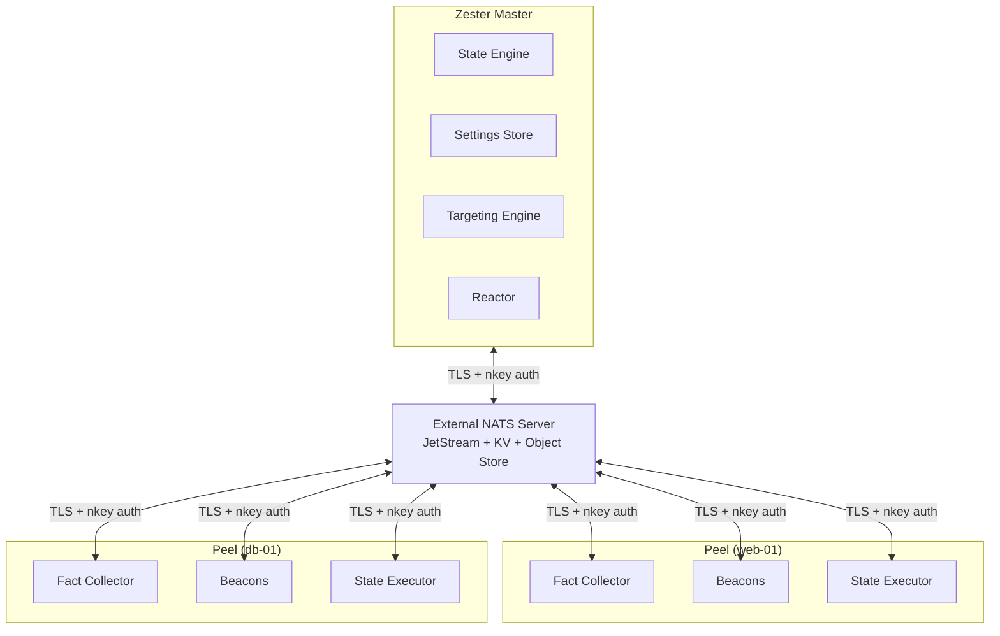
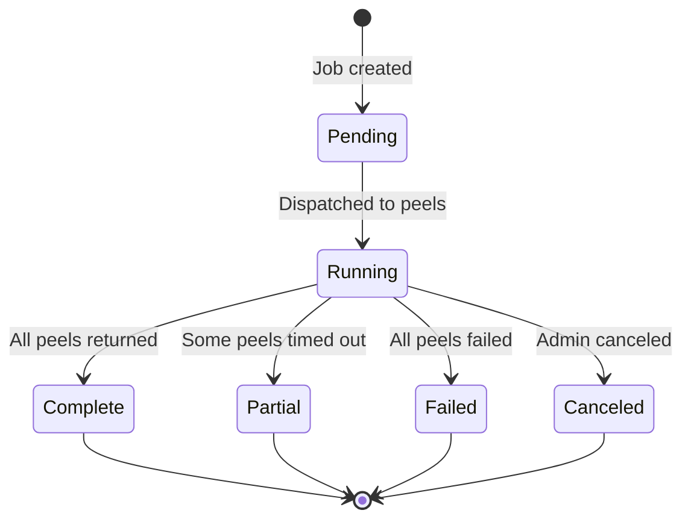

---

## Concept Map



---

## Master

**Salt equivalent:** Salt Master

The master is the central control plane. It connects to an **external NATS server** with JetStream enabled as a client. The master process handles:

- **Targeting** — resolving which peels should receive a command
- **State rendering** — compiling `.zy` state files with templates and settings
- **Settings distribution** — delivering per-peel configuration data
- **Job tracking** — monitoring state.apply progress and collecting results
- **Reactor** — responding to events from peels

The master connects to the NATS server (default `tls://nats:4222` — plaintext `nats://` URLs are rejected at startup). All communication passes through NATS, encrypted with TLS 1.3.

```
zester-master --nats-url tls://nats:4222
```

Multiple masters can run against the same NATS server: work like job dispatch and target resolution is load-balanced across them, while file publishing is coordinated through advisory leader leases. See [Master Configuration](/docs/reference/configuration/master#multi-master-coordination).

<Callout type="info" title="External NATS Server">
Zester requires an external NATS server with JetStream enabled. For development, a single NATS server is sufficient. For production at scale, deploy a 3+ node NATS cluster with RAFT consensus for high availability.
</Callout>

---

## Peel

**Salt equivalent:** Minion

A peel is the agent that runs on each managed node. It connects to the NATS server, publishes its facts, and listens for commands. Each peel:

- Collects **facts** about the local system (OS, CPU, memory, network, etc.)
- Publishes facts to NATS KV for instant master-side queries
- Listens for **state.apply** commands on its dedicated NATS subject
- Executes states locally and reports results back through NATS
- Runs **beacons** to monitor local conditions and emit events

A peel keeps working through control-plane outages: it boots offline-first from its cached state files and last-known-good settings snapshot, and its scheduler keeps enforcing until the NATS connection returns. While connected, it writes a liveness heartbeat every 10s (this is what `zester peel list` reports as ONLINE).

Peels authenticate using NATS credentials files (`.creds`) that contain a signed JWT and an nkey seed.

```
zester-peel --id web-01 --nats-url tls://nats:4222
```

<Callout type="success" title="Why 'peel'?">
Salt -> Zest -> Zester. A zester is a kitchen tool that peels citrus. Each managed node is a peel.
</Callout>

---

## Facts

**Salt equivalent:** Grains

Facts are local system information collected by the peel. They describe **what** a machine is: its OS, architecture, CPU count, memory, network interfaces, disk mounts, and custom user-defined data.

### Built-in Fact Collectors

| Collector | Data Collected |
|---|---|
| `os` | OS name, version, architecture, kernel |
| `network` | IP addresses, interfaces, MACs, hostname, FQDN |
| `cpu` | Count, model, features |
| `memory` | Total, available |
| `disk` | Mounts, sizes |
| `defaultip` | Outbound IPv4 detection |
| `custom` | User-defined facts from `/etc/zester/facts` |

### How Facts Are Stored

Unlike Salt, which stores grains in master memory and requires fan-out queries to refresh them, Zester stores facts in **NATS KV**:

```
KV Bucket: "facts"
Key: <peel-id>
Value: { "os": "linux", "arch": "amd64", "cpu_count": 4, ... }
```

This means:

- The master reads any peel's facts **instantly** from KV (no round-trip)
- KV history tracks fact changes over time
- Facts survive master restarts
- No equivalent of `salt '*' grains.items` fan-out is needed

### Custom Facts

Define custom facts as static values or shell commands:

```yaml title="/etc/zester/facts/app.yaml"
app_version:
  cmd: "/opt/myapp/bin/version"
  interval: 5m
datacenter:
  value: "us-east-1"  # static fact
```

---

## Settings

**Salt equivalent:** Pillars

Settings are secure, per-peel configuration data resolved on each peel from master-published templates and encrypted secrets. They are the mechanism for pushing configuration values — database passwords, API keys, feature flags — to the nodes that need them.

### Structure

```
/srv/zester/settings/
  top.zy              # targeting map
  common/
    base.zy
  webservers/
    nginx.zy
    certs.zy
```

### Targeting with top.zy

The `top.zy` file maps which peels receive which settings, using the same targeting expressions as the CLI:

```yaml title="/srv/zester/settings/top.zy"
base:
  '*':
    - common.base
  'role:webserver':
    - webservers.nginx
    - webservers.certs
```

### Encryption

Settings use a multi-layer encryption model:

1. **TLS 1.3** encrypts all data in transit
2. **NATS subject permissions** ensure peels can only read their own settings
3. **NaCl box encryption** (X25519 + XSalsa20-Poly1305) protects individual sensitive fields

Sensitive values can be double-encrypted per-peel:

```yaml
db_password: !encrypted |
  ENC[nkey,AQFz8r3...]  # only the target peel can decrypt
```

---

## States

**Salt equivalent:** States

States are declarative definitions of desired system configuration. They describe **what** the system should look like, and Zester figures out **how** to get there.

State files use the `.zy` extension and support Gonja templating:

```yaml title="/srv/zester/states/nginx/init.zy"


nginx_package:
  pkg.installed:
    - name: nginx

nginx_config:
  file.managed:
    - path: /etc/nginx/nginx.conf
    - content: |
        worker_processes {{ workers }};
    - mode: "0644"
    - require:
      - pkg.installed:nginx_package
```

### Execution Model

Each state module implements a two-phase approach:

1. **Check** — Read-only inspection of current state. Determines if there is drift.
2. **Apply** — Enforce the desired state. Only runs if Check detected drift.

This makes every state execution **idempotent**: running the same state twice produces the same result. Modules also implement a **Revert** phase to undo applied changes, and any run can be executed as a dry run (`--test` or `test=True`) that reports pending changes without applying them.

### Built-in State Modules

| Module | Purpose |
|---|---|
| `pkg.installed` / `pkg.latest` / `pkg.removed` / `pkg.purged` | Package management (apt, yum, dnf, brew) |
| `file.managed`, `file.directory`, `file.line`, `file.replace`, ... | File management (content, permissions, surgery on existing files) |
| `cmd.run` | Command execution |
| `service.running` / `service.dead` / `service.enabled` | Service management |
| `user.*`, `group.*`, `cron.*`, `git.*`, `archive.extracted`, ... | Users, groups, cron entries, Git checkouts, archives, and more |

See the [Module Reference](/docs/guides/modules) for the complete list with parameters.

### Dependencies

States support dependency ordering with `require` (plus the full Salt requisite set: `watch`, `onchanges`, `onfail`, `prereq`, `listen`, and their `_in` forms):

```yaml
nginx_config:
  file.managed:
    - path: /etc/nginx/nginx.conf
    - source: /srv/zester/files/nginx.conf
    - require:
      - pkg.installed:nginx_package  # package must be installed first

reload_nginx:
  cmd.run:
    - command: systemctl reload nginx
    - require:
      - file.managed:nginx_config  # config must be deployed first
```

Dependencies are resolved into a DAG (directed acyclic graph) and executed with maximum parallelism where possible.

---

## Jobs

Jobs are the tracking mechanism for commands dispatched to peels. Every `state.apply`, `cmd.run`, or other remote execution creates a job with a unique ID.

### Job ID (JID)

Zester uses **KSUIDs** (K-Sortable Unique IDs) for job tracking. KSUIDs are timestamp-sortable and globally unique without coordination:

```
2oHfKnCPMQnLEYQeBQsNtUiJp3r
```

### Job Lifecycle



### Job Storage

Jobs and their returns are stored in NATS KV:

| KV Bucket | Key Format | Content |
|---|---|---|
| `jobs` | `<jid>` and `active.<jid>` | Job spec, target, state, timestamps; plus a tiny active-jobs index entry per in-flight job |
| `job-returns` | `<jid>.<peel-id>` | Per-peel results, written incrementally (scheduler results are stored the same way) |

This replaces Salt's need for an external returner database — job history is built in.

### CLI

```bash
zester job list                  # list recent jobs
zester job show <jid>            # job detail with per-peel returns
zester job active                # currently running jobs
zester job kill <jid>            # cancel a running job
```

---

## Basket

**Salt equivalent:** Mine

Basket enables peel-to-peel data sharing. A peel publishes data to NATS KV, and other peels (or the master) read it directly.

### How It Differs from Salt Mine

In Salt, mine data is proxied through the master. In Zester, basket data is stored in NATS KV and read directly — no master bottleneck.

```
KV Bucket: "basket"
Key: <peel-id>.<function-name>
Value: result data
```

### Usage

```bash
# Get basket data from peels matching a target
zester basket get 'role:webserver' network.ip_addrs

# List all basket keys for a peel
zester basket list web-01
```

In templates:

```jinja

  allow {{ peel.value }};

```

---

## NATS as the Backbone

Unlike Salt's custom ZeroMQ-based event bus, Zester builds on [NATS](https://nats.io/) — a production-grade messaging system. NATS provides:

| Capability | What It Replaces |
|---|---|
| **Pub/Sub** | Salt's ZeroMQ event bus |
| **JetStream** | External returner databases, event persistence |
| **KV Store** | Fact storage, job tracking, settings distribution |
| **Request/Reply** | Salt's custom RPC protocol |
| **Clustering** | Salt syndic chains |
| **Leaf Nodes** | Salt syndic (multi-tier / edge relay) |
| **Subject Permissions** | Custom authorization logic |

### Subject Hierarchy

All Zester communication follows a structured NATS subject hierarchy:

```
zester.cmd.<target>              # Master -> Peel commands
zester.event.<peel-id>.>         # Peel -> Master events (event.send, beacons)
zester.event._master.>           # Master-synthesized events
zester.event._admin.send.>       # Operator events (zester event send)
zester.fact.<peel-id>            # Fact data publish/sync
zester.dispatch                  # CLI -> Master job dispatch
zester.basket.<key>              # Basket data sharing
zester.job.<jid>                 # Job tracking and returns
zester.reactor.test              # Reactor rule dry-runs (request/reply)
```

---

## nkeys for Identity

**Salt equivalent:** Salt Keys (RSA)

Zester uses **nkeys** — Ed25519-based identity keys native to NATS — instead of Salt's RSA key exchange.

### Three-Tier Trust Hierarchy

```
Operator (root of trust for the organization)
  Account: "production"
    User: peel-web-01    (nkey: UABC...)
    User: peel-web-02    (nkey: UDEF...)
    User: master-01      (nkey: UGHI...)
  Account: "staging"
    User: peel-stg-01    (nkey: UJKL...)
```

Each tier issues signed JWTs for the tier below:

- **Operator** signs Account JWTs
- **Account** signs User JWTs
- **User** (peel) authenticates with nkey challenge-response

<Callout type="info" title="No key files on the master">
Unlike Salt, where the master stores every minion's public key in `/etc/salt/pki`, the NATS server validates JWT signatures against the operator trust chain. Account admins can onboard peels without touching the master configuration.
</Callout>

### Key Advantages over Salt Keys

| Salt Keys | Zester nkeys |
|---|---|
| RSA (slow, large keys) | Ed25519 (fast, 32-byte keys) |
| Manual `salt-key --accept` | Automated via JWT signing chain |
| Keys stored on master filesystem | JWT chain verified at connection time |
| Single trust boundary | Account isolation (prod vs staging) |
| AES session key negotiation | TLS 1.3 handles encryption |

---

## Beacons and Reactor

**Salt equivalent:** Beacons and the Reactor system

**Beacons** monitor local conditions on peels and emit events to `zester.event.<peel-id>.beacon.<name>`. v1 ships the **service** beacon (running-state transitions of configured services, set up via the settings pipeline's `beacons:` key); the full Salt beacon set (disk usage, file watch, load, ...) is planned.

**Reactor** consumes events on the master and triggers automated responses: rules in `reactor/top.zy` match events by `<origin>/<tag>` keys and run Jinja-rendered reaction files that dispatch jobs, approve enrollments, chain further events, or log. Events are persisted in the `events` JetStream stream, so they replay after master downtime, and all reaction side effects are deduplicated (deterministic reaction job IDs) so redeliveries are exactly-once.

Peels and operators can also emit custom events: `zester 'web-01' event.send myco/deploy/finished version=1.2.3` (peel origin) or `zester event send myco/deploy/finished` (operator origin). See the [Reactor guide](/docs/guides/reactor).

---

## Summary

| Concept | Salt Name | Purpose | Storage |
|---|---|---|---|
| **Master** | Master | Control plane, NATS client | — |
| **Peel** | Minion | Managed node agent | — |
| **Facts** | Grains | Local system info | NATS KV (`facts`) |
| **Settings** | Pillars | Per-peel configuration | NATS KV (`settings-files`, `secrets`) |
| **States** | States | Desired-state definitions | Filesystem (`.zy` files) |
| **Jobs** | Jobs | Command tracking | NATS KV (`jobs`, `job-returns`) |
| **Basket** | Mine | Peel-to-peel data | NATS KV (`basket`) |
| **Beacons** | Beacons | Peel-side monitoring (v1: service beacon) | Events via JetStream (`events` stream) |
| **Reactor** | Reactor | Event-driven automation | JetStream (`events` stream, `reactor-files` KV) |

---

## Next Steps

- **[Architecture](/docs/architecture)** — Deep dive into the NATS message bus, security model, and scaling architecture.
- **[Authentication](/docs/reference/authentication)** — Understand the full nkey and JWT hierarchy.
- **[States](/docs/guides/states)** — Learn to write production-grade state files.
