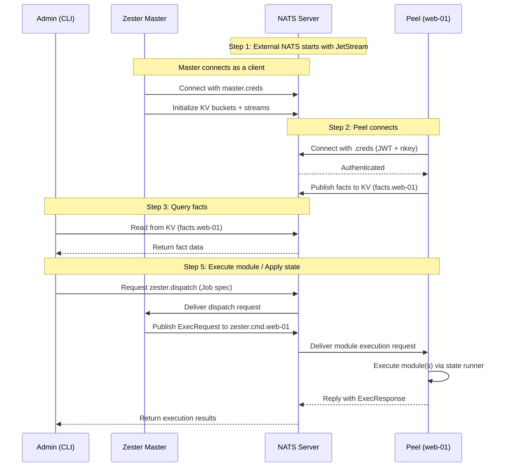

---

## Docker Compose Playground

The fastest way to try Zester. No manual setup required — Docker Compose handles auth bootstrap, NATS server, and peel agents automatically.

### Start the Cluster

```bash
git clone https://github.com/ptorbus/zester.git
cd zester
docker compose up -d
```

Wait a few seconds for all services to start. Verify everything is running:

```bash
docker compose ps
```

You should see `nats`, `master`, `web-01`, `web-02`, `db-01`, and `admin` running (plus `init` which exits after bootstrapping).

### Enroll the Peels

The playground demonstrates the full enrollment flow. Peels start without credentials and auto-enroll via the master's HTTPS enrollment API. An admin must approve each enrollment before the peel can connect to NATS.

List pending enrollments (wait ~10 seconds for peels to submit requests):

```bash
docker compose exec admin zester enroll list --state pending
```

```
ID              PEEL ID  HOSTNAME  STATE    CREATED
enr-2abc...     web-01   -         pending  2026-02-10 12:00:00
enr-3def...     web-02   -         pending  2026-02-10 12:00:01
enr-4ghi...     db-01    -         pending  2026-02-10 12:00:01
```

Approve all pending enrollments at once with the convenience script:

```bash
docker compose exec admin sh /playground/auto-approve.sh
```

Or approve individually:

```bash
docker compose exec admin zester enroll approve enr-2abc...
```

Wait ~15 seconds for peels to download credentials and connect, then verify:

```bash
docker compose exec admin zester enroll list --state active
```

### Run Commands (Salt-Style)

Once peels are active, use `zester` from the `admin` container to run modules against peels:

```bash
# Run a command on a single peel
docker compose exec admin zester 'web-01' cmd.run 'uptime'
```

```
web-01:
    cmd.run:
        name: cmd.run:ad-hoc
        command: uptime
        stdout: 16:35:51 up 6 days, 16:29,  0 users,  load average: 0.59, 0.23, 0.13
        stderr:
        exitcode: 0
        changed: true
        duration: 1.12ms
```

```bash
# Run a command on ALL peels using glob targeting
docker compose exec admin zester '*' cmd.run 'hostname'
```

```
web-01:
    cmd.run:
        name: cmd.run:ad-hoc
        command: hostname
        stdout: 598b2d65c935
        ...
db-01:
    cmd.run:
        ...
web-02:
    cmd.run:
        ...
```

```bash
# Target only web peels with a glob
docker compose exec admin zester 'web*' cmd.run 'whoami'
```

### Apply a State

Apply the included `hello` state, which creates a file on the target peel:

```bash
docker compose exec admin zester 'web-01' state.apply hello
```

```
web-01:
    state.apply:
        name: file.managed:/tmp/hello-zester.txt
        path: /tmp/hello-zester.txt
        bytes: 129
        mode: 0644
        changed: true
        duration: 156.08us
```

Verify:

```bash
docker compose exec web-01 cat /tmp/hello-zester.txt
```

### Query Facts and Settings

Query peel facts directly (like Salt's `grains.*`):

```bash
# List all facts for a peel
docker compose exec admin zester 'web-01' facts.items

# Get a specific fact
docker compose exec admin zester 'web-01' facts.get os.family

# List fact namespaces
docker compose exec admin zester '*' facts.keys

# Ping all peels (liveness check)
docker compose exec admin zester '*' test.ping
```

Query resolved settings (like Salt's `pillar.*`):

```bash
# List all resolved settings for a peel
docker compose exec admin zester 'web-01' settings.items

# Get a specific setting
docker compose exec admin zester 'web-01' settings.get database.port
```

### Direct Module Execution

Execute any registered module directly without writing a state file:

```bash
# Create a file on db-01
docker compose exec admin zester 'db-01' file.managed /tmp/test.txt content="hello world" mode=0644

# Install a package (if available in the container)
docker compose exec admin zester 'web-01' pkg.installed curl
```

### Tear Down

```bash
docker compose down -v
```

<Callout type="success" title="Playground states and settings">
The playground ships with example states in `playground/states/` and settings in `playground/settings/`. These demonstrate file management, package installation, command execution, and role-based settings targeting.
</Callout>

---

## Manual Setup

The following steps walk through setting up Zester manually without Docker.

### Step 1: Start NATS and the Master

Zester requires an external NATS server with JetStream enabled. The master connects to NATS as a client.

### Generate the Auth Hierarchy

Zester uses a three-tier trust model: **Operator** (root of trust) signs **Account** JWTs, which sign **User** JWTs. For a quick start, generate the full chain at once:

```bash
mkdir -p /var/lib/zester/jetstream
mkdir -p /etc/zester
```

Start the NATS server with the generated configuration:

```bash
nats-server -c /etc/zester/nats-server.conf
```

The `nats-server.conf` configures the operator JWT, resolver, and JetStream storage. See [Authentication](/docs/reference/authentication) for details on generating this configuration.

Create the master configuration:

```yaml title="/etc/zester/master.yaml"
master:
  urls:
    - "nats://localhost:4222"
```

Start the master:

```bash
zester-master
```

Expected output:

```
INFO  connecting to NATS  url=nats://nats:4222
INFO  zester master ready
```

<Callout type="success" title="NATS URL">
The master connects to `nats://nats:4222` by default. Override this with the `--nats-url` flag or the `master.urls` config field.
</Callout>

---

## Step 2: Bootstrap a Peel

Peels authenticate to the master using NATS credentials files (`.creds`), which contain a signed JWT and an nkey seed.

### Generate a Peel Identity

On the peel machine (or on the same machine for testing), generate an nkey seed:

```bash
zester peel init
```

Expected output:

```
Public key: UABC1234DEFG5678HIJK9012LMNO3456PQRS7890TU
Seed:       SUAML5HKFGN7ROTPK3KRCOCPQWYIFZAMB6WS52V3FEZQIUZZSQFBRMCVG4

Save the seed to /etc/zester/peel.key and set permissions to 0600.
```

Or save the seed directly to a file:

```bash
zester peel init -o /etc/zester/peel.key
```

Expected output:

```
Peel nkey seed saved to: /etc/zester/peel.key
Public key: UABC1234DEFG5678HIJK9012LMNO3456PQRS7890TU
```

<Callout type="warn" title="Protect the seed">
The nkey seed is the peel's private identity. Keep it secure with `0600` permissions. Anyone with the seed can impersonate the peel.
</Callout>

### Create the Credentials File

There are two ways to provision peel credentials:

**Option A: Manual provisioning** — The account administrator creates a user JWT signed by the account key and packages it with the peel's nkey seed into a `.creds` file. The `BootstrapPeelCreds` function in `pkg/auth/creds.go` handles this in a single call. See [Authentication](/docs/reference/authentication) for details.

**Option B: Enrollment (recommended for production)** — Start the peel without a `.creds` file and use the [enrollment system](/docs/operations/enrollment) for automated, operator-approved credential provisioning. The peel will request enrollment via HTTPS, prove key ownership via challenge-response, and wait for an operator to approve before receiving credentials. See [Enrollment Architecture](/docs/architecture/enrollment) for the full design.

### Start the Peel

```bash
zester-peel --id web-01 --nats-url nats://nats-host:4222
```

The peel loads its credentials from `/data/auth/<peel-id>.creds` automatically.

Expected output:

```
INFO  connecting to NATS  peel=web-01 url=nats://nats-host:4222
INFO  publishing facts
INFO  zester-peel ready  peel=web-01
```

### Verify the Connection

From the master or any machine with CLI access, list connected peels:

```bash
zester peel list
```

Expected output:

```
PEEL ID   OS      ARCH    LAST SEEN
web-01    linux   amd64   connected
```

---

## Step 3: Collect Facts

Facts are the peel's local system information — analogous to Salt grains. They are automatically collected on peel startup and stored in NATS KV.

### Query All Facts

```bash
zester kv fact get web-01
```

Expected output:

```json
{
  "os": "linux",
  "arch": "amd64",
  "hostname": "web-01",
  "fqdn": "web-01.example.com",
  "cpu_count": 4,
  "memory_total": 8589934592,
  "kernel": "6.1.0",
  "network": {
    "interfaces": ["eth0", "lo"],
    "ip_addrs": ["10.0.1.5", "127.0.0.1"]
  }
}
```

### Query a Specific Fact

Use dot notation to drill into nested values:

```bash
zester kv fact get web-01 network.ip_addrs
```

Expected output:

```json
["10.0.1.5", "127.0.0.1"]
```

<Callout type="info" title="No fan-out required">
Unlike Salt's `salt '*' grains.items`, Zester reads facts directly from NATS KV. No round-trip to the peel is needed.
</Callout>

---

## Step 4: Write Your First State

State files define the desired state of your infrastructure. They use the `.zy` extension and support Gonja (Jinja2-compatible) templating.

### Create the State Directory

```bash
mkdir -p /srv/zester/states/hello
```

### Write a Simple State

```yaml title="/srv/zester/states/hello/init.zy"
# A simple state that creates a file on the peel.

/tmp/hello-zester.txt:
  file.managed:
    - content: |
        Hello from Zester!
        Hostname: {{ facts.hostname }}
        OS: {{ facts.os }}
        CPU count: {{ facts.cpu_count }}
    - mode: "0644"
    - makedirs: true
```

This state uses the `file.managed` module to create a file on the target peel. The `{{ facts.* }}` variables are populated from the peel's collected facts.

<Callout type="success" title="Template syntax">
Zester uses [Gonja](https://github.com/nikolalohinski/gonja), which supports the same syntax as Jinja2: `{{ variables }}`, ``, ``, and `{{ value | filter }}`.
</Callout>

---

## Step 5: Apply the State

### Target and Apply (Salt-Style)

Apply the state using the Salt-like direct execution syntax:

```bash
zester 'web-01' state.apply hello
```

Expected output:

```
web-01:
    state.apply:
        name: file.managed:/tmp/hello-zester.txt
        path: /tmp/hello-zester.txt
        bytes: 129
        mode: 0644
        changed: true
        duration: 156.08us
```

### Run Ad-Hoc Commands

You can also run modules directly without a state file:

```bash
# Run a command
zester 'web-01' cmd.run 'uptime'

# Create a file directly
zester 'web-01' file.managed /tmp/test.txt content="hello" mode=0644
```

### Target Multiple Peels

Use glob patterns to target multiple peels at once:

```bash
# Glob: all peels starting with "web"
zester 'web*' state.apply hello

# All peels
zester '*' cmd.run 'hostname'
```

Advanced targeting (fact-based, compound, list) is also supported:

```bash
# Fact-based: all Ubuntu peels
zester 'G@os:ubuntu' state.apply hello

# Compound: web peels running Ubuntu
zester 'web* and G@os:ubuntu' state.apply hello

# Explicit list
zester 'L@web-01,web-02,web-03' state.apply hello
```

### Check the Result

Verify the file was created on the peel:

```bash
cat /tmp/hello-zester.txt
```

Expected output:

```
Hello from Zester!
Hostname: web-01
OS: linux
CPU count: 4
```

### Monitor Jobs

List recent jobs to see the state.apply result:

```bash
zester job list
```

Expected output:

```
JID                              FUNCTION      TARGET   STATE
2oHfKnCPMQnLEYQeBQsNtUiJp3r    state.apply   web-01   complete
```

Get detailed results:

```bash
zester job show 2oHfKnCPMQnLEYQeBQsNtUiJp3r
```

---

## What Happened

Here is what Zester did behind the scenes during this walkthrough:



Key points:

1. NATS runs as an **external server** with JetStream. The master and all peels connect to it as clients.
2. All connections are authenticated — the master uses `master.creds`, peels use per-peel `.creds` files, and the CLI uses `admin.creds`.
3. NATS enforces **JWT-based authorization** via nkey challenge-response. Each credential is scoped to specific NATS subjects.
4. Facts are stored in **NATS KV**, so queries read directly from the store without contacting the peel.
5. Default module execution uses the **job pipeline** (`zester.dispatch` -> master dispatch -> `zester.cmd.<peel-id>`), while `--direct` uses request/reply straight to the peel.
6. Both direct module execution (`cmd.run`, `file.managed`) and state application (`state.apply`) run through the same peel execution modules.

---

## Next Steps

- **[Concepts](/docs/getting-started/concepts)** — Understand the full architecture and how all the pieces fit together.
- **[Authentication](/docs/reference/authentication)** — Set up proper credential generation with the three-tier JWT hierarchy.
- **[States](/docs/guides/states)** — Write more complex states using all available modules.
- **[Targeting](/docs/guides/targeting)** — Master the targeting engine for precise peel selection.
