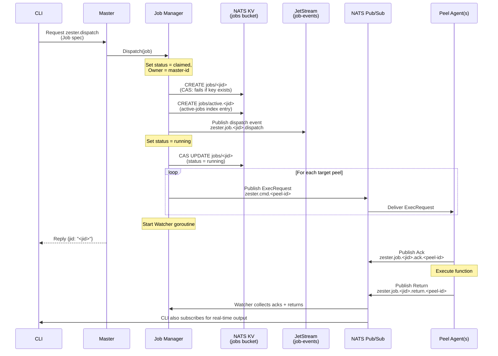

Every operation in Zester -- applying states, running commands, collecting facts -- begins with dispatching a job from the master to one or more peels. This page covers job creation, the KSUID-based identifier scheme, the full dispatch flow through NATS, and targeting.

**Source**: `pkg/job/manager.go`, `pkg/job/job.go`

---

## Creating Jobs

The `NewJob` constructor builds a `Job` with a unique identifier, the function to execute, arguments, a list of target peels, and a timeout:

```go title="pkg/job/job.go"
job := NewJob(
    "state.apply",                          // function
    map[string]any{"state": "webserver"},   // args
    []string{"web-01", "web-02"},           // targets
    5 * time.Minute,                        // timeout
)
```

The resulting `Job` struct contains all the data needed to dispatch, track, and finalize the operation:

| Field | Type | Description |
|---|---|---|
| `JID` | `string` | Auto-generated KSUID (e.g., `2hPx1FNsSgJMqVn5bLSTXeBQMpO`) |
| `Function` | `string` | The operation to execute (e.g., `state.apply`, `cmd.run`) |
| `Args` | `map[string]any` | Arguments for the function |
| `Targets` | `[]string` | List of peel IDs that should execute this job |
| `TargetExpr` | `string` | The operator's original targeting expression (e.g. `web*`), recorded for audit only -- the resolved `Targets` list is authoritative. Empty when the dispatcher supplied no expression |
| `Timeout` | `time.Duration` | Maximum wait time for all returns |
| `Status` | `Status` | Current lifecycle status (initially `pending`) |
| `Created` | `time.Time` | When the job was created (UTC) |
| `Updated` | `time.Time` | When the status was last modified (UTC) |
| `User` | `string` | Operator identity that initiated the job -- set by the CLI (`os/user.Current()`, falling back to `$USER`, then `unknown`) or by the REST API from the authenticated token's username |
| `Owner` | `string` | Master instance ID that claimed this job (optional) |
| `Epoch` | `uint64` | KV revision from CAS ownership claim; fencing token (optional) |
| `Deadline` | `time.Time` | Wall-clock time by which all returns must be collected (`Created` + `Timeout`); re-anchored on the master's clock at dispatch. A record read back with a zero deadline is defensively normalized to `Created` + `Timeout` before use |
| `ReclaimCount` | `int` | Number of times the job has been reclaimed from a dead master; capped at 3 |
| `StateID` | `string` | Bare positional argument from the CLI (e.g., the state name); forwarded to peels as the `ExecRequest` ID |
| `ReturnCount` | `int` | Number of per-peel returns collected, stamped on the record at finalize (zero while in flight) |
| `SuccessCount` | `int` | Number of collected returns that reported success, stamped at finalize alongside `ReturnCount` |
| `V` | `int` | Wire protocol version stamped by `NewJob` (`proto.ProtocolVersion`); a decoded `0` means the field was never set and is always treated as compatible |
| `Metadata` | `map[string]string` | Arbitrary key-value metadata (optional) |

All job data is serialized with **MessagePack** (`github.com/vmihailenco/msgpack/v5`) for compact binary encoding across NATS and KV storage.

---

## KSUID Job IDs

Job IDs are generated using [KSUIDs](https://github.com/segmentio/ksuid) (K-Sorted Unique IDs). A KSUID is a 27-character, base62-encoded identifier that embeds a timestamp in its first 4 bytes and 16 bytes of random data.

```
2hPx1FNsSgJMqVn5bLSTXeBQMpO
2hPx2Kd8VnR7YmWqTz4PLsCfNjA
2hPx3GhTWoS9ZnXrUa5QMtDgOkB
```

**Key properties:**

- **Time-ordered** -- IDs sort chronologically in lexicographic order, making job listing by recency trivial. No timestamp parsing is required.
- **Globally unique** -- No coordination between masters is needed to avoid ID collisions. The 16-byte random payload makes collisions astronomically unlikely.
- **URL-safe** -- Base62-encoded characters are safe for use in NATS subjects, API paths, and file names.
- **No central authority** -- Each master generates IDs independently, making the system suitable for multi-master or federated topologies.

<Callout type="info" title="Why KSUIDs over UUIDs">
UUIDv4 is randomly distributed, so listing jobs by time requires a separate index. KSUIDs encode time intrinsically -- a lexicographic sort of keys in the `jobs` KV bucket produces a chronological job history with no additional work.
</Callout>

---

## Dispatch Flow

When a job is dispatched, the `Manager.Dispatch` method orchestrates a multi-step process that stores the job, publishes events, delivers the job spec to each target peel, and starts a monitoring goroutine.



### Step-by-Step Breakdown

1. **Claim ownership** -- The job's status is set to `claimed` and `Owner` is set to this master's instance ID. The dispatch `Deadline` is re-anchored on the master's clock (`now + Timeout`, or the 60-second default when no timeout is given) -- the client-computed deadline is never trusted, so a CLI host with a lagging clock cannot cause the job to be finalized as timed out before any returns arrive.

2. **Store job in NATS KV via CAS** -- The full job spec is MessagePack-encoded and stored in the `jobs` KV bucket via `Create` (which fails if the key already exists, ensuring idempotent dispatch). The KV revision is saved as the job's `Epoch` (fencing token).

    ```
    KV CREATE: jobs/<jid> = <msgpack-encoded job>
    ```

3. **Index the job as active** -- A companion key `active.<jid>` is created in the same `jobs` bucket, holding a tiny `ActiveJobEntry` (`owner`, `updated`). This is the [active-jobs index](/docs/guides/jobs/tracking#active-jobs-index) the orphan scanner and `zester job active` enumerate instead of scanning the whole 7-day bucket. The write is best-effort: on failure the job is simply invisible to the scanner until the bucket TTL ages it out.

4. **Publish dispatch event to JetStream** -- A structured event is published to `zester.job.<jid>.dispatch`. The `job-events` JetStream stream captures this for replay and audit.

    ```
    Subject: zester.job.<jid>.dispatch
    Payload: Event{JID, Type: "dispatched", Data: <job>, Timestamp}
    ```

5. **Update status to Running -- before anything hits the wire** -- The job status is CAS-updated to `running` in KV (using the epoch from the initial `Create`) *before* any ExecRequest is published. This ordering is an invariant: once a request is on the wire, KV must never claim the job was undispatched, so a `claimed` record in KV **provably means never-published** -- which is what makes re-dispatching reclaimed `claimed` jobs safe by construction. If this CAS fails, `Dispatch` returns an error without publishing anything; a retry resumes the persisted claim from this step (the master recognizes its own interrupted `claimed` record) and publishes exactly once relative to KV state.

6. **Publish ExecRequest to each target** -- An `ExecRequest` (containing the JID, function, state ID, args, epoch, and protocol version) is published to each target peel's command subject. Each peel subscribes to its own `zester.cmd.<peel-id>` subject.

    ```
    Subject: zester.cmd.web-01 -> <msgpack-encoded ExecRequest>
    Subject: zester.cmd.web-02 -> <msgpack-encoded ExecRequest>
    ```

    The job's `StateID` (the CLI's bare positional, e.g. `zester '*' pkg.version nginx` sets it to `nginx`) is forwarded as the `ExecRequest` ID, so job-mode runs behave exactly like `--direct` runs.

7. **Start a Watcher goroutine** -- A dedicated goroutine subscribes to the job's ack and return subjects to track progress. Every return is persisted to its per-peel key in the `job-returns` KV bucket as soon as it arrives; a failed write is re-queued and retried. See [Tracking and Returns](/docs/guides/jobs/tracking) for details.

The master also logs every accepted dispatch at Info level (`dispatch request received`) with the JID, user, function, and target count -- an audit trail of who ran what, where.

<Callout type="info" title="Return duration is measured on the peel">
Each return published on `zester.job.<jid>.return.<peel-id>` includes a `Duration` field measured on the peel (wall-clock time of the module execution). It surfaces in the `DURATION` column of `zester job show`.
</Callout>

---

## Acks and Silent-Target Re-Dispatch

ExecRequest delivery is fire-and-forget core NATS -- a peel that is briefly disconnected at dispatch time would otherwise silently never receive the job, and the operator could not tell delivery failure from execution failure. Two mechanisms close that gap.

### Peel Acknowledgments

The moment a peel **accepts** a job dispatch (after epoch/duplicate fencing, before execution starts), it publishes a MessagePack `Ack` (`jid`, `peel_id`, `timestamp`) on:

```
zester.job.<jid>.ack.<peel-id>
```

The ack tells the dispatching master's watcher "received, still executing" -- it distinguishes a slow peel from an unreachable one. Rejected (stale or duplicate) dispatches and `--direct` request/reply executions send no ack. Ack publish failures are non-fatal on the peel (Debug-logged): the ack is a delivery signal, not part of the result.

### The Ack Window

Watchers started by an actual publish (fresh dispatches and claimed-job reclaims -- never recovery watchers, whose peels may be mid-execution) arm a one-shot **ack window**, `DefaultAckWindow` = 5 seconds (`Manager.AckWindow` overrides it; a negative value disables reconciliation). When the window fires, the watcher compares the set of peels it has *heard from* (acked ∪ returned) against the job's targets and re-publishes the encoded ExecRequest -- same epoch, same args -- **exactly once** to every silent target, logging at Warn:

```
re-dispatched job to silent targets (no ack or return within ack window)
```

The window fires once and only once per job; there is no retry loop.

### Duplicate Protection on the Peel

The re-send is safe because each peel keeps a **persisted per-JID dedup record** (`/data/peel-dedup.msgpack`, 0600, capped at 4096 entries with insertion-order eviction). A job ExecRequest whose epoch is **less than or equal to** the stored epoch for a known JID is rejected (`rejected duplicate dispatch (jid already observed at this epoch)` for the equal case; `rejected stale dispatch (epoch too old)` for lower epochs). The record is flushed to disk *synchronously* before an accepted job dispatch executes, so even a peel that crashes and restarts inside the ack window cannot re-execute a non-idempotent job at the same epoch. Legitimate failover re-dispatch is unaffected -- every dispatch/reclaim path CAS-bumps the epoch.

---

## Operator Attribution

Every job carries the identity of the operator who dispatched it in the `User` field:

- The **CLI** resolves the identity via `os/user.Current()`, falling back to the `$USER` environment variable, then `"unknown"`.
- The **REST API** records the username associated with the bearer token that authenticated the request.

The `USER` column appears in `zester job list` and `zester job active` output, and the `user` field in `zester job show` JSON. The master logs the user with every accepted dispatch (see above), so job history and master logs form a consistent audit trail.

<Callout type="info" title="`--direct` mode is unattributed">
`zester --direct` bypasses the master and job records entirely -- direct executions leave no job record and carry no operator identity.
</Callout>

---

## Deadlines and Ownership Recovery

### Dispatch Deadline

Every job records a wall-clock `Deadline` (`Created` + `Timeout`, defaulting to 60 seconds when no timeout is given). `Manager.Dispatch` always re-anchors it on the master's clock, so client clock skew cannot shorten or extend the budget. The deadline governs how long the job's watcher waits:

- A freshly dispatched job waits up to `Timeout` as before.
- A watcher **recovered after a master failover** honors only the *remaining* budget (`Deadline - now`) instead of restarting the full timeout -- a 5-minute job reclaimed 4 minutes in has 1 minute left, not 5.
- A job whose deadline has already expired at reclaim time is finalized immediately from the returns collected so far, without re-dispatching.
- A job record read back with a zero deadline is defensively normalized to `Created` + `Timeout` before use, so every code path sees a concrete deadline.

### Per-Return Persistence

The watcher persists every return to its per-peel key (`<jid>.<peel-id>`) in the `job-returns` KV bucket the moment it arrives (`returnPersistThreshold = 1`); a dedicated writer goroutine performs the KV writes so a slow write never blocks the NATS callback. Returns whose KV write fails are re-queued and retried on the next persist or the detach-path flush at shutdown. The per-peel keys are the **source of truth** for a job's results -- no aggregated value is written at finalize -- and they are the record handed to a reclaiming master, so a dropped write would otherwise finalize the job as `partial` after a failover even though the peel succeeded. See [Tracking and Returns](/docs/guides/jobs/tracking#retrieving-returns) for the storage layout.

### Reclaim Cap

Each time an orphaned job is reclaimed from a dead master, its `ReclaimCount` is incremented (persisted with the CAS ownership update). A job reclaimed more than **3 times** (`maxReclaims`) is CAS-finalized as `failed` -- with the reason recorded in `Metadata["failed_reason"]` -- instead of being re-dispatched. This stops ownership ping-pong: a job cannot bounce between crashing masters indefinitely.

### Orphan Scan Hardening

The orphan scanner (which runs on every master, every 20 seconds) is deliberately conservative about declaring a master dead:

- **Index-driven scanning.** The scanner enumerates only the `active.<jid>` keys of the [active-jobs index](/docs/guides/jobs/tracking#active-jobs-index) and fetches just the referenced job records -- cost is O(active jobs), independent of the 7-day retention window and scheduler volume.
- **Liveness read errors abort the scan cycle.** A failure to read the `master-heartbeat` bucket is never interpreted as "all masters dead" -- the cycle ends with no reclaims and no miss-count bumps, and the scanner retries on the next tick. Only a missing heartbeat key counts as an expired master.
- **Two consecutive misses required.** An owner must be absent from the live-master set for **2 consecutive scan cycles** (`DefaultMissThreshold`) before its jobs are reclaimed, so a single heartbeat-bucket blip cannot trigger a mass reclaim of jobs whose owners are alive.

Worst-case reclaim latency is therefore roughly the heartbeat TTL (15s) plus two 20-second scan cycles -- **~55 seconds**. See [Tracking and Returns](/docs/guides/jobs/tracking) for the full recovery process.

---

## Scheduled Jobs (Synthetic)

Not every job in `zester job list` goes through `Manager.Dispatch`. When a peel-side [schedule entry](/docs/guides/scheduling) has `return_job: true`, the peel reports the run as a **synthetic job**:

1. The peel generates a KSUID JID locally and publishes a `ScheduledResult` on `zester.job.<jid>.schedule.<peel-id>`.
2. The `job-events` JetStream stream captures the message durably (7-day retention), so results survive master downtime.
3. All masters share the durable consumer `schedule-results`, which creates the job record idempotently and persists the per-peel return.

Synthetic jobs target exactly one peel and are marked with metadata `source: schedule` and `schedule: <entry-name>`. Peels have no write access to the `jobs` or `job-returns` KV buckets -- the reporting peel's identity comes from the NATS-permission-enforced trailing subject token, not the payload. See [Scheduling](/docs/guides/scheduling#result-reporting) for the full flow.

---

## Targeting

Jobs specify targets as a list of peel IDs. Before dispatching, the CLI resolves targeting patterns against the master's fact index to produce this list.

| Type | Syntax | Example | Description |
|---|---|---|---|
| **Glob** | Pattern | `web*` | Glob match on peel IDs |
| **Regex** | `E@<pattern>` | `E@web-\d+` | Regex match on peel IDs |
| **Fact** | `G@<key>:<value>` | `G@os:ubuntu` | Match peels by fact values |
| **List** | `L@<id>,<id>` | `L@web-01,web-02` | Explicit comma-separated peel list |
| **Compound** | `<expr> and <expr>` | `web* and G@os:ubuntu` | Boolean combination of expressions |

<Callout type="success" title="Target resolution happens before dispatch">
The CLI resolves targeting expressions via the masters' target-resolution service -- a request/reply on `zester.target.resolve`, answered from an in-memory fact index by whichever master in the `zester-target-resolvers` queue group picks it up. If no master serves the subject (master outage), the CLI falls back to scanning the NATS KV facts bucket locally and logs a one-line warning. Either way, the resolved peel ID list is set as the job's `Targets` field (with the raw expression recorded in `TargetExpr` for audit) before dispatching to the master via `zester.dispatch`.
</Callout>

### Examples

```bash
# Target all peels
zester '*' state.apply base

# Target by glob pattern
zester 'web-*' state.apply webserver

# Target by fact (all Ubuntu peels)
zester 'G@os:ubuntu' state.apply base.packages

# Target by regex
zester 'E@db-\d{2}' state.apply database

# Target explicit list
zester 'L@web-01,web-02,web-03' state.apply webserver

# Compound targeting
zester 'web* and G@os:ubuntu' state.apply webserver
```

For full targeting documentation, see the [Targeting](/docs/guides/targeting) section.

---

## REST Usage

The master also supports token-authenticated REST dispatch:

```bash
curl -sS -k -X POST \
  -H "Authorization: Bearer $(cat /data/auth/api-tokens/ci-system.token)" \
  -H "Content-Type: application/json" \
  -d '{"target":"web-*","function":"test.ping","timeout":"60s"}' \
  https://master.example.com:8443/api/v1/jobs
```

Track status and returns:

```bash
curl -sS -k \
  -H "Authorization: Bearer $(cat /data/auth/api-tokens/ci-system.token)" \
  https://master.example.com:8443/api/v1/jobs/<jid>
```

See [Master REST API](/docs/reference/master-api) for full route details.

---

## CLI Usage

### Apply a State

```bash
zester '<target>' state.apply <state> [flags]
```

| Flag | Default | Description |
|---|---|---|
| `--timeout` | `5m` | Maximum time to wait for all returns |

```bash title="Apply a state to matching peels"
$ zester 'web*' state.apply mystate
Targeting 3 peel(s): [web-01 web-02 web-03]
Job 2hPx1FNsSgJMqVn5bLSTXeBQMpO dispatched
web-01:
    ...
web-02:
    ...
web-03:
    ...
```

### List Recent Jobs

```bash title="List jobs in chronological order"
$ zester job list
JID                            FUNCTION      TARGET    STATE     USER    OWNER
2hPx1FNsSgJMqVn5bLSTXeBQMpO   state.apply   web*      complete  alice   2hPwQm3TxUvW8YnZrAb6NcDeFgH
2hPx2Kd8VnR7YmWqTz4PLsCfNjA   cmd.run       db*       running   bob     2hPwQm3TxUvW8YnZrAb6NcDeFgH
```

Because JIDs are KSUIDs, lexicographic ordering produces chronological output with no additional sorting logic.

### Show Job Details

```bash title="Inspect a specific job"
$ zester job show 2hPx1FNsSgJMqVn5bLSTXeBQMpO
{
  "jid": "2hPx1FNsSgJMqVn5bLSTXeBQMpO",
  "function": "state.apply",
  "args": {"state": "webserver"},
  "state_id": "webserver",
  "targets": ["web-01", "web-02"],
  "target_expr": "web*",
  "status": "complete",
  "created": "2026-02-10T14:30:00Z",
  "updated": "2026-02-10T14:30:45Z",
  "deadline": "2026-02-10T14:35:00Z",
  "user": "alice",
  "owner": "2hPwQm3TxUvW8YnZrAb6NcDeFgH",
  "return_count": 2,
  "success_count": 2
}

Returns:
PEEL    SUCCESS  DURATION
web-01  true     12.3s
web-02  true     14.1s
```

---

## Error Handling

Dispatch errors are handled at each stage:

| Stage | Error | Behavior |
|---|---|---|
| KV store | Bucket unavailable | Dispatch fails, error returned |
| JetStream publish | Stream unavailable | Dispatch fails, error returned |
| CAS to `running` | Update fails | Dispatch fails, error returned -- **nothing was published**, so a retry safely resumes the persisted claim |
| Per-target publish | NATS publish error | Error logged, other targets still dispatched |
| Watcher startup | Subscribe error | Job finalized as `failed` |

If publishing to an individual target fails, the master logs the error but continues dispatching to remaining targets. This ensures partial delivery when individual peels are unreachable.

<Callout type="info" title="Partial dispatch does not fail the job">
A job that could not be delivered to one or more targets is still tracked. The watcher will eventually finalize it as `partial` or `timeout` depending on how many peels respond. Check `zester job show <jid>` to see which peels returned results.
</Callout>
