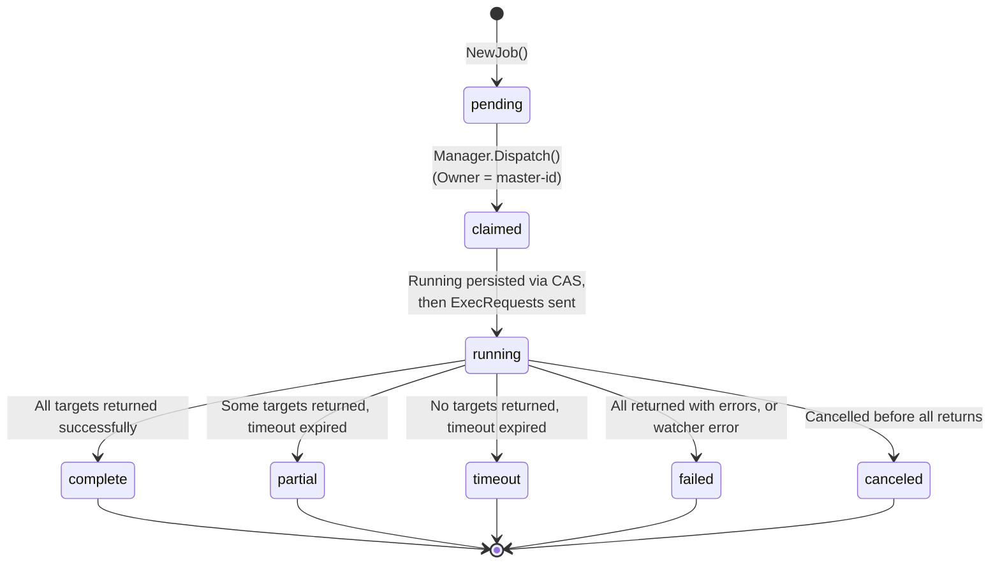
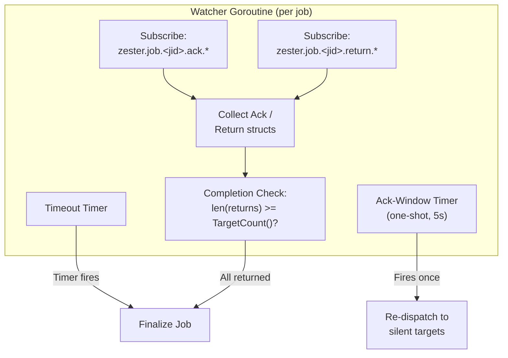

Every dispatched job in Zester is tracked from creation through completion. The tracking system uses a per-job Watcher goroutine to monitor returns over NATS, persists all state transitions in JetStream KV, and publishes events to a durable stream for replay and audit.

**Source**: `pkg/job/watcher.go`, `pkg/job/manager.go`

---

## Job Status Lifecycle

Jobs move through a defined set of statuses during their lifecycle:



### Status Definitions

| Status | Description |
|---|---|
| `pending` | Job created but not yet dispatched to targets |
| `claimed` | Job claimed by a master via KV CAS but ExecRequests not yet sent -- the running status is persisted *before* anything is published, so a `claimed` record provably means no peel ever received the job |
| `running` | Job dispatched; waiting for returns from targets |
| `complete` | All targeted peels returned results successfully |
| `partial` | Some (but not all) targeted peels returned results before timeout |
| `timeout` | Timeout expired with zero returns received |
| `failed` | All peels returned but one or more reported errors, or a watcher/subscription failure occurred |
| `canceled` | Job was cancelled before all targets returned |

### Terminal States

A job is considered terminal when its status is one of: `complete`, `partial`, `timeout`, `failed`, or `canceled`. Terminal jobs are no longer actively monitored by a Watcher.

```go title="pkg/job/job.go"
func (j *Job) IsTerminal() bool {
    switch j.Status {
    case StatusComplete, StatusPartial, StatusTimeout, StatusFailed, StatusCanceled:
        return true
    }
    return false
}
```

<Callout type="info" title="Non-terminal jobs consume resources">
Each non-terminal job has an active Watcher goroutine with NATS subscriptions. If a job stays in `running` state indefinitely (due to a bug or missed timeout), it leaks resources. The timeout mechanism is the primary safeguard against this.
</Callout>

---

## Job Ownership

In multi-master deployments, every job has an `Owner` field that records which master instance dispatched and is watching it, and an `Epoch` field that serves as a fencing token to prevent duplicate execution.

| Field | Type | Description |
|-------|------|-------------|
| `Owner` | `string` | Master instance ID that dispatched and is watching this job |
| `Epoch` | `uint64` | KV revision number from the CAS ownership claim (fencing token) |

The `Owner` and `Epoch` are set during `Manager.Dispatch` via a KV CAS operation. The `Epoch` is included in every `ExecRequest` sent to peels. Peels track the highest epoch seen per JID and **reject** ExecRequests whose epoch is less than *or equal to* the stored value -- a lower epoch is a stale dispatch from a superseded owner, an equal epoch is a duplicate delivery (e.g. the [ack-window re-send](/docs/guides/jobs/dispatching#acks-and-silent-target-re-dispatch)). The per-JID record is persisted to disk (`/data/peel-dedup.msgpack`), so rejection survives peel restarts; legitimate failover re-dispatch always carries a freshly CAS-bumped (higher) epoch and is unaffected.

---

## Master Heartbeat

Each master publishes a periodic heartbeat to the `master-heartbeat` KV bucket. The heartbeat contains the master's instance ID, a timestamp, and the list of active job IDs it owns. Other masters watch this bucket to detect failures.

| Property | Value |
|----------|-------|
| Bucket | `master-heartbeat` |
| Key pattern | `<master-instance-id>` |
| TTL | 15 seconds (3x heartbeat interval) |
| History | 1 |
| Interval | Every 5 seconds |

The 15-second TTL (3x the heartbeat interval) means a master must miss 3 consecutive heartbeats before being declared dead. This provides tolerance for GC pauses, brief network hiccups, and NATS leader elections.

---

## Active-Jobs Index

The `jobs` KV bucket holds **two key families**:

| Key | Value | Lifecycle |
|---|---|---|
| `<jid>` | Full MessagePack `Job` record | Created at claim time; lives out the 7-day bucket TTL |
| `active.<jid>` | Tiny `ActiveJobEntry` (`owner`, `updated`) | Created at claim time; owner rewritten on reclaim; **deleted on every terminal transition** |

The index exists so that anything asking "which jobs are live right now?" -- the orphan scanner and `zester job active` -- enumerates only the `active.` prefix instead of scanning the entire 7-day bucket. Scan cost is **O(active jobs)**, independent of retention and scheduler-synthetic job volume (synthetic jobs are terminal at creation and never get index entries).

Index maintenance is best-effort with self-healing:

- The index entry is deleted by the watcher after a *successful* terminal write and when the reclaim cap finalizes a job as `failed`. A CAS-fenced finalize does **not** delete the entry -- the superseding owner (or the scanner) is responsible for it.
- The scanner self-heals stale entries: an `active.<jid>` key whose job record is missing or already terminal is deleted and skipped. The job record itself is authoritative for status, epoch, and reclaim count; the index value is never used for reclaim decisions.

---

## Orphan Detection and Recovery

When a master's heartbeat key expires (the master has not refreshed it within the TTL), surviving masters detect the missing heartbeat via the OrphanScanner's periodic polling and initiate orphan recovery.

### Recovery Process

1. **Detect heartbeat expiration** -- The OrphanScanner polls every 20 seconds, listing live masters from the `master-heartbeat` bucket and comparing against job owners.
2. **Scan for orphaned jobs** -- Enumerate the [active-jobs index](#active-jobs-index) (`active.<jid>` keys) and fetch only the referenced job records, keeping those where `Owner` matches a dead master's ID and `Status` is non-terminal (`claimed` or `running`).
3. **Adopt orphaned jobs** -- For each orphaned job, perform a CAS update on the `Owner` field (generating a new epoch) and rewrite the index entry with the new owner. Only one master's CAS succeeds; others back off.
4. **Recover return state** -- Read the incrementally persisted per-peel returns from the `job-returns` KV bucket, then **replay the `job-events` stream** for the job's return subjects and merge the results (KV wins on collision; replayed-only returns are persisted so the per-peel keys catch up). Re-subscribe to return subjects. If the merged seeds already cover every target, the job finalizes immediately instead of burning the remaining deadline.
5. **Close the replay gap** -- Once the recovery watcher's live subscriptions are attached, the stream is replayed a *second* time and merged, so a return published between the first replay and the subscription attach is never lost.
6. **Finalize or continue** -- The recovery watcher operates identically to a normal watcher (except it never re-publishes ExecRequests -- its peels may be mid-execution). It collects any remaining returns and finalizes the job when complete, timed out, or cancelled.

<Callout type="warn" title="Recovery race condition">
If multiple surviving masters detect the same heartbeat expiration simultaneously, they could both attempt to adopt the same orphaned jobs. This is resolved by using NATS KV's compare-and-swap (CAS) semantics on the `Owner` field update. Only one master's CAS succeeds; the others back off.
</Callout>

### Incremental Return Persistence

Returns are persisted to the `job-returns` KV bucket **incrementally** during execution, not just at job finalization. Every return is written immediately (`returnPersistThreshold` is 1) as a per-peel entry keyed `<jid>.<peel-id>` — an O(1) write per return. The NATS callback only records state and enqueues; a dedicated per-watcher writer goroutine (buffered channel, synchronous-persist fallback on overflow so nothing is ever dropped) performs the KV writes, and entries whose write fails are re-queued and retried on the next persist (including the drain-and-flush that runs before finalize and when a watcher detaches at shutdown).

The per-peel keys are the **sole store** for return payloads. No aggregated `[]Return` is written at finalization — a single aggregated value would bound a job's total returns by the ~1MB NATS payload cap, so a wide job could not record all its results. Instead, the finalized job record carries two summary counts, `return_count` and `success_count`, and readers list the per-peel keys (an O(this job's returns) prefix-scoped listing, not a bucket scan).

### Cancel Propagation

In multi-master mode, **all masters** subscribe to the cancel wildcard `zester.job.*.cancel`. When a master receives a cancel for a job it owns, it cancels the local watcher. If the master does not own the job, it ignores the message. Peels also receive the cancel directly and stop execution.

### Recovery Guarantees

| Guarantee | Mechanism |
|-----------|-----------|
| At-most-one owner | KV CAS on Owner field update |
| No duplicate execution | Fencing tokens (epoch) in ExecRequest; peels reject stale and same-epoch duplicates via persisted per-JID dedup (survives restarts) |
| Claimed = never published | Dispatch CAS-persists `running` *before* publishing any ExecRequest, so reclaimed `claimed` jobs are safe to re-dispatch |
| Returns recoverable | Incremental per-peel return persistence to `job-returns` KV |
| Returns not lost (post-crash) | Recovery watcher replays the `job-events` stream twice (seed before start, gap merge after its live subscriptions attach) and re-subscribes to return subjects |
| Timely detection | 15-second heartbeat TTL (3x heartbeat interval) provides bounded detection time |
| Cancel reaches owner | All masters subscribe to `zester.job.*.cancel` wildcard |

<Callout type="info" title="See also">
For detailed HA deployment procedures, multi-master topology diagrams, fencing token protocol, and operational runbooks, see the [High Availability](/docs/architecture/ha) documentation.
</Callout>

---

## Watcher

The `Watcher` is a goroutine created per-job that monitors NATS subscriptions for acks and returns from target peels.

**Source**: `pkg/job/watcher.go`



### Subscription Subjects

| Subject Pattern | Purpose |
|---|---|
| `zester.job.<jid>.ack.*` | Receive delivery acknowledgments from peels that accepted the dispatch |
| `zester.job.<jid>.return.*` | Receive returns from all targeted peels |

The wildcard `*` in the subject matches the peel ID, so a single subscription captures messages from all targets for that job.

### Watcher Loop

The watcher runs a `select` loop that processes incoming acks and returns until one of three conditions terminates it:

1. **All returns received** -- `len(returns) >= TargetCount()` triggers context cancellation.
2. **Timeout expires** -- The `time.Timer` fires.
3. **Context cancelled** -- External cancellation (e.g., `Manager.Cancel` or `Manager.Shutdown`).

On watchers that follow an actual publish, a fourth (non-terminating) event fires once: the **ack window** (default 5 seconds), which re-publishes the ExecRequest exactly once to targets that have neither acked nor returned. See [Acks and Silent-Target Re-Dispatch](/docs/guides/jobs/dispatching#acks-and-silent-target-re-dispatch).

---

## Return Structure

Each peel that executes a job publishes a `Return` with its result:

| Field | Type | Description |
|---|---|---|
| `JID` | `string` | The job this return belongs to |
| `PeelID` | `string` | Which peel produced this return |
| `Success` | `bool` | Whether the function executed without error |
| `ReturnData` | `any` | The function's output data (module-specific) |
| `Error` | `string` | Error message if the function failed |
| `Duration` | `time.Duration` | How long execution took on the peel |
| `Timestamp` | `time.Time` | When the return was generated (UTC) |

Returns are published to `zester.job.<jid>.return.<peel-id>` and collected by the Watcher. Each return is already persisted to its per-peel `job-returns` key as it arrives; finalization only stamps the summary counts (`return_count`, `success_count`) onto the job record.

### Acknowledgment Structure

Peels publish an `Ack` on `zester.job.<jid>.ack.<peel-id>` the moment they **accept** a job dispatch -- after epoch/duplicate fencing, before execution starts:

| Field | Type | Description |
|---|---|---|
| `JID` | `string` | The job being acknowledged |
| `PeelID` | `string` | Which peel is acknowledging |
| `Timestamp` | `time.Time` | When the ack was sent (UTC) |

The ack lets the watcher distinguish "received, still executing" from "never received": acked peels are exempt from the ack-window re-dispatch, so long-running jobs are never double-sent to healthy peels. Rejected (stale/duplicate) dispatches and `--direct` request/reply executions produce no ack.

---

## Completion Detection

The Watcher tracks how many returns it has collected and compares against the job's target count:

```go title="pkg/job/watcher.go"
if len(w.returns) >= w.job.TargetCount() {
    w.cancelFunc() // triggers ctx.Done(), exits the select loop
}
```

When `len(returns) >= TargetCount()`, the watcher cancels its context, which causes the main select loop to exit and proceed to finalization.

### Final Status Determination

When the watcher terminates (by completion, timeout, or cancellation), it determines the final status:

| Condition | Final Status |
|---|---|
| Cancelled and returns < targets | `canceled` |
| Returns >= Targets, all successful | `complete` |
| Returns >= Targets, some failed | `failed` |
| Returns > 0 but < Targets | `partial` |
| Returns == 0 | `timeout` |

### Finalization Steps

After determining the final status, the watcher:

1. Flushes any still-queued per-peel returns to the `job-returns` KV bucket (the per-peel keys must be complete before the terminal status lands).
2. Updates the job in the `jobs` KV bucket -- final status, updated timestamp, and the `return_count`/`success_count` summary -- via CAS, so a stale owner cannot overwrite a newer finalization.
3. Deletes the job's `active.<jid>` index entry (only after the terminal write succeeded; a CAS-fenced finalize leaves it for the superseding owner or the scanner's self-heal).
4. Publishes a completion event to JetStream (`zester.job.<jid>.status`).
5. Closes its `done` channel to signal completion to the Manager.

---

## Event Stream

All job events are captured by the `job-events` JetStream stream for replay and audit:

| Property | Value |
|---|---|
| Stream name | `job-events` |
| Subjects | `zester.job.>` (all job sub-subjects) |
| Max age | 7 days |
| Storage | File |
| Retention | Limits policy |

### Event Types

| Event Type | Published By | When |
|---|---|---|
| `dispatched` | Master | Job is dispatched to targets |
| `acked` | Peel | Peel accepted the dispatch (published on the ack subject before execution) |
| `returned` | Peel (via watcher) | Peel publishes execution result |
| `completed` | Master (watcher) | Job reaches a terminal status |
| `canceled` | Master | Job cancelled by operator or API |
| `timeout` | Master (watcher) | Job timeout expires |
| `failed` | Master (watcher) | Job completed with all returns failing |

<Callout type="warn" title="Event stream is append-only">
The `job-events` stream uses file storage with a 7-day retention window. Events cannot be modified or deleted -- they are immutable once written. This makes the stream suitable for compliance auditing but means sensitive data in job arguments or return data will persist for the full retention period.
</Callout>

---

## Retrieving Returns

The `Manager.GetReturns` method reads returns from the `job-returns` KV bucket:

```go title="pkg/job/manager.go"
returns, err := manager.GetReturns(ctx, jid)
// returns is []Return -- one entry per peel that responded
```

It lists the `<jid>.<peel-id>` keys via a prefix-scoped listing (server-side filter, O(this job's returns)) and decodes each. The per-peel keys are the only place returns live -- scheduled results are stored the same way.

The KV bucket has a 7-day TTL, after which entries are automatically purged.

### KV Storage

| Bucket | Key Format | TTL | History | Content |
|---|---|---|---|---|
| `jobs` | `<jid>` and `active.<jid>` | 7 days | 10 revisions | Full job spec and current status, plus the active-jobs index entries |
| `job-returns` | `<jid>.<peel-id>` | 7 days | 1 revision | Incremental per-peel returns -- the sole store for return payloads, scheduled results included |

The `jobs` bucket keeps 10 revisions of history per key, allowing you to trace how a job's status evolved over time:

```
Revision 1: {status: "claimed", owner: "master-1", ...}
Revision 2: {status: "running", ...}
Revision 3: {status: "complete", ...}
```

---

## Active Jobs

The `Manager.ActiveJobs` method returns a list of JIDs for jobs that currently have an active Watcher:

```go title="pkg/job/manager.go"
jids := manager.ActiveJobs()
// jids is []string -- JIDs of all jobs with running watchers
```

Active jobs are those in a non-terminal state with a Watcher goroutine still monitoring for returns. Note that this is a *local* view (this master's watchers); the fleet-wide view is the [active-jobs index](#active-jobs-index), which is what `zester job active` reads.

---

## CLI Commands

### Show Job Details

```bash title="Inspect a specific job with its returns"
$ zester job show 2hPx1FNsSgJMqVn5bLSTXeBQMpO
{
  "jid": "2hPx1FNsSgJMqVn5bLSTXeBQMpO",
  "function": "state.apply",
  "args": ["webserver"],
  "targets": ["web-01", "web-02"],
  "status": "complete",
  "created": "2026-02-10T14:30:00Z",
  "updated": "2026-02-10T14:30:45Z",
  "return_count": 2,
  "success_count": 2
}

Returns:
PEEL    SUCCESS  DURATION
web-01  true     12.3s
web-02  true     14.1s
```

The `Returns` table is read from the per-peel `<jid>.<peel-id>` keys (sorted by peel ID, so output is deterministic).

### List Active Jobs

```bash title="See which jobs are currently active"
$ zester job active
JID                            FUNCTION    TARGETS                STATUS    USER    OWNER
2hPx2Kd8VnR7YmWqTz4PLsCfNjA   cmd.run     [db-01 db-02 db-03]    running   bob     2hPwQm3TxUvW8YnZrAb6NcDeFgH
```

The command enumerates only the [active-jobs index](#active-jobs-index) keys and fetches just the referenced job records -- no full-bucket scan. The `TARGETS` column shows the targeted peel IDs and `STATUS` shows the current job lifecycle state; stale index entries (job already terminal) are skipped.

### List Recent Jobs

```bash title="List jobs in chronological order"
$ zester job list
JID                            FUNCTION      TARGET    STATE     USER    OWNER
2hPx1FNsSgJMqVn5bLSTXeBQMpO   state.apply   web*      complete  alice   2hPwQm3TxUvW8YnZrAb6NcDeFgH
2hPx2Kd8VnR7YmWqTz4PLsCfNjA   cmd.run       db*       running   bob     2hPwQm3TxUvW8YnZrAb6NcDeFgH
2hPx3GhTWoS9ZnXrUa5QMtDgOkB   state.apply   cache*    partial   alice   2hPwQm3TxUvW8YnZrAb6NcDeFgH
```

The listing skips `active.<jid>` index keys -- only real job records are shown.

### Cancel a Job

```bash title="Cancel a running job"
$ zester job kill 2hPx2Kd8VnR7YmWqTz4PLsCfNjA
Cancel signal sent for job 2hPx2Kd8VnR7YmWqTz4PLsCfNjA
```

See [Timeouts and Cancellation](/docs/guides/jobs/timeouts) for details on cancellation behavior.
