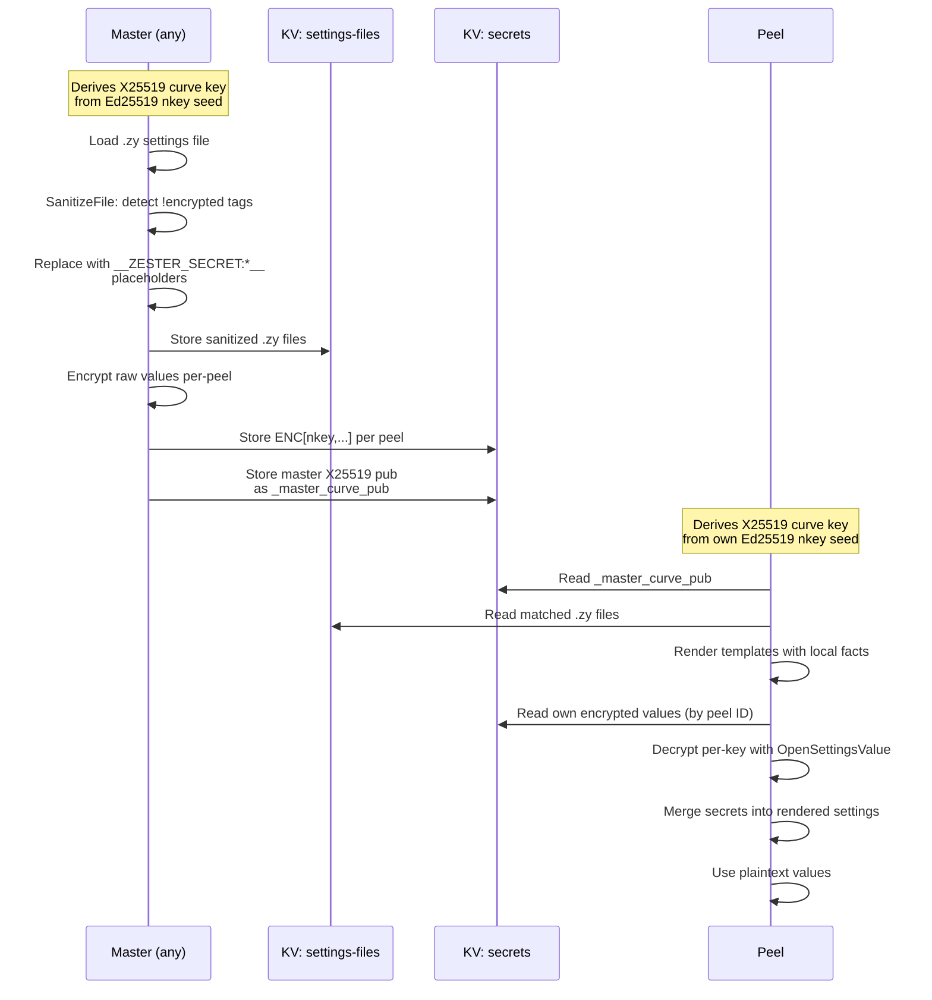

## Overview

Configuration management systems need to distribute secrets -- database passwords, API keys, TLS private keys. These values flow through the NATS message bus and are stored in a KV bucket. Without encryption, anyone with NATS access could read every peel's secrets.

Zester solves this with **per-peel encryption** using NaCl box (X25519 + XSalsa20-Poly1305). Each sensitive value is encrypted specifically for a single peel using that peel's X25519 public key. Only the intended peel can decrypt its own settings.

## How It Works

The master replaces `!encrypted` literal values with **placeholders** (`__ZESTER_SECRET:<key.path>__`) before storing `.zy` files in the shared `settings-files` KV bucket. The actual encrypted values are stored per-peel in the `secrets` KV bucket. Each peel renders templates locally, then decrypts and substitutes placeholders with plaintext values.



<Callout type="error" title="Critical: Never store plaintext secrets in shared KV">
The `settings-files` KV bucket is readable by all peels. Raw `.zy` files must have `!encrypted` literal values replaced with `__ZESTER_SECRET:*__` placeholders before storage. This prevents any peel from reading another peel's secrets.
</Callout>

<Callout type="warn" title="Placeholder limitation">
Because `!encrypted` values are replaced with placeholders before template rendering, they cannot be used in Jinja2 expressions (e.g., ``). Encrypted values should only be used as terminal values.
</Callout>

The algorithm is **NaCl box** (libsodium `crypto_box`):

| Component | Algorithm |
|-----------|-----------|
| Key exchange | X25519 (Curve25519 Diffie-Hellman) |
| Symmetric cipher | XSalsa20 |
| Authentication | Poly1305 MAC |
| Nonce | 24 bytes, randomly generated per seal |

## The `!encrypted` Tag

In settings `.zy` files, mark sensitive values with the `!encrypted` YAML tag. The master's `SanitizeFile` function detects these tags using `yaml.v3` Node parsing and replaces them with `__ZESTER_SECRET:*__` placeholders before storing the template in shared KV.

```yaml title="/srv/zester/settings/databases/credentials.zy"
database:
  host: db.example.com
  port: 5432
  username: myapp
  password: !encrypted "s3cretP@ss"
  api_key: !encrypted "abc123"
```

The `!encrypted` tag is a standard YAML tag. It does not change the value's type -- the value remains a string. The tag is detected by `SanitizeFile` during master-side publishing, which scans the YAML AST for `!encrypted` tagged nodes before any template rendering occurs.

### What Gets Encrypted

- Only string values with the `!encrypted` tag are encrypted.
- Non-string values (numbers, booleans, maps) with `!encrypted` are left unchanged.
- The tag is evaluated at the top-level key of the value node in the YAML mapping.

### What the Peel Receives

The `settings-files` KV bucket stores the sanitized `.zy` template, with `!encrypted` values replaced by placeholders:

```yaml
database:
  host: db.example.com
  port: 5432
  username: myapp
  password: "__ZESTER_SECRET:database.password__"
  api_key: "__ZESTER_SECRET:database.api_key__"
```

The `secrets` KV bucket (keyed by peel ID) stores the corresponding encrypted values as a map:

```json
{
  "database.password": "ENC[nkey,YWJjZGVmZ2hpamtsbW5vcHFyc3R1dnd4eXowMTIzNDU2Nzg5...]",
  "database.api_key":  "ENC[nkey,eHl6MTIzNDU2Nzg5MGFiY2RlZmdoaWprbG1ub3BxcnN0dXZ3...]"
}
```

After the peel renders templates and decrypts secrets, the final in-memory settings map has all values in plaintext.

## Encryption Flow

The full end-to-end flow from authoring to decryption:

### Step 1: Author writes a settings file

```yaml title="/srv/zester/settings/app/secrets.zy"
api:
  key: !encrypted "sk_live_abc123def456"
  webhook_secret: !encrypted "whsec_789xyz"
  endpoint: https://api.example.com
```

### Step 2: Master sanitizes the file

`SanitizeFile` walks the YAML AST, extracts `!encrypted` tagged values, and replaces them with placeholders:

```
api.key             → "__ZESTER_SECRET:api.key__"
api.webhook_secret  → "__ZESTER_SECRET:api.webhook_secret__"
```

The sanitized template (with no plaintext secrets) is stored in `settings-files` KV.

### Step 3: Master encrypts secrets per-peel

For each peel whose curve public key is known, the master seals each extracted secret individually:

```go
enc, err := p.masterEnc.SealSettingsValue([]byte(plaintext), peel.CurvePublicKey)
// Returns: "ENC[nkey,<base64>]"
```

The encrypted map (dot-path → `ENC[nkey,...]`) is stored in the `secrets` KV bucket under the peel's ID. If a peel has not yet published its curve public key, its secrets are not published.

### Step 4: Master publishes its own curve public key

The master stores its X25519 public key in the `secrets` KV bucket as `_master_curve_pub`. Peels read this key to verify the sender during decryption.

### Step 5: Peel renders and decrypts

The peel loads its matched `.zy` files, renders each template locally with its own facts, then reads its encrypted secrets:

```go
// Per-key decryption in Resolver.loadSecrets:
plaintext, err := r.encryptor.OpenSettingsValue(val, r.senderPub)
// r.senderPub is the master's curve public key (_master_curve_pub)
```

Each key is decrypted individually. Decrypted values are then merged into the rendered settings map, replacing the `__ZESTER_SECRET:*__` placeholders.

## Encryption and Decryption API

| Function | Purpose |
|----------|---------|
| `NewEncryptor(kb)` | Create an encryptor from a key bundle (derives X25519 from Ed25519) |
| `e.Seal(plaintext, recipientPub)` | Encrypt a value for a specific recipient |
| `e.Open(ciphertext, senderPub)` | Decrypt a value from a known sender |
| `e.SealSettingsValue(plaintext, recipientPub)` | Encrypt and wrap as `ENC[nkey,<base64>]` |
| `e.OpenSettingsValue(tagged, senderPub)` | Unwrap and decrypt an `ENC[nkey,...]` string |
| `IsEncryptedValue(s)` | Check if a string matches the `ENC[nkey,...]` pattern |
| `EncryptSettingsMap(settings, sensitiveKeys, encryptor, recipientPub)` | Encrypt specific keys in a settings map |
| `DecryptSettingsMap(settings, encryptor, senderPub)` | Decrypt all `ENC[nkey,...]` values in a settings map |

`EncryptSettingsMap` walks the settings map and encrypts only the keys listed in `sensitiveKeys`. `DecryptSettingsMap` walks the entire map and decrypts every value matching the `ENC[nkey,...]` pattern.

## Key Derivation

Both the master and peels start with Ed25519 nkey seeds. X25519 curve keys are derived from the Ed25519 seeds through `CurvePublicKeyFromSeed`:

```
Ed25519 nkey seed
    |
    v  nkeys.DecodeSeed()
    |
    v  Raw 32-byte seed
    |
    v  nkeys.EncodeSeed(PrefixByteCurve, rawSeed)
    |
    v  Curve seed
    |
    v  nkeys.FromCurveSeed()
    |
    v  X25519 key pair (public + private)
```

This derivation means every entity's signing identity (its nkey) also provides an encryption identity. No additional key distribution or management is required.

<Callout type="info" title="Key prefix conventions">
Ed25519 public keys use role prefixes (`O`, `A`, `U`). Seeds use `SO`, `SA`, `SU`. X25519 curve public keys use the `X` prefix. The curve key is always derivable from the corresponding Ed25519 seed.
</Callout>

## Security Considerations

### Per-Peel Isolation

Each peel has a **unique** X25519 key pair derived from its unique nkey seed. The master encrypts settings individually for each target peel. This means:

- Peel A cannot decrypt settings encrypted for Peel B.
- Even if the NATS KV store is compromised (e.g., by accessing the JetStream data directory on disk), encrypted values are unreadable without the target peel's private key.
- The master encrypts per-peel, so there is no shared encryption key across peels.

### Threat Mitigation

| Threat | Protection |
|--------|-----------|
| NATS KV store accessed directly | Values are NaCl box encrypted; unreadable without peel's private key |
| Network eavesdropping | TLS 1.3 encrypts all traffic; NaCl box provides an additional layer |
| Compromised peel | Only that peel's settings are exposed; other peels are unaffected |
| Master compromise | Attacker gains access to all peel curve public keys but still needs individual peel seeds to decrypt |

<Callout type="warn" title="Protect nkey seeds">
The peel's nkey seed is the root of its encryption identity. If an attacker obtains the seed, they can decrypt all settings ever encrypted for that peel. Store seeds securely (`0600` permissions at minimum) and rotate them if compromised.
</Callout>

### What Is Not Encrypted

- Non-sensitive settings values (hostnames, ports, feature flags) are stored as plaintext in the KV bucket.
- Only values explicitly tagged with `!encrypted` in the `.zy` source file are encrypted.
- The settings map structure (key names, nesting) is visible in plaintext -- only the tagged values are opaque.

## Best Practices

1. **Encrypt all secrets** -- Passwords, API keys, tokens, private keys, and any PII should always use `!encrypted`.

2. **Keep encrypted files focused** -- Put encrypted values in dedicated files (e.g., `credentials.zy`) rather than mixing them with non-sensitive configuration. This makes auditing easier.

3. **Use environment-specific files** -- Production and staging secrets should live in separate files, targeted via `top.zy`:

    ```yaml
    environments:
      'environment:production':
        - environments.production_secrets
      'environment:staging':
        - environments.staging_secrets
    ```

4. **Never log decrypted values** -- Ensure your application does not log settings that contain decrypted secrets.

5. **Rotate on compromise** -- If a peel's nkey seed is compromised, revoke the key, re-bootstrap the peel with a new identity, and re-encrypt its settings with the new curve public key.
