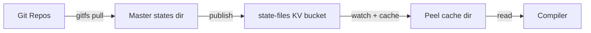

By default, state files live on each peel's local filesystem (`/data/states`). For production deployments, Zester supports **KV-based state distribution** — the master publishes state files to a NATS KV bucket, and peels automatically cache them to local disk.

This mirrors the settings pipeline: the master is the single source of truth, and peels stay in sync via KV watches.

---

## How It Works



### Master Side

The publisher-lease-holding master walks `--states-dir` and publishes all non-hidden files to the `state-files` KV bucket. This includes `.zy` state files, `.star` Starlark modules, and any other non-hidden files in the states directory. KV keys use forward-slash relative paths (e.g., `webserver/init.zy`, `_modules/nginx.star`, `common/packages.zy`, `top.zy`).

State files are stored as **raw bytes** in KV (not MessagePack encoded), because peels write them directly to disk for the compiler.

**On-disk edits publish live — no master restart.** Three mechanisms keep the KV bucket current (all apply to the settings and reactor file trees too):

1. **File watcher** (`files_watch`, default on): inotify on the file trees; an edit publishes ~1 second later. Unreliable on NFS/remote mounts, hence:
2. **Republish interval** (`files_republish_interval`, default 30s): the lease holder re-walks the trees periodically as the correctness backstop. `0` disables.
3. **`zester fileserver update [--force]`**: push-it-now on demand (Salt's `fileserver.update`). Answered only by the lease holder; the reply reports per-set file counts and whether anything changed. `--force` rewrites every key even when unchanged (heals a tampered or torn bucket).

Every publish is **hash-gated**: when the computed manifest is byte-identical to the bucket's, nothing is written — no `_revision` bump, no peel resyncs — so the watcher and interval are free when nothing changed.

### Multi-Master

Only the publisher-lease holder publishes; **standby masters mirror every file set from KV back into their local dirs** (`files_mirror`, default on), so those dirs track fleet truth. On failover the new holder runs one catch-up sync and its initial publish is a hash-gated no-op — a takeover never reverts the fleet to a stale tree. Consequences:

- **Edit on the lease holder** — find it with `zester fileserver status`; a standby's local edits are overwritten by the mirror with a loud warning naming the files, and the master `.deb` installs an MOTD snippet that warns at SSH login on a standby.
- **Settings converge through a dedicated sealed channel.** The peel-facing settings bucket holds *sanitized* content (`!encrypted` plaintext replaced by placeholders) and is never mirrored — that would destroy secrets. Instead the lease holder replicates the **raw** settings tree into the masters-only `master-settings` bucket with every file **sealed to the shared account curve key**: any master can open it (they all hold `account.seed`), peel credentials have no grant for the bucket at all, and JetStream storage/backups never contain plaintext. The manifest hashes are HMAC-keyed under the account seed, so they can't be used as an offline brute-force oracle on secret values by anyone lacking `account.seed` (the file values are the ciphertext; only account-key holders — all masters — can verify or read either). Standbys decrypt on sync and refresh their in-memory secret state, so a standby holding the `facts-secrets` lease always encrypts current values.
- Mirrored dirs are **managed trees**: a sync replaces them with exactly the published file set, so unpublished extras (hidden files, manual checkouts) don't survive on standbys.
- GitFS-sourced states are auto-excluded from the mirror (masters converge through the git remote instead), and under GitFS the watcher/interval/`fileserver update` paths skip states entirely — GitFS owns states publishing, including its half-clone safety gate.
- Disable `files_mirror` when masters share one filesystem for these dirs (shared volume/NFS) — the holder's publishes already are the standby's dirs, and the sealed replica publish is skipped too.

### Peel Side

On startup, the peel:

1. **Syncs** all entries from the `state-files` KV bucket to `--states-cache` (default `/data/states-cache`)
2. **Watches** the bucket for changes and updates the cache incrementally
3. **Falls back** to the baked-in `/data/states` directory if the cache is empty (e.g., on first boot before the master has published)

The compiler reads state files from whichever directory has content — the KV cache takes priority over the baked-in states.

<Callout type="success" title="Zero-downtime updates">
Because peels watch the KV bucket continuously, pushing updated state files to the master's `--states-dir` (or via GitFS) propagates to all peels automatically. No peel restart required.
</Callout>

---

## Configuration

### Master Flags

| Flag | Default | Description |
|------|---------|-------------|
| `--states-dir` | `/data/states` | Root directory for state files |
| `--settings-dir` | `/data/settings` | Root directory for settings files |
| `--files-watch` | `true` | Watch the file trees and publish on change (lease holder only) |
| `--files-republish-interval` | `30s` | Periodic hash-gated republish backstop (`0` disables) |
| `--files-mirror` | `true` | Standby masters mirror published files from KV into their local dirs |
| `--publisher-status-file` | `/run/zester/publisher-status` | Rewritten with the lease role on every transition (MOTD source; empty disables) |

### Peel Flags

| Flag | Default | Description |
|------|---------|-------------|
| `--states-cache` | `/data/states-cache` | Local cache directory for state files downloaded from KV |

---

## GitFS

GitFS is an optional feature that syncs state files from one or more Git repositories. The master clones repos into `--states-dir`, periodically pulls updates, and republishes changed files to KV.

This is similar to SaltStack's `gitfs_remotes` — you can manage your state files in Git and have them automatically distributed to all peels.

### GitFS Flags

| Flag | Default | Description |
|------|---------|-------------|
| `--gitfs-remotes` | `""` | Comma-separated Git remote URLs |
| `--gitfs-interval` | `5m` | Pull interval |
| `--gitfs-ssh-key` | `""` | Path to SSH private key for authentication |

### Clone Strategy

Each remote is cloned into `{states-dir}/{repo-name}/` where `repo-name` is the last path segment of the URL without `.git`:

| Remote URL | Clone Directory |
|-----------|----------------|
| `git@github.com:org/nginx-formula.git` | `{states-dir}/nginx-formula/` |
| `https://github.com/org/base-states.git` | `{states-dir}/base-states/` |

Clones use `--depth 1` (shallow) for speed. Updates use `git pull --ff-only`.

### SSH Authentication

For private repositories, provide an SSH key:

```bash
zester-master --gitfs-remotes "git@github.com:org/states.git" \
              --gitfs-ssh-key /data/auth/gitfs-deploy-key
```

The key is passed via `GIT_SSH_COMMAND` with `StrictHostKeyChecking=accept-new`.

<Callout type="warn" title="Git must be installed">
GitFS shells out to the `git` binary. The master Docker image includes `git` and `openssh-client` by default. If running outside Docker, ensure `git` is in `$PATH`.
</Callout>

### Example: Multiple Repos

```bash
zester-master --gitfs-remotes "git@github.com:org/base.git,git@github.com:org/app.git" \
              --gitfs-interval 2m \
              --gitfs-ssh-key /data/auth/deploy.key
```

This clones both repos into `--states-dir`, pulls every 2 minutes, and republishes all `.zy` files to KV after each sync. State files from both repos are available to peels via `state.apply` and `state.highstate`.

### Error Handling

- A failed `git pull` logs an error but does **not** crash the master. The next interval retries.
- If a remote is unreachable on initial clone, other remotes still proceed.
- The previous KV state remains intact until a successful pull + publish cycle.

---

## Fallback Behavior

The peel uses the KV cache if it has any files, otherwise falls back to the baked-in `/data/states` directory. This means:

- **Existing deployments** continue working without configuration changes
- **New deployments** work immediately on first boot (before the master publishes)
- **Master outage** — peels keep their cached state files and continue operating

---

## KV Bucket Details

| Property | Value |
|----------|-------|
| Bucket name | `state-files` |
| History | 3 versions per key |
| Replicas | 1 (increase to 3 for production clusters) |
| TTL | None (files persist until explicitly deleted) |
| Encoding | Raw bytes (not MessagePack) |
