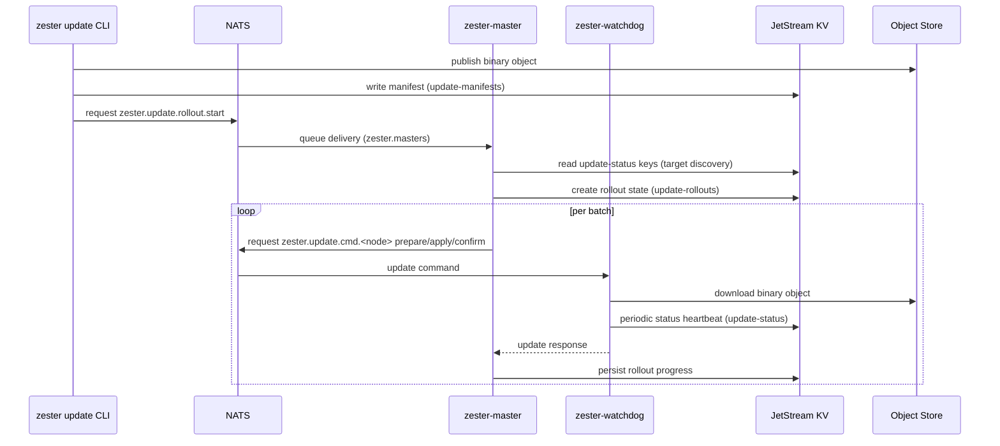

## End-to-End Flow

## Control Plane Subjects

Source of truth: `pkg/bus/subjects.go`.

| Subject | Direction | Use |
|---|---|---|
| `zester.update.rollout.start` | CLI -> master (request/reply) | Start rollout |
| `zester.update.rollout.abort` | CLI -> master (request/reply) | Abort rollout |
| `zester.update.cmd.<id>` | master -> watchdog (request/reply) | Node update commands (`prepare`, `apply`, `confirm`, `rollback`, `status`) |

Watchdog status flows through `update-status` KV heartbeats, not a dedicated event subject.

## Rollout Controller Behavior

Source of truth: `pkg/update/rollout.go`, wiring in `cmd/zester-master/main.go`.

- Rollouts are persisted in `update-rollouts` KV with CAS revision control.
- Node list is resolved from `update-status` keys.
- Targets currently support:
  - standard targeting expressions (`glob`, `E@` PCRE, `L@` list, `G@` fact, `compound`)
  - evaluated against the set of nodes currently reporting in `update-status` for the component
- Pre-flight eligibility checks run before batching (skipped when the status KV is unavailable; they also apply to dry runs):
  - **Degraded exclusion** — nodes whose `NodeStatus.Degraded` is set are excluded, with an Info log listing them (`excluding degraded nodes from rollout`). If exclusion empties a non-empty target set, the rollout errors with `no eligible nodes (N degraded excluded)`.
  - **Min-protocol gating** — when the target manifest declares `MinProtocol > 0`, every remaining node's `NodeStatus.Protocol` is checked; any node below it refuses the whole rollout with an error naming each incompatible node as `node (protocol X < Y)`. Nodes reporting `Protocol` 0 (the field was never set — treated as compatible everywhere else) and nodes with no status record fail the check only when `MinProtocol > 0`; a manifest with `MinProtocol` 0 never refuses anyone. Watchdogs stamp `NodeStatus.Protocol` with `proto.ProtocolVersion` (see `pkg/proto/doc.go` for the additive-only wire policy that `MinProtocol` gates).
- Batch execution runs commands in parallel per batch:
  - `prepare` on batch
  - `apply` on batch
  - wait `soak_time` (each node's watchdog independently polls the child's readiness during this window and auto-rolls back on sustained failure — see [Watchdog Runtime](/docs/operations/update/watchdog))
  - `confirm` on batch — must arrive before the watchdog's confirm-deadline (3× soak time, floored at 5 minutes), or the node auto-rolls back
  - wait `batch_pause` between batches
- `max_failed` is global per rollout; once reached, rollout transitions to aborted.
- Abort does not automatically roll back already-updated nodes. Abort works from **any** master: if the rollout is not locally active, the abort is CAS-written to the rollout record and the owning driver stops on its next save or abort-poll. Aborting an already-aborted rollout is idempotent.

## Rollout Resume (Driver Failover)

A rollout survives the death of the master driving it:

- The rollout record carries `DriverID` and `DriverHeartbeat` (msgpack `driver_id` / `driver_heartbeat`, additive). The driving controller refreshes the heartbeat on every batch step and at least every 10s while waiting or soaking.
- Every master runs the resume loop (`RolloutController.RunResumeLoop`, scan period `DefaultRolloutResumeInterval` = 60s). It scans `update-rollouts` for non-terminal, non-dry-run rollouts whose heartbeat is older than `DefaultRolloutStaleAfter` (60s) and CAS-adopts each — writing its own driver ID and a fresh heartbeat; losing the CAS race just skips. A zero heartbeat (never written) reads as maximally stale and is adopted immediately.
- A resumed rollout re-issues commands to its current batch starting at `prepare`; nodes already past prepare (staged/soaking) reject the duplicate and are recorded failed — bounded by `max_failed` and backstopped by the watchdog confirm-deadline auto-rollback. Adopted aborting records just finish the abort.
- A master shutting down (context cancelled) stops driving **without** aborting, leaving the record for another master's resume loop. A mid-run persistence failure, by contrast, loudly aborts the rollout.
- Brief double-drive during adoption is safe by design: the watchdog handler rejects duplicate prepare/apply commands, and a superseded driver stops on its next CAS save.

## Rollout Persistence Model

Each rollout state tracks:

- config (`version`, `component`, target and timing controls)
- deterministic batches
- per-node result map (`prepared`, `applied`, `confirmed`, `failed`)
- current batch index
- failed count
- start/finish timestamps
- state (`created`, `rolling`, `completed`, `aborting`, `aborted`, etc.)
- driver identity and liveness (`driver_id`, `driver_heartbeat`) for resume adoption

## Scope Notes

- This architecture is for watchdog-mediated binary swaps, not `state.apply`.
- Rollout targeting only sees nodes currently reporting to `update-status` — an offline watchdog is invisible to a rollout.
