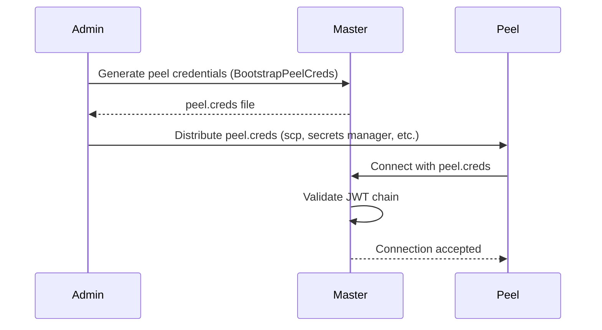

## File Format

A `.creds` file contains two decorated sections:

```
-----BEGIN NATS USER JWT-----
eyJ0eXAiOiJKV1QiLCJhbGciOiJlZDI1NTE5LW5rZXkifQ.eyJqdGk...
------END NATS USER JWT------

************************* IMPORTANT *************************
  NKEY Seed printed below can be used to sign and prove identity.
  NKEYs are sensitive and should be treated as secrets.

-----BEGIN USER NKEY SEED-----
SUACSSL3UAHUDXKFSNVUZRF5UHPMWZ6BFDTJ7M6USDXIEDNPPQYYYCU3VY
------END USER NKEY SEED------

*************************************************************
```

<Callout type="error" title="Handle with care">
The `.creds` file contains the private nkey seed. Treat it like a password file. Zester writes `.creds` files with mode `0600` (owner read/write only).
</Callout>

## The CredsFile Struct

```go
type CredsFile struct {
    JWT  string  // The user JWT token
    Seed []byte  // The user nkey seed
    Path string  // File path (empty if parsed from bytes)
}
```

## Generating Credentials

### From Existing Keys

If you already have a user JWT and seed:

```go
// Generate the raw .creds content
content, err := auth.GenerateCredsFile(userJWT, userKP.Seed)

// Or write directly to disk (mode 0600)
err := auth.WriteCredsFile("/etc/zester/peel.creds", userJWT, userKP.Seed)
```

### Bootstrapping Peel Credentials

The `BootstrapPeelCreds` helper generates a complete set of credentials for a peel in one step:

```go
userKP, userJWT, err := auth.BootstrapPeelCreds(
    accountKP,                        // Account key bundle (signs the user JWT)
    "web-server-01",                  // Peel ID
    "/etc/zester/web-server-01.creds", // Output path
)
```

This function:

1. Generates a new user key pair.
2. Creates a user JWT with `PeelUserJWTOptions` (scoped to the peel's subjects).
3. Writes the `.creds` file to disk.

## Loading Credentials

### From a File

```go
creds, err := auth.LoadCredsFile("/etc/zester/peel.creds")
// creds.JWT  => "eyJ0eXAi..."
// creds.Seed => []byte("SUACSSL3...")
// creds.Path => "/etc/zester/peel.creds"
```

### From Raw Bytes

```go
creds, err := auth.ParseCredsData(rawBytes, "embedded-creds")
// creds.Path => "embedded-creds" (used for error messages)
```

## Connecting to NATS

The `CredsFile` struct provides a `NATSOption()` method that returns a `nats.Option` for authenticating a NATS connection:

```go
creds, _ := auth.LoadCredsFile("/etc/zester/peel.creds")

nc, err := nats.Connect("nats://master:4222", creds.NATSOption())
```

### File-Based vs Inline Authentication

When the creds were loaded from a file (`.Path` is set), `NATSOption()` uses `nats.UserCredentials(path)`. This enables **automatic key rotation** -- if the `.creds` file is replaced on disk, the NATS client picks up the new credentials on reconnect.

When the creds were parsed from bytes (`.Path` is empty), it uses an inline JWT + sign callback. This is useful for embedded scenarios but does not support rotation.

| Source | NATS Method | Supports Rotation |
|--------|-------------|-------------------|
| `LoadCredsFile(path)` | `nats.UserCredentials(path)` | Yes |
| `ParseCredsData(bytes)` | `nats.UserJWT(callback)` | No |

## Seed-Only Authentication

For server-level authentication where JWTs are not used (e.g., trusted internal services), authenticate with just an nkey seed:

```go
opt, err := auth.NATSOptionFromSeed(seedBytes)
nc, err := nats.Connect("nats://master:4222", opt)
```

This performs challenge-response authentication: the NATS server sends a nonce, the client signs it with the private key, and the server verifies the signature against a list of trusted public keys.

## Peel Connection Options

Pre-configured NATS options for peel connections:

```go
opts := auth.NATSOptionsForPeel("/etc/zester/peel.creds", "web-server-01")
nc, err := nats.Connect("nats://master:4222", opts...)
```

This sets:

| Option | Value | Description |
|--------|-------|-------------|
| Authentication | `UserCredentials(path)` | JWT + nkey from `.creds` file |
| Connection name | `zester-peel-<peelID>` | Identifies the peel in server logs |
| Max reconnects | `-1` (unlimited) | Never stop trying to reconnect |
| Reconnect wait | Default (2s + jitter) | Backoff between reconnect attempts |
| Reconnect buffer | 8 MB | Buffer for messages during reconnection |

## Master Connection Options

Pre-configured NATS options for master connections:

```go
opts := auth.NATSOptionsForMaster("/etc/zester/master.creds")
nc, err := nats.Connect("nats://localhost:4222", opts...)
```

| Option | Value | Description |
|--------|-------|-------------|
| Authentication | `UserCredentials(path)` | JWT + nkey from `.creds` file |
| Connection name | `zester-master` | Identifies the master in server logs |
| Max reconnects | `-1` (unlimited) | Never stop trying to reconnect |

## Credential Distribution Workflow

A typical workflow for provisioning a new peel:



<Callout type="success" title="Automation">
In automated environments, use a configuration management tool or secrets manager to distribute `.creds` files. The master can generate credentials for new peels via `BootstrapPeelCreds` and push them through your existing secrets pipeline.
</Callout>
