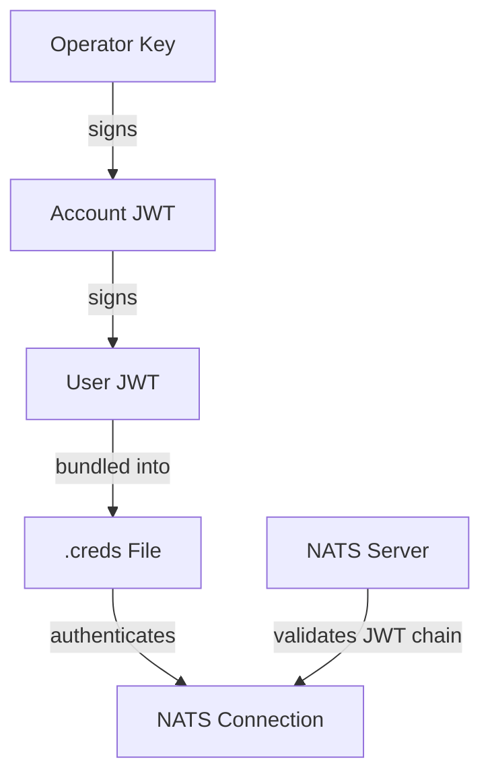

Zester uses the same cryptographic authentication stack as [NATS](https://nats.io): **Ed25519 nkeys** for identity and **JWTs** for authorization. Every connection between a peel and the master is authenticated -- there is no anonymous access.

## How It Works

Authentication in Zester follows a three-layer model, enforced by the external NATS server:

1. **nkeys** provide cryptographic identity. Each entity (operator, account, user) has an Ed25519 key pair. The private seed never leaves the machine that generated it.

2. **JWTs** encode authorization claims. An operator signs account JWTs; an account signs user JWTs. This creates a verifiable trust chain.

3. **Credentials files** bundle a user JWT with its nkey seed into a single `.creds` file. The master uses `master.creds`, the CLI uses `admin.creds`, and each peel uses `<peel-id>.creds`.

4. **NATS enforces authentication** via a challenge-response flow: when a client connects, NATS sends a nonce; the client signs it with its nkey; NATS verifies the signature against the public key in the user JWT, and validates the JWT chain up to the trusted operator.

## Section Contents

| Page | Description |
|------|-------------|
| [nkeys](/docs/reference/authentication/nkeys) | Ed25519 key pairs, seed files, public key prefixes, and key roles |
| [JWT Hierarchy](/docs/reference/authentication/jwt) | Operator, account, and user JWTs -- options, signing, and chain validation |
| [Credentials Files](/docs/reference/authentication/credentials) | The `.creds` format, generation, loading, and NATS connection options |
| [Key Management](/docs/reference/authentication/key-management) | Acceptance policies, key states, revocation, and rotation procedures |
| [Enrollment](/docs/architecture/enrollment) | Automated credential provisioning via challenge-response and operator approval |

## Design Principles

Zester's authentication is designed around these principles:

- **Zero trust by default** -- every connection (master, peels, CLI) must present valid credentials. The NATS server never accepts unauthenticated connections.
- **Decentralized key generation** -- keys are generated locally and only the public key is shared. Private seeds never traverse the network.
- **Least-privilege permissions** -- each peel user JWT is scoped to only the NATS subjects that peel needs (its own events, facts, and job responses).
- **Encrypted secrets** -- sensitive settings values are encrypted with NaCl box using X25519 curve keys derived from the same nkey identity, ensuring only the target peel can decrypt them.

<Callout type="warn" title="Production requirement">
Always enable TLS in production. While nkey authentication prevents impersonation, TLS prevents eavesdropping on the wire. See [Master Configuration](/docs/reference/configuration/master) for TLS setup.
</Callout>
