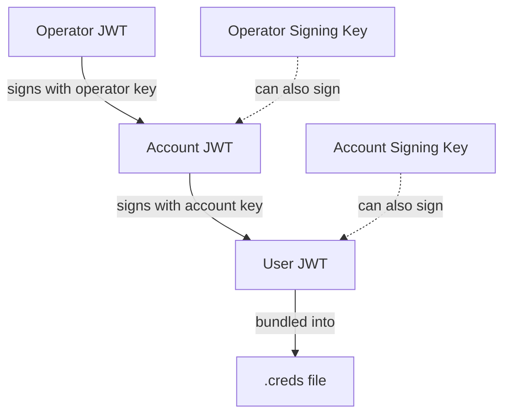

Zester uses [NATS JWTs](https://github.com/nats-io/jwt) to encode authorization claims in a three-level trust chain: **operator** signs **account**, account signs **user**. Each level delegates a bounded set of permissions to the level below.

## Trust Chain



The chain is validated bottom-up: a user JWT is only valid if its issuer is the account (or one of the account's signing keys), and the account JWT is only valid if its issuer is the operator (or one of the operator's signing keys).

## Operator JWT

The operator is the root of trust. There is typically one operator per Zester deployment.

### OperatorJWTOptions

| Field | Type | Default | Description |
|-------|------|---------|-------------|
| `Name` | `string` | `""` | Human-readable name for the operator |
| `SigningKeys` | `[]string` | `nil` | Additional public keys authorized to sign account JWTs on behalf of this operator |
| `SystemAccount` | `string` | `""` | Public key of the system account (enables NATS system events) |
| `StrictSignKeys` | `bool` | `false` | When `true`, only signing keys (not the operator key itself) can sign account JWTs |

### Creating an Operator JWT

```go
operatorKP, _ := auth.GenerateKeyBundle(auth.RoleOperator)

operatorJWT, err := auth.CreateOperatorJWT(operatorKP, auth.OperatorJWTOptions{
    Name:           "prod-operator",
    StrictSignKeys: true,
    SigningKeys:    []string{signingKeyPub},
})
```

<Callout type="info" title="Signing keys">
Signing keys allow you to keep the root operator key offline. Generate a separate operator key pair, add its public key to `SigningKeys`, and use that key pair for day-to-day account signing. If a signing key is compromised, revoke it without rotating the root operator.
</Callout>

## Account JWT

An account defines a namespace boundary and resource limits. Zester typically uses one account for all peels in an environment.

### AccountJWTOptions

| Field | Type | Default | Description |
|-------|------|---------|-------------|
| `Name` | `string` | `""` | Human-readable name for the account |
| `SigningKeys` | `[]string` | `nil` | Additional public keys authorized to sign user JWTs under this account |
| `MaxConns` | `int64` | `0` (unlimited) | Maximum concurrent connections allowed |
| `MaxData` | `int64` | `0` (unlimited) | Maximum data in bytes across all connections |
| `MaxPayload` | `int64` | `0` (unlimited) | Maximum message payload size in bytes |
| `AllowPub` | `[]string` | `nil` | Default publish permission subjects for users in this account |
| `AllowSub` | `[]string` | `nil` | Default subscribe permission subjects for users in this account |
| `IssuerAccount` | `string` | `""` | Set automatically when signed by an operator signing key (rather than the operator key itself) |
| `JetStream` | `bool` | `false` | When `true`, enables JetStream for this account with unlimited storage and streams |

### Creating an Account JWT

```go
accountKP, _ := auth.GenerateKeyBundle(auth.RoleAccount)

accountJWT, err := auth.CreateAccountJWT(accountKP, operatorKP, auth.AccountJWTOptions{
    Name:       "production",
    MaxConns:   1000,
    MaxPayload: 1024 * 1024, // 1MB
    AllowPub:   []string{"zester.>"},
    AllowSub:   []string{"zester.>"},
})
```

The second argument (`operatorKP`) is the signing key -- either the operator's own key bundle or a designated signing key.

## User JWT

A user JWT represents a single authenticated identity. In Zester, each peel gets its own user JWT with permissions scoped to that peel's ID.

### UserJWTOptions

| Field | Type | Default | Description |
|-------|------|---------|-------------|
| `Name` | `string` | `""` | Human-readable name (typically the peel ID) |
| `AllowPub` | `[]string` | `nil` | Subjects the user may publish to |
| `AllowSub` | `[]string` | `nil` | Subjects the user may subscribe to |
| `DenyPub` | `[]string` | `nil` | Subjects explicitly denied for publish |
| `DenySub` | `[]string` | `nil` | Subjects explicitly denied for subscribe |
| `MaxPayload` | `int64` | `0` (unlimited) | Maximum message payload size in bytes |
| `BearerToken` | `bool` | `false` | When `true`, the JWT can be used without the nkey seed (less secure) |
| `Expiry` | `time.Duration` | `0` (no expiry) | How long until the JWT expires |
| `IssuerAccount` | `string` | `""` | The account public key. Required when signed by an account signing key. |

### Creating a User JWT

```go
userKP, _ := auth.GenerateKeyBundle(auth.RoleUser)

userJWT, err := auth.CreateUserJWT(userKP, accountKP, auth.UserJWTOptions{
    Name:          "web-server-01",
    IssuerAccount: accountKP.PublicKey,
    AllowPub:      []string{"zester.event.web-server-01.>"},
    AllowSub:      []string{"zester.cmd.web-server-01.>"},
    Expiry:        24 * time.Hour,
})
```

## Peel User JWT Defaults

The `PeelUserJWTOptions` helper generates a `UserJWTOptions` pre-configured with the exact subjects a peel needs:

```go
opts := auth.PeelUserJWTOptions("web-server-01", accountKP.PublicKey)
```

This sets the following permissions:

**Publish (peel sends to):**

| Subject Pattern | Purpose |
|-|-|
| `zester.event.<peelID>.>` | Emit events (`event.send` module and beacons; captured by the `events` stream that feeds the reactor — the subject token is the trust anchor for event origin) |
| `zester.fact.<peelID>` | Report facts |
| `zester.job.*.ack.<peelID>` | Acknowledge job receipt |
| `zester.job.*.return.<peelID>` | Return job results |
| `$JS.API.STREAM.INFO.KV_facts` | JetStream: facts bucket info |
| `$JS.API.DIRECT.GET.KV_facts.>` | JetStream: direct get from facts |
| `$JS.API.STREAM.MSG.GET.KV_facts` | JetStream: message get from facts |
| `$JS.API.CONSUMER.CREATE.KV_facts` | JetStream: create consumer on facts |
| `$JS.API.CONSUMER.CREATE.KV_facts.>` | JetStream: create named consumer on facts |
| `$JS.API.CONSUMER.DELETE.KV_facts.>` | JetStream: delete consumer on facts |
| `$JS.API.STREAM.INFO.KV_settings-files` | JetStream: settings-files bucket info |
| `$JS.API.DIRECT.GET.KV_settings-files.>` | JetStream: direct get from settings-files |
| `$JS.API.STREAM.MSG.GET.KV_settings-files` | JetStream: message get from settings-files |
| `$JS.API.CONSUMER.CREATE.KV_settings-files` | JetStream: create consumer on settings-files |
| `$JS.API.CONSUMER.CREATE.KV_settings-files.>` | JetStream: create named consumer on settings-files |
| `$JS.API.CONSUMER.DELETE.KV_settings-files.>` | JetStream: delete consumer on settings-files |
| `$JS.API.STREAM.INFO.KV_secrets` | JetStream: secrets bucket info |
| `$JS.API.DIRECT.GET.KV_secrets.>` | JetStream: direct get from secrets |
| `$JS.API.STREAM.MSG.GET.KV_secrets` | JetStream: message get from secrets |
| `$JS.API.CONSUMER.CREATE.KV_secrets` | JetStream: create consumer on secrets |
| `$JS.API.CONSUMER.CREATE.KV_secrets.>` | JetStream: create named consumer on secrets |
| `$JS.API.CONSUMER.DELETE.KV_secrets.>` | JetStream: delete consumer on secrets |
| `$JS.API.STREAM.INFO.KV_basket` | JetStream: basket bucket info |
| `$JS.API.DIRECT.GET.KV_basket.>` | JetStream: direct get from basket |
| `$JS.API.STREAM.MSG.GET.KV_basket` | JetStream: message get from basket |
| `$JS.API.CONSUMER.CREATE.KV_basket` | JetStream: create consumer on basket |
| `$JS.API.CONSUMER.CREATE.KV_basket.>` | JetStream: create named consumer on basket |
| `$JS.API.CONSUMER.DELETE.KV_basket.>` | JetStream: delete consumer on basket |
| `$JS.API.STREAM.INFO.KV_state-files` | JetStream: state-files bucket info |
| `$JS.API.DIRECT.GET.KV_state-files.>` | JetStream: direct get from state-files |
| `$JS.API.STREAM.MSG.GET.KV_state-files` | JetStream: message get from state-files |
| `$JS.API.CONSUMER.CREATE.KV_state-files` | JetStream: create consumer on state-files |
| `$JS.API.CONSUMER.CREATE.KV_state-files.>` | JetStream: create named consumer on state-files |
| `$JS.API.CONSUMER.DELETE.KV_state-files.>` | JetStream: delete consumer on state-files |
| `$KV.basket.<peelID>.>` | Write own basket data to KV |
| `$KV.facts.<peelID>` | Write own facts to KV |
| `_INBOX.>` | NATS request-reply inbox |

**Subscribe (peel listens to):**

| Subject Pattern | Purpose |
|-|-|
| `zester.cmd.<peelID>` | Receive commands |
| `zester.cmd.<peelID>.>` | Receive sub-commands |
| `zester.job.*.cancel` | Receive job cancellation signals |
| `$KV.settings-files.>` | Read settings template files from KV |
| `$KV.secrets._master_curve_pub` | Read master's curve public key |
| `$KV.secrets.<peelID>` | Read own encrypted secrets from KV |
| `$KV.basket.>` | Read all basket data from KV |
| `$KV.state-files.>` | Read state files from KV |
| `_INBOX.>` | NATS request-reply inbox |

<Callout type="warn" title="Least privilege">
Each peel can only publish to its own subjects and subscribe to commands targeted at it. A compromised peel cannot impersonate other peels or intercept their traffic.
</Callout>

## Full Hierarchy Generation

For bootstrapping or testing, generate a complete operator-account-user chain in one call:

```go
operatorKP, accountKP, userKP,
operatorJWT, accountJWT, userJWT,
err := auth.GenerateFullHierarchy("prod-ops", "production", "master-user")
```

This creates three key bundles and three signed JWTs with default options.

## Chain Validation

Validate that a set of JWTs form a valid trust chain:

```go
err := auth.ValidateJWTChain(operatorJWT, accountJWT, userJWT)
```

This checks:

1. The operator JWT is well-formed and self-signed.
2. The account JWT's issuer matches the operator's public key or one of its signing keys.
3. The user JWT's issuer matches the account's public key or one of its signing keys.

### Verifying a Single User JWT

For a single token, decode it and then validate issuer/expiry in your caller:

```go
claims, err := auth.DecodeUserJWT(userJWT)
if err != nil {
    return err
}
if claims.Issuer != accountKP.PublicKey && claims.IssuerAccount != accountKP.PublicKey {
    return fmt.Errorf("user JWT not issued by expected account")
}
if claims.Expires > 0 && time.Now().Unix() > claims.Expires {
    return fmt.Errorf("user JWT expired")
}
```

For full trust validation, prefer `ValidateJWTChain(operatorJWT, accountJWT, userJWT)`.

## Decoding JWTs

Decode individual JWTs to inspect their claims:

```go
operatorClaims, err := auth.DecodeOperatorJWT(operatorJWT)
accountClaims, err := auth.DecodeAccountJWT(accountJWT)
userClaims, err := auth.DecodeUserJWT(userJWT)
```

## Signing Keys

Signing keys provide operational flexibility. Instead of using the root operator or account key for every signing operation, generate dedicated signing keys and reference them:

```go
// Generate a signing key (same type as the parent)
signingKP, _ := auth.GenerateKeyBundle(auth.RoleOperator)

// Include it in the operator JWT
operatorJWT, _ := auth.CreateOperatorJWT(operatorKP, auth.OperatorJWTOptions{
    Name:       "prod-ops",
    SigningKeys: []string{signingKP.PublicKey},
})

// Now sign accounts with the signing key instead of the root key
accountJWT, _ := auth.CreateAccountJWT(accountKP, signingKP, auth.AccountJWTOptions{
    Name: "production",
})
```

Benefits of signing keys:

- The root key can stay offline (cold storage, HSM).
- Signing keys can be rotated without re-issuing the operator JWT (just add the new key and remove the old one).
- If a signing key is compromised, only JWTs signed by that key need re-issuing.
