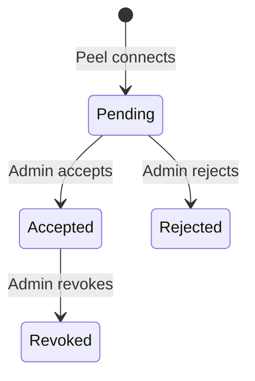
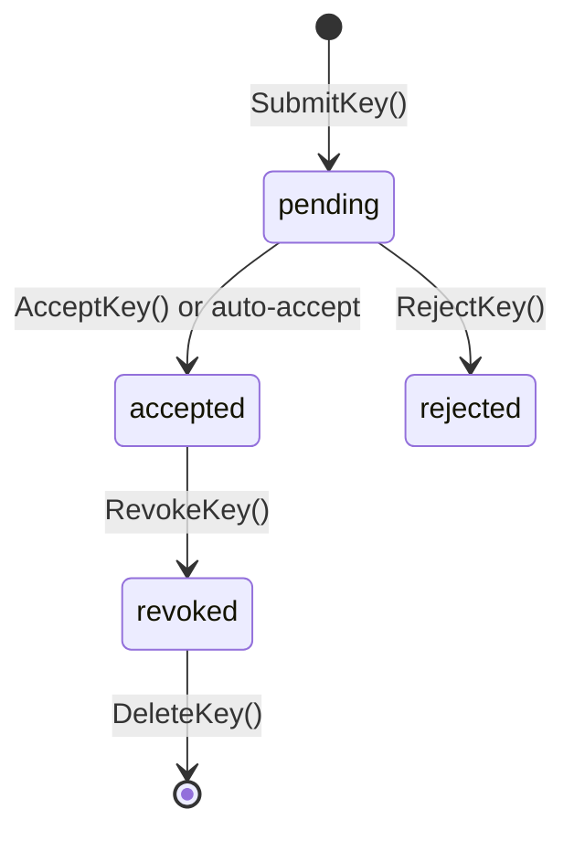
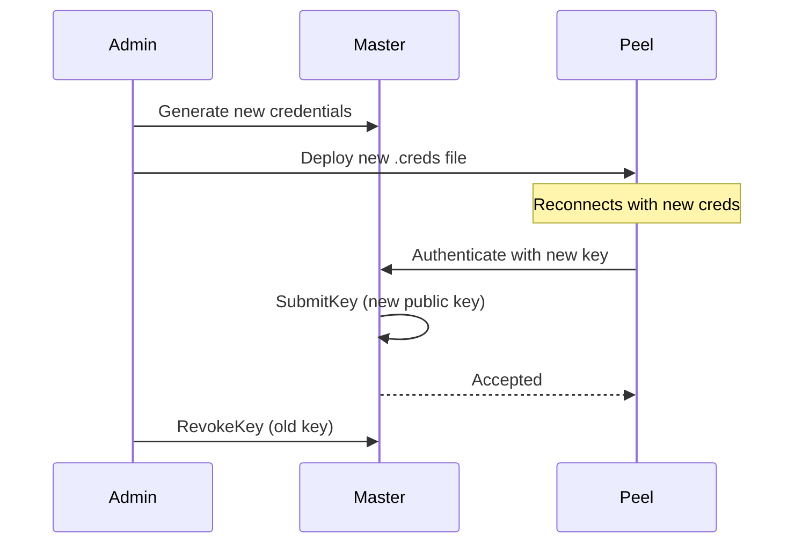

## Acceptance Policies

The acceptance policy determines how new peel keys are handled when they first connect:

| Policy | Config Value | Description |
|--------|-------------|-------------|
| **Manual** | `manual` | An administrator must explicitly accept each peel key. Most secure. |
| **Auto-Trusted** | `auto-trusted` | Peels whose user JWT is signed by a trusted account are auto-accepted. Recommended for production. |
| **Auto-All** | `auto-all` | All peels are accepted automatically. For development and testing only. |

<Callout type="error" title="Never use `auto-all` in production">
The `auto-all` policy accepts any key without verification. This is intended only for local development and testing environments.
</Callout>

### Manual Policy

With the `manual` policy, every new peel key enters the `pending` state. An administrator must review and accept each key:



This is the most secure option -- it ensures that only explicitly authorized peels can join the fleet.

### Auto-Trusted Policy

The `auto-trusted` policy automatically accepts peels whose user JWT was signed by a trusted account. The master maintains a list of trusted account public keys:

```go
keyStore := auth.NewKeyStore(auth.AcceptAutoTrusted)
keyStore.AddTrustedAccount(accountKP.PublicKey)
```

When a peel submits its key, the master:

1. Decodes the peel's user JWT.
2. Checks if the issuer (or `IssuerAccount`) matches a trusted account public key.
3. If trusted, auto-accepts the key. If not, leaves it in `pending` state.

This is the recommended production policy -- it provides automated onboarding while ensuring only properly signed credentials are accepted.

### Auto-All Policy

Accepts every peel without any verification:

```go
keyStore := auth.NewKeyStore(auth.AcceptAutoAll)
```

## Key States

Each peel key passes through a defined lifecycle:

| State | Description |
|-------|-------------|
| `pending` | Submitted but not yet accepted. Peel cannot execute commands. |
| `accepted` | Authorized. Peel is a full member of the fleet. |
| `rejected` | Explicitly denied by an administrator. |
| `revoked` | Previously accepted, now revoked. Peel is locked out. |

### State Transitions



<Callout type="info" title="Revoked keys cannot be re-accepted">
Once a key is revoked, the peel must generate new credentials and re-submit. The revoked record remains in the store as an audit trail. Use `DeleteKey` to remove it entirely if needed.
</Callout>

## Key Record

The `KeyRecord` struct tracks the full lifecycle of a peel's key:

| Field | Type | Description |
|-------|------|-------------|
| `PeelID` | `string` | The unique identifier of the peel |
| `PublicKey` | `string` | The peel's Ed25519 public key (prefix `U`) |
| `CurvePubKey` | `string` | The peel's X25519 curve public key (prefix `X`) for encryption |
| `State` | `KeyState` | Current state: `pending`, `accepted`, `rejected`, or `revoked` |
| `SubmittedAt` | `time.Time` | When the key was first submitted |
| `DecidedAt` | `time.Time` | When the accept/reject/revoke decision was made |
| `DecidedBy` | `string` | Who or what made the decision (admin name, `"auto-trusted"`, or `"auto-all"`) |

## KeyStore Operations

### Creating a KeyStore

```go
keyStore := auth.NewKeyStore(auth.AcceptAutoTrusted)

// Register trusted accounts for auto-accept
keyStore.AddTrustedAccount(accountKP.PublicKey)
```

### Submitting a Key

When a peel connects, the master submits its key to the store:

```go
state, err := keyStore.SubmitKey(
    "web-server-01",       // peel ID
    userKP.PublicKey,       // Ed25519 public key
    curvePub,               // X25519 curve public key
    userJWT,                // user JWT (used for auto-trusted validation)
)

switch state {
case auth.KeyAccepted:
    // Peel is authorized
case auth.KeyPending:
    // Waiting for admin approval
case auth.KeyRevoked:
    // Previously revoked, err is set
}
```

If the peel has already been accepted with the same public key, `SubmitKey` returns `KeyAccepted` immediately (idempotent).

### Manual Accept/Reject

```go
// Accept a pending key
err := keyStore.AcceptKey("web-server-01", "admin@example.com")

// Reject a pending key
err := keyStore.RejectKey("web-server-01", "admin@example.com")
```

### Revoking a Key

Revoke a previously accepted key to immediately lock out a peel:

```go
err := keyStore.RevokeKey("web-server-01", "admin@example.com")
```

After revocation, the peel's existing connection continues until it disconnects, but it cannot re-authenticate.

### Querying Key State

```go
// Check if a peel is accepted
if keyStore.IsAccepted("web-server-01") {
    // proceed
}

// Get full record
record, exists := keyStore.GetRecord("web-server-01")

// List all pending keys
pending := keyStore.ListByState(auth.KeyPending)
fmt.Printf("%d keys awaiting approval\n", len(pending))

// Count pending (without allocating the list)
count := keyStore.PendingCount()
```

### Removing a Key Record

Permanently delete a key record (no undo):

```go
keyStore.DeleteKey("web-server-01")
```

## Managing Trusted Accounts

For the `auto-trusted` policy, manage the set of trusted account public keys:

```go
// Add a trusted account
keyStore.AddTrustedAccount("ABJK7P2XGHW...")

// Remove a trusted account (new peels from this account will be pending)
keyStore.RemoveTrustedAccount("ABJK7P2XGHW...")
```

<Callout type="success" title="Multiple accounts">
You can trust multiple accounts simultaneously. This is useful when migrating between accounts or running separate environments that share a master.
</Callout>

## Key Rotation

To rotate a peel's credentials:

1. Generate new credentials for the peel using `BootstrapPeelCreds`.
2. Distribute the new `.creds` file to the peel.
3. The peel's NATS connection will use the new credentials on next reconnect (if file-based).
4. Optionally revoke the old key: `keyStore.RevokeKey(peelID, "rotation")`.



## Encryption Key Management

When a peel's key is accepted, the master stores both the Ed25519 public key and the X25519 curve public key. The curve key is used for encrypting sensitive settings values:

```go
// The master encrypts a settings value for a specific peel
enc, err := masterEncryptor.SealSettingsValue(
    []byte("database-password"),
    record.CurvePubKey,  // from the KeyRecord
)
// Result: "ENC[nkey,base64...]"
```

Only the target peel can decrypt the value because only it holds the private curve key derived from its nkey seed.

See [Settings Encryption](/docs/guides/settings/encryption) for details on the encryption protocol.
