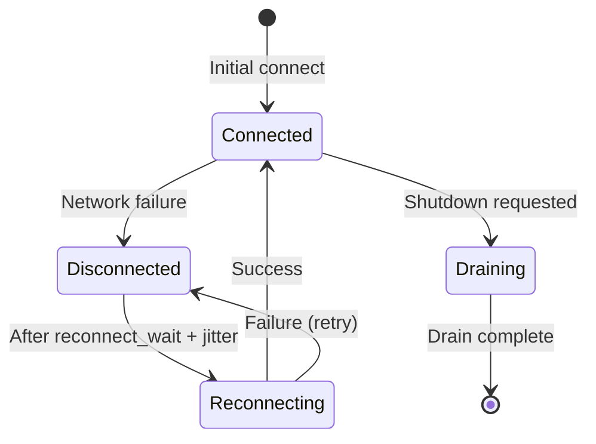

A peel is a managed node that connects to the NATS server as a client. Configuration is provided via a YAML config file and/or command-line flags. The underlying `ClientConfig` struct controls connection and resilience behavior.

## Configuration File

The peel loads configuration from a YAML file. The default search path is `/etc/zester/peel.yaml`. Use `--config` to specify a custom path.

**Precedence** (lowest to highest):

1. Built-in defaults
2. Config file values
3. Command-line flags

### Example Config File

```yaml
id: web-01
# Only tls:// URLs are accepted — plaintext nats:// is rejected at startup.
nats_url: tls://nats:4222
nats_ca: /data/auth/nats-ca.crt
master_url: https://master:8443
enroll_ca: /data/auth/enroll-ca.crt
states_cache: /data/states-cache
health_addr: "127.0.0.1:9090"
```

The packaged config installed by the `.deb`/`.rpm` (`packaging/config/peel.yaml`) uses `nats_url: "tls://localhost:4222"` with `nats_ca` under `/var/lib/zester/auth/`.

### Config File Reference

| Key | Type | Default | Description |
|-----|------|---------|-------------|
| `id` | string | machine hostname | Peel identifier. When unset, defaults to `hostname -f`. The dotted form is what you see and type everywhere — targets (`zester 'web01.pl' …`, `L@web01.pl`, reactor `require_peel`) and all CLI output use it; on the wire it becomes a NATS subject token with `.` encoded as `_` (`web01.example.com` ↔ `web01_example_com`, lossless — a valid hostname never contains `_`, and a configured id may not contain a raw `_`: write the dot). The derived id is pinned to `<auth_dir>/node-id` so a DNS-degraded `hostname -f` can't re-identify the node across reboots (delete the file to re-derive); a derived localhost placeholder is refused. An explicit value is sanitized the same way and never pinned. |
| `nats_url` | string | `tls://nats:4222` | NATS server URL. Must use the `tls://` scheme — plaintext `nats://` URLs are rejected at startup. |
| `nats_ca` | string | `""` | CA certificate file for NATS TLS server verification (see [CA resolution order](#nats-tls-and-ca-resolution)) |
| `master_url` | string | `""` | Master enrollment API URL (single URL; superseded by `master_urls` when that is set) |
| `master_urls` | list | `[]` | Ordered list of master enrollment API URLs, tried in order for failover. Takes precedence over `master_url` when non-empty. |
| `enroll_ca` | string | `""` | CA certificate for enrollment TLS |
| `states_cache` | string | `/data/states-cache` | Local cache directory for state files |
| `health_addr` | string | `127.0.0.1:9090` | Listen address for the local observability endpoints — `/healthz`, `/readyz`, `/metrics` (polled by zester-watchdog `--health-url` / `--ready-url`) |
| `log_level` | string | `info` | Log level: `debug`, `info`, `warn`, or `error`. Invalid values abort startup. |
| `log_format` | string | `json` | Log format: `json` or `text`. See [Logging](#logging). |
| `schedule` | map | `{}` | Local scheduler entries (see [Schedule](#schedule)) |

## Command-Line Flags

| Flag | Default | Description |
|------|---------|-------------|
| `--config` | `/etc/zester/peel.yaml` | Path to YAML config file |
| `--id` | (required) | Peel identifier |
| `--nats-url` | `tls://nats:4222` | NATS server URL (must be `tls://`) |
| `--nats-ca` | `""` | CA certificate for NATS TLS server verification |
| `--master-url` | `""` | Master enrollment API URL (e.g., `https://master:8443`). Required for auto-enrollment when no credentials exist. |
| `--master-urls` | `""` | Comma-separated master enrollment API URLs, tried in order for failover. Takes precedence over `--master-url`; passing an explicitly empty value (`--master-urls ""`) clears a YAML-provided list. |
| `--enroll-ca` | `""` | CA certificate file for enrollment TLS verification |
| `--states-cache` | `/data/states-cache` | Local cache directory for state files from KV |
| `--health-addr` | `127.0.0.1:9090` | Listen address for `/healthz`, `/readyz`, and `/metrics` |
| `--log-level` | `info` | Log level (`debug`, `info`, `warn`, `error`) |
| `--log-format` | `json` | Log format (`json`, `text`) |

Flags explicitly passed on the command line override config file values; default flag values do not. Flags and YAML fields are generated from the same tagged config struct (`PeelConfig` in `internal/config/peel.go`), so every flag has a matching YAML field with a shared default; the precedence stays flag > config file > built-in default.

The peel credentials file is loaded from `/data/auth/<peel-id>.creds`. If no credentials file exists and a master URL is configured (`master_urls` or `master_url`), the peel runs the enrollment flow automatically, trying each URL in order.

On startup, the peel syncs state files from the `state-files` KV bucket to `--states-cache` and watches for updates. If the cache is empty (e.g., first boot), the peel falls back to baked-in states at `/data/states`. The effective states directory is re-evaluated before every execution, so a peel that boots before state files reach KV switches to the cache once it fills. See [State File Distribution](/docs/guides/states/distribution) for details.

<Callout type="info" title="Settings resolution fails closed">
Before `state.apply` / `state.highstate` executes, the peel resolves settings for the run. If resolution fails, the peel falls back to the last-known-good settings from a previous successful resolve and logs a warning. If the peel has *never* resolved settings successfully, the execution fails with an explanatory error — states are never applied with empty settings.
</Callout>

## Offline-First Startup

The peel starts in two phases and never exits just because NATS is unreachable:

1. **Local phase** — health endpoints, enrollment, local fact collection, provider detection, the states engine (cache or baked fallback), settings warm-start from the on-disk snapshot, the scheduler, and the exec/cancel subscriptions (registered while the client is still connecting; NATS replays them on connect).
2. **Connected phase** — everything JetStream-dependent: facts publishing, the settings resolver and watchers, state-file cache sync, the basket publisher, and the peel heartbeat. It starts once the NATS connection reports healthy; failures here are retried or degrade gracefully — they never terminate the daemon.

Only genuinely local problems abort startup: a bad config file, no credentials and no master URL to enroll with, an invalid TLS configuration, or unreadable credentials. NATS-dependent failures (facts bucket not yet initialized, resolver errors, state-file sync) are retried in the background.

The `zester-peel ready` log line appears after the local phase. When NATS is reachable at boot, the peel first waits (up to 60s) for the connected phase to finish so the observable startup sequence matches earlier releases. When NATS is down, the line is preceded by the warning `NATS unreachable, starting in offline mode; scheduler and cached state remain active`, and the peel enforces from local state — scheduler entries, cached state files, snapshot settings — attaching to the control plane whenever the connection arrives.

### On-Disk Runtime State

Offline-first operation relies on two small peel-managed files, both written atomically with mode `0600`:

| File | Purpose |
|------|---------|
| `/data/settings-snapshot.msgpack` | Last-known-good resolved settings. Written on every successful settings resolution (skipped when the content hash is unchanged) and loaded at boot to warm the settings cache, the `basket_scope`, and settings-sourced schedule entries — a peel that restarts during a NATS outage keeps enforcing the settings it last saw (log line: `settings loaded from last-known-good snapshot`). |
| `/data/peel-dedup.msgpack` | Per-job dispatch dedup state (JID → epoch). Saved debounced (~1s) and flushed synchronously before an accepted job dispatch executes, so a crash-and-restart cannot re-execute a non-idempotent job at the same epoch. Capped at 4096 entries. |

### Peel Heartbeat

While connected, the peel writes a liveness record to the `peel-heartbeat` KV bucket (key `<peel-id>`, bucket TTL 30s) every 10 seconds, so a peel reads as offline after roughly three missed beats. The heartbeat feeds the ONLINE column of `zester peel list` and the master's `zester_master_connected_peels` gauge. Failed heartbeat writes are logged at debug level and retried on the next tick — the peel just looks offline in presence views, nothing breaks. The write is authorized by the peel credential's `$KV.peel-heartbeat.<peel-id>` grant, issued as part of enrollment.

## Execution Queue and Read-Only Fast Path

Mutating executions (state applies, `cmd.run`, package operations, ...) go through a bounded queue (depth 64) drained by a single worker. When the queue is full, the peel rejects the request immediately: request/reply callers receive the error `peel busy: execution queue full`, and job dispatches produce a failed return with the same message. Jobs that are queued but not yet running can be cancelled with `zester job kill`.

Read-only modules bypass the queue and execute concurrently, so liveness probes and data queries keep answering during a long `state.highstate`. The read-only set is exactly: `facts.*` (except `facts.set`, which mutates the custom-facts file and stays on the serialized path), `settings.*` and their `pillar.*` aliases, `test.ping`, `grains.*`, and `sys.list_functions`.

<Callout type="success" title="`pillar.*` execution aliases">
`pillar.get`, `pillar.items`, and `pillar.keys` work as execution-module aliases for the corresponding `settings.*` functions, matching the template-side Salt compatibility layer.
</Callout>

## Logging

The peel emits structured `slog` logs with a configurable level and format:

- `log_level` / `--log-level` — `debug`, `info`, `warn`, or `error` (default `info`)
- `log_format` / `--log-format` — `json` or `text` (default `json`)

Invalid values abort startup with an error listing the valid options. Every log line carries the base attributes `component=peel` and `version=<build version>`, plus `peel_id=<id>`.

<Callout type="warn" title="JSON is now the default log format">
Earlier releases logged human-readable text by default. The default is now structured JSON, so a watchdog and its wrapped child emit uniformly parseable lines on the same stream. Set `log_format: text` (or `--log-format text`) to restore the previous behavior.
</Callout>

## Health and Metrics Endpoints

The local listener on `health_addr` (default `127.0.0.1:9090`) serves three endpoints:

| Endpoint | Purpose |
|----------|---------|
| `GET /healthz` | Pure liveness — `200` whenever the process is up. Body: `{"status":"ok","component":"peel","version":"<build>"}`. The watchdog's restart monitoring polls this; it never depends on NATS or any other subsystem. |
| `GET /readyz` | Readiness — runs the subsystem checks below in parallel with a 2s per-check timeout. Returns `503` only when at least one check is `down`; `degraded` means working-but-impaired and stays `200`. The JSON body carries per-check status, message, and latency. |
| `GET /metrics` | Prometheus scrape endpoint (see [Monitoring](/docs/operations/monitoring)). |

Readiness checks:

| Check | `down` when |
|-------|-------------|
| `nats` | NATS client not yet created, or the connection is unhealthy |
| `kv` | A cheap JetStream round-trip (bucket-info lookup) fails — proves the JetStream API answers, not just that the TCP connection is up |

`/readyz` reports `503` from process start until the NATS connection is established, so it is suitable for systemd/Kubernetes readiness gating and is what the watchdog polls during the update soak phase (`--ready-url`).

<Callout type="info" title="Readiness while offline">
A peel that boots (or keeps running) without NATS reports `503` on `/readyz` — accurate, since the control plane is unreachable — but it still enforces its schedule and cached state (see [Offline-First Startup](#offline-first-startup)). Liveness (`/healthz`) stays `200`, so the watchdog's restart monitoring never restarts a healthy-but-disconnected peel.
</Callout>

## NATS TLS and CA Resolution

The peel refuses to start with a plaintext NATS URL: `bus.ValidateTLSNATSURLs` rejects anything that is not `tls://` before connecting (the master and watchdog enforce the same rule).

The CA certificate used to verify the NATS server is resolved in this order:

1. Explicit `--nats-ca` flag / `nats_ca` YAML field
2. `NATS_CA_FILE` environment variable
3. `/data/auth/nats-ca.crt`, if the file exists
4. The host's system trust store

If your NATS server certificate is signed by a public or OS-trusted CA, no configuration is needed. For a private CA, either drop the CA cert at `/data/auth/nats-ca.crt` or point `nats_ca` at it.

## Schedule

The `schedule` map configures the peel-side scheduler: named entries that run modules at fixed intervals or cron times. Entries can also come from the settings pipeline (hot-reloaded); `peel.yaml` entries are static.

```yaml
schedule:
  refresh-facts:
    module: "facts.items"
    interval: "10m"
    splay: "1m"
    return_job: true
  nightly-highstate:
    module: "state.highstate"
    cron: "0 3 * * *"
    maxrunning: 1
    return_job: true
```

| Key | Type | Description |
|-----|------|-------------|
| `module` | string | Module to execute (e.g., `state.highstate`, `cmd.run`) |
| `args` | map | Module arguments |
| `interval` | duration | Run every interval. Exactly one of `interval` or `cron` is required; they are mutually exclusive. |
| `cron` | string | Cron expression for scheduled runs |
| `splay` | duration | Random delay added to each run to spread load |
| `maxrunning` | int | Maximum concurrent runs of this entry (default `1`) |
| `run_on_start` | bool | Run once immediately on startup |
| `return_job` | bool | Publish the result as a synthetic job visible in `zester job list` |
| `enabled` | bool | Set `false` to disable the entry without removing it |

<Callout type="info" title="How `return_job` results reach the master">
The peel does not write to the job KV buckets. With `return_job: true`, the result is published on the peel-scoped subject `zester.job.<jid>.schedule.<peel-id>`, captured durably by the `job-events` JetStream stream, and persisted as a synthetic job by the masters' shared `schedule-results` consumer — so results survive master downtime. The peel's identity comes from the NATS-permission-enforced subject token, not the payload.
</Callout>

## ClientConfig Reference

The `ClientConfig` struct in `pkg/bus/client.go` controls the NATS connection:

| Field | Type | Default | Description |
|-------|------|---------|-------------|
| `URLs` | `[]string` | (required) | One or more NATS server URLs. Example: `["tls://nats:4222"]` |
| `Name` | `string` | `"zester-peel"` | Client name shown in server logs and monitoring |
| `TLS` | TLS config | `nil` | TLS configuration for the connection (see below) |
| `CredsFile` | `string` | `""` | Path to a `.creds` file (JWT + nkey seed). |
| `NKeySeedFile` | `string` | `""` | Path to an nkey seed file for challenge-response auth (no JWT) |
| `MaxReconnects` | `int` | `-1` (unlimited) | Maximum reconnection attempts. `-1` means never stop trying. |
| `ReconnectWait` | `duration` | `2s` | Base wait time between reconnection attempts. NATS adds jitter automatically. |
| `ReconnectBufSize` | `int` (bytes) | `8388608` (8 MB) | Buffer size for messages published during a reconnection window |
| `PingInterval` | `duration` | `20s` | Interval for NATS ping/pong health check messages |
| `MaxPingsOut` | `int` | `3` | Number of outstanding pings before the connection is considered unhealthy |
| `DrainTimeout` | `duration` | `30s` | Timeout for draining subscriptions during graceful shutdown |

## Full Example

```yaml
id: web-server-01
nats_url: tls://nats-1.example.com:4222
nats_ca: /data/auth/nats-ca.crt
master_urls:
  - https://master-1.example.com:8443
  - https://master-2.example.com:8443
enroll_ca: /data/auth/enroll-ca.crt
states_cache: /data/states-cache
health_addr: "127.0.0.1:9090"
log_level: info
log_format: json

schedule:
  nightly-highstate:
    module: "state.highstate"
    cron: "0 3 * * *"
    maxrunning: 1
    return_job: true
```

## Authentication

A peel authenticates using a `.creds` file located at `/data/auth/<peel-id>.creds`. This path is derived from the peel's `id` and is not a configurable YAML field.

The credentials file is a standard NATS decorated format containing a JWT (with publish/subscribe permissions) and an nkey seed. It is generated by the enrollment system or provisioned manually.

<Callout type="success" title="Enrollment auto-provisioning">
When no `.creds` file exists, the peel automatically initiates enrollment with the master (via `master_urls`, or the single `master_url`). With multiple URLs, the client rotates to the next master on connection failures and 5xx responses, so enrollment survives a master outage. On approval, the credentials file is written to disk and loaded. See [Enrollment Operations](/docs/operations/enrollment).
</Callout>

## TLS Configuration

| Field | Type | Default | Description |
|-------|------|---------|-------------|
| `cert` | `string` | `""` | Path to the client TLS certificate (for mTLS) |
| `key` | `string` | `""` | Path to the client TLS private key (for mTLS) |
| `ca` | `string` | `""` | Path to the CA certificate for verifying the server |

When the master requires mutual TLS (`verify_client: true`), the peel must provide a client certificate and key.

## Connection Resilience

Zester peels are designed to maintain persistent connections to the master. The client handles network interruptions automatically.

### Reconnection Behavior



- **Unlimited reconnects** (`max_reconnects: -1`): The peel never gives up trying to reconnect. This is the default and recommended setting.
- **Jitter**: NATS automatically adds random jitter (500ms-5s) to `reconnect_wait` to prevent thundering herd when many peels reconnect simultaneously.
- **Reconnect buffer**: Messages published while disconnected are buffered up to `reconnect_buf_size` (default 8 MB). If the buffer fills, publish calls will return an error.

### Health Monitoring

The NATS client sends periodic ping messages to verify the connection is alive:

- Every `ping_interval` (default 20s), a ping is sent.
- If `max_pings_out` (default 3) pings go unanswered, the connection is considered dead and reconnection begins.
- The `IsHealthy()` method reports the current connection state.

### Disconnect/Reconnect Notifications

The client exposes channels for monitoring connection state changes:

```go
client, _ := bus.NewClient(cfg)

// Monitor in a goroutine
go func() {
    for {
        select {
        case <-client.DisconnectNotify():
            log.Warn("lost connection to master")
        case <-client.ReconnectNotify():
            log.Info("reconnected to master")
        }
    }
}()
```

## Multiple Server URLs

When multiple URLs are provided, the client connects to the first URL and uses the rest as failover targets:

```yaml
peel:
  urls:
    - tls://master-01.example.com:4222
    - tls://master-02.example.com:4222
    - tls://master-03.example.com:4222
```

<Callout type="info" title="Connection order">
When multiple URLs are specified, the NATS client joins them into a comma-separated connection string. The NATS client library handles failover across the provided URLs.
</Callout>

## Shutdown Behavior

Graceful shutdown follows this sequence:

1. `Drain()` is called on the NATS connection, which:
    - Unsubscribes from all subscriptions.
    - Waits for pending messages to be processed.
    - Flushes any buffered outgoing messages.
2. If drain does not complete within `drain_timeout`, the connection is force-closed.
3. All internal channels are closed.

```go
ctx, cancel := context.WithTimeout(context.Background(), 30*time.Second)
defer cancel()
client.Shutdown(ctx)
```

## CLI Configuration

The Zester CLI uses a separate configuration structure focused on connecting to the master for administrative operations:

| Field | YAML Key | Default | Description |
|-------|----------|---------|-------------|
| `URLs` | `master.urls` | `["tls://localhost:4222"]` | Master NATS server URLs |
| `CredsFile` | `master.creds_file` | `""` | Path to admin credentials file |
| `NKeySeedFile` | `master.nkey_seed_file` | `""` | Path to admin nkey seed file |
| `TLSCert` | `master.tls_cert` | `""` | Client TLS certificate path |
| `TLSKey` | `master.tls_key` | `""` | Client TLS private key path |
| `TLSCA` | `master.tls_ca` | `""` | CA certificate path |

### CLI Config File Locations

The CLI searches for configuration in this order:

1. Path specified by `--config` flag
2. `/etc/zester/master.yaml`
3. `~/.zester/config.yaml`

If no configuration file is found, defaults are used (connect to `tls://localhost:4222` without authentication).

### CLI Config Example

```yaml
master:
  urls:
    - tls://master.example.com:4222
  creds_file: /home/admin/.zester/admin.creds
  tls_ca: /etc/zester/tls/ca.crt
```
